# Дипломный практикум в Yandex.Cloud

### Автор: Ларин Владимир

Работа выполнена в Яндекс.Облаке. Инфраструктура разворачивается через Terraform,
кластер Kubernetes ставится Kubespray, приложение собирается и деплоится через
GitHub Actions. Дополнительно настроен Rundeck для операционных задач.

---

## Содержание

1. [Схема решения](#схема-решения)
2. [Создание облачной инфраструктуры](#1-создание-облачной-инфраструктуры)
3. [Создание Kubernetes кластера](#2-создание-kubernetes-кластера)
4. [Тестовое приложение](#3-тестовое-приложение)
5. [Мониторинг и деплой приложения](#4-мониторинг-и-деплой-приложения)
6. [Деплой инфраструктуры в pipeline](#5-деплой-инфраструктуры-в-pipeline)
7. [Установка и настройка CI/CD](#6-установка-и-настройка-cicd)
8. [Управление ресурсами через Rundeck](#7-управление-ресурсами-через-rundeck)
9. [Доступы](#доступы)
10. [Проблемы, с которыми столкнулся](#проблемы-с-которыми-столкнулся)

---

## Схема решения

| Компонент | Реализация |
|---|---|
| Провайдер | Yandex Cloud, каталог `default` |
| Инфраструктура | Terraform 1.11.4, бекенд в Object Storage |
| Kubernetes | Self-hosted, Kubespray 2.27, версия 1.31.9 |
| Сеть | 3 подсети в разных зонах доступности |
| Реестр образов | Yandex Container Registry |
| Мониторинг | kube-prometheus-stack (Prometheus, Grafana, Alertmanager) |
| CI/CD | GitHub Actions |
| Операционные задачи | Rundeck |

Состав кластера:

| Узел | Зона | vCPU | Доля | RAM | Диск | Прерываемая |
|---|---|---|---|---|---|---|
| diplom-master | ru-central1-a | 2 | 50% | 4 ГБ | 30 ГБ SSD | нет |
| diplom-worker-1 | ru-central1-b | 2 | 20% | 4 ГБ | 30 ГБ HDD | да |
| diplom-worker-2 | ru-central1-d | 2 | 20% | 4 ГБ | 30 ГБ HDD | да |

Воркеры сделаны прерываемыми, а доля vCPU снижена — это требование задания
по экономии купона. Мастер оставлен обычной машиной, чтобы кластер не разваливался
при вытеснении.

---

## 1. Создание облачной инфраструктуры

### Сервисный аккаунт и бекенд

Конфигурация вынесена в отдельную папку, потому что она создаёт сам бакет,
в котором потом хранится состояние основной конфигурации. Состояние этой папки
остаётся локальным — иначе получается замкнутый круг.

Файлы конфигурации:

* [terraform/00-backend/main.tf](terraform/00-backend/main.tf) — сервисный аккаунт, права, статический ключ, бакет
* [terraform/00-backend/variables.tf](terraform/00-backend/variables.tf)
* [terraform/00-backend/outputs.tf](terraform/00-backend/outputs.tf)
* [terraform/00-backend/versions.tf](terraform/00-backend/versions.tf)

Права выданы точечно, роль администратора каталога не использовалась:

```
storage.admin
vpc.admin
compute.admin
container-registry.admin
load-balancer.admin
iam.serviceAccounts.user
```

Результат применения:

```
yandex_iam_service_account.tf: Creation complete [id=aje43ecb1f2p865kt7df]
yandex_iam_service_account_static_access_key.tf: Creation complete
yandex_storage_bucket.tfstate: Creation complete [id=diplom-tfstate-ibnz0n]

Apply complete! Resources: 10 added, 0 changed, 0 destroyed.
```

Бакет для хранения состояния:

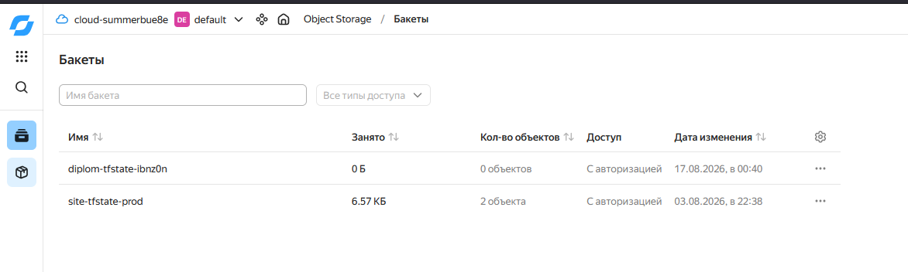

Сервисный аккаунт с ролями:

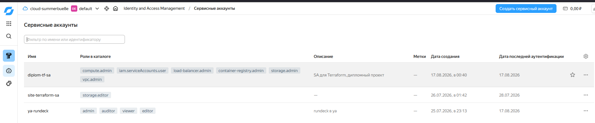

### Основная инфраструктура

Файлы конфигурации:

* [terraform/01-infra/network.tf](terraform/01-infra/network.tf) — сеть и подсети
* [terraform/01-infra/compute.tf](terraform/01-infra/compute.tf) — виртуальные машины
* [terraform/01-infra/security.tf](terraform/01-infra/security.tf) — группа безопасности
* [terraform/01-infra/address.tf](terraform/01-infra/address.tf) — зарезервированные адреса
* [terraform/01-infra/registry.tf](terraform/01-infra/registry.tf) — реестр образов
* [terraform/01-infra/versions.tf](terraform/01-infra/versions.tf) — подключение бекенда

Адресация подсетей:

| Подсеть | Зона | CIDR |
|---|---|---|
| diplom-subnet-ru-central1-a | ru-central1-a | 10.10.1.0/24 |
| diplom-subnet-ru-central1-b | ru-central1-b | 10.10.2.0/24 |
| diplom-subnet-ru-central1-d | ru-central1-d | 10.10.3.0/24 |

Виртуальные машины:

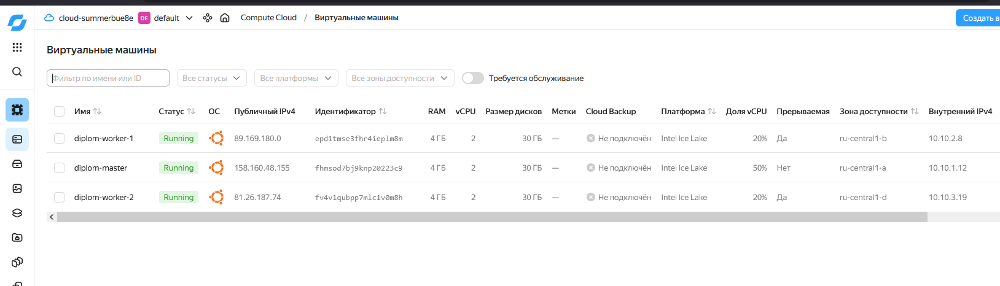

Сеть и подсети:

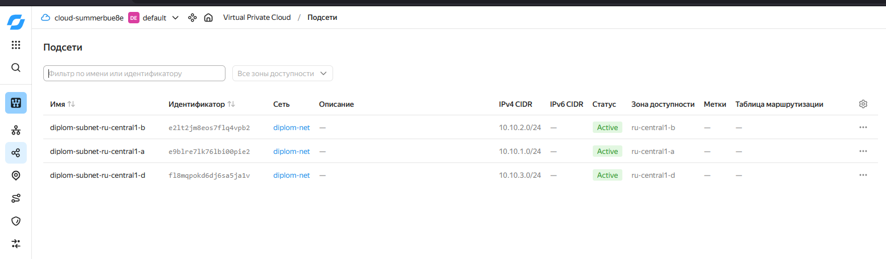

Состояние основной конфигурации хранится в бакете `diplom-tfstate-ibnz0n`
по ключу `infra/terraform.tfstate`. Команды `terraform apply` и `terraform destroy`
выполняются без дополнительных ручных действий.

---

## 2. Создание Kubernetes кластера

Выбран рекомендуемый вариант — самостоятельная установка через Kubespray
(ветка `release-2.27`).

Файлы:

* [ansible/inventory/inventory.ini](ansible/inventory/inventory.ini) — инвентарь
* [ansible/inventory/group_vars/k8s_cluster/k8s-cluster.yml](ansible/inventory/group_vars/k8s_cluster/k8s-cluster.yml) — переопределения

Что было добавлено в переменные кластера:

```yaml
# API-сервер должен слушать на публичном адресе, иначе kubectl с хоста не подключится
supplementary_addresses_in_ssl_keys: ["158.160.48.155"]
metrics_server_enabled: true
ingress_nginx_enabled: true
ingress_nginx_host_network: true
helm_enabled: true
```

Ingress работает в режиме host network — так приложение и Grafana доступны
по 80 порту прямо на адресах воркеров, без отдельного балансировщика.
Это заодно экономит ресурсы купона.

Итог установки:

```
PLAY RECAP *********************************************************************
master     : ok=708  changed=156  unreachable=0  failed=0  skipped=1092  ignored=6
worker-1   : ok=467  changed=93   unreachable=0  failed=0  skipped=695   ignored=1
worker-2   : ok=467  changed=93   unreachable=0  failed=0  skipped=692   ignored=1
```

Состояние кластера:

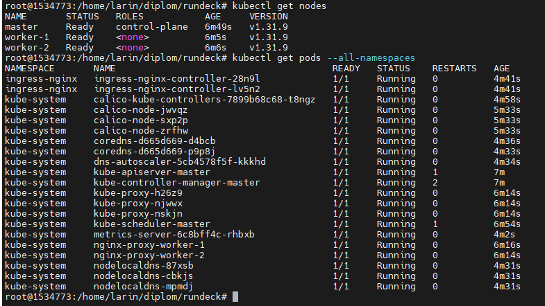

Полный вывод: [logs/07-kubernetes.md](logs/07-kubernetes.md)

Данные для доступа лежат в `~/.kube/config`, команда
`kubectl get pods --all-namespaces` отрабатывает без ошибок.

---

## 3. Тестовое приложение

Приложение — nginx, отдающий статическую страницу. Версия подставляется на этапе
сборки из тега git, поэтому по странице сразу видно, какой образ реально
работает в кластере.

Файлы:

* [app/Dockerfile](app/Dockerfile)
* [app/nginx.conf](app/nginx.conf)
* [app/html/index.html](app/html/index.html)

Отдельный путь `/healthz` добавлен для проб готовности и живости пода.

Локальная проверка сборки: [logs/06-docker-build.md](logs/06-docker-build.md)

Приложение в кластере, версия v0.1.0:

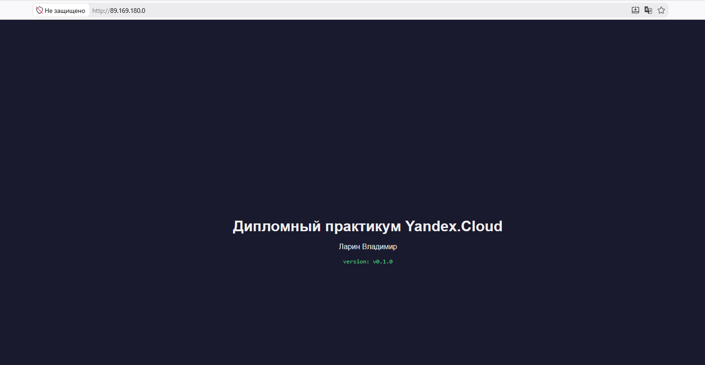

Образы публикуются в Yandex Container Registry `crp1oavjn6oftmsg31lk`.
Для реестра заведены два отдельных сервисных аккаунта: один умеет только
загружать образы (`container-registry.images.pusher`), второй только
скачивать (`container-registry.images.puller`). Так CI не получает лишних прав.

Вывод публикации: [logs/08-registry.md](logs/08-registry.md)

---

## 4. Мониторинг и деплой приложения

### Мониторинг

Установлен helm-чарт `kube-prometheus-stack` — он включает Prometheus, Grafana,
Alertmanager, node_exporter и kube-state-metrics.

Файлы:

* [k8s/monitoring/values.yaml](k8s/monitoring/values.yaml) — переопределения ресурсов
* [k8s/monitoring/install.sh](k8s/monitoring/install.sh) — скрипт установки

Ресурсы урезаны под слабые ноды, хранение метрик — 3 дня, постоянные тома
не используются, потому что storage class в кластере не настраивался.
Проверки etcd отключены, чтобы не сыпались ложные срабатывания.

Grafana доступна по 80 порту через ingress. Своего домена нет, поэтому
использован сервис `nip.io`, который резолвит адрес прямо из имени хоста.

Страница входа:

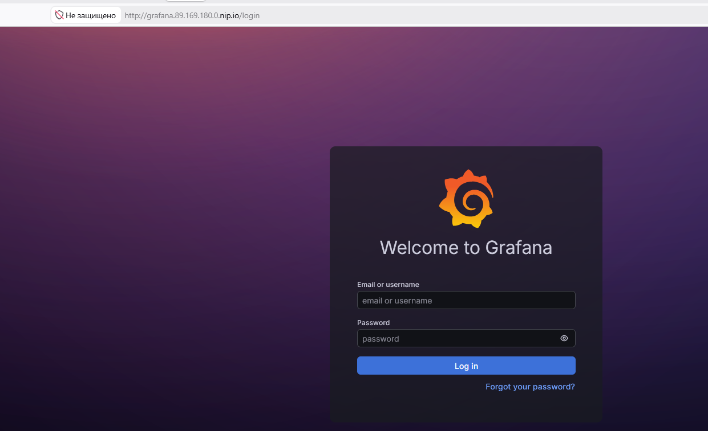

Дашборд по ресурсам кластера:

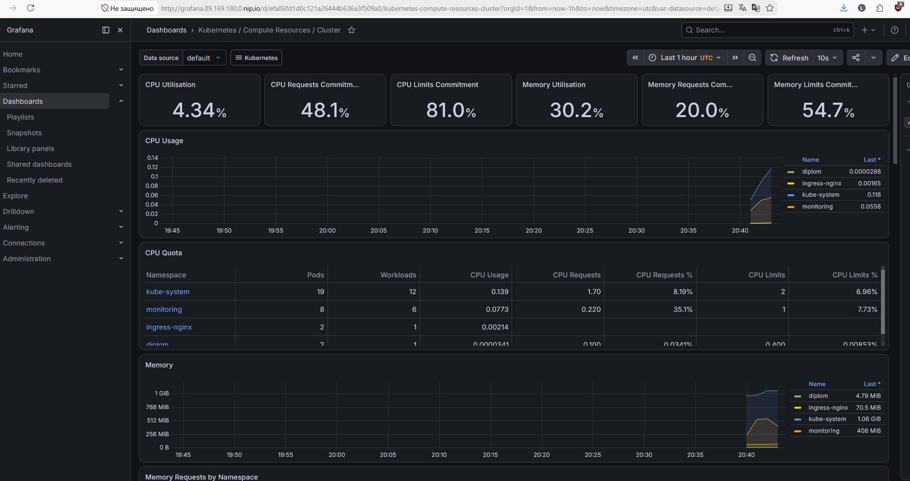

Дашборд по нодам:

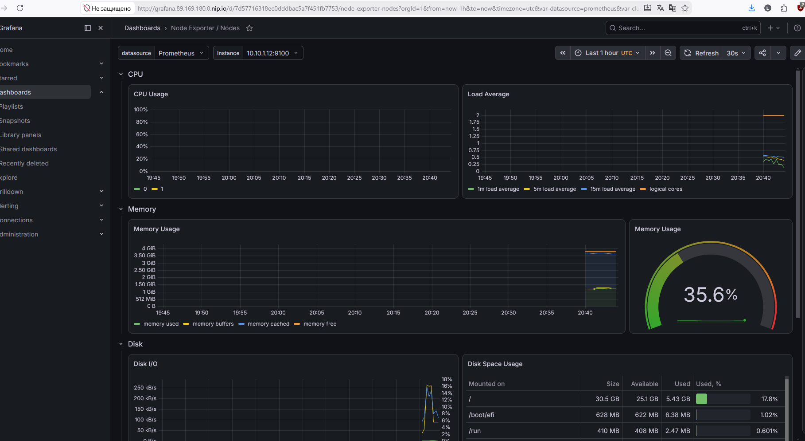

Вывод проверки: [logs/10-monitoring.md](logs/10-monitoring.md)

### Деплой приложения

Файлы манифестов:

* [k8s/app/namespace.yaml](k8s/app/namespace.yaml)
* [k8s/app/deployment.yaml](k8s/app/deployment.yaml)
* [k8s/app/service.yaml](k8s/app/service.yaml)
* [k8s/app/ingress.yaml](k8s/app/ingress.yaml)

В деплойменте прописан `imagePullSecrets` — реестр приватный, без секрета
образ не скачается. Секрет создаётся из ключа сервисного аккаунта с правами
только на чтение.

Два ingress уживаются на одном контроллере: Grafana отвечает по имени хоста,
приложение — по IP без указания хоста.

Вывод: [logs/09-app-deploy.md](logs/09-app-deploy.md)

---

## 5. Деплой инфраструктуры в pipeline

Из трёх вариантов задания выбран третий — автоматический запуск Terraform
из репозитория при коммите в main.

Файл: [.github/workflows/diplom-terraform.yml](../.github/workflows/diplom-terraform.yml)

Что делает пайплайн:

1. `terraform init` с бекендом в бакете
2. `terraform validate`
3. `terraform plan`
4. `terraform apply` — только при push в main, на pull request план строится
   без применения

Фильтр по путям настроен так, что пайплайн срабатывает только на изменения
в `diplom/terraform/01-infra/`. Иначе правки приложения запускали бы Terraform
без нужды.

Ключ сервисного аккаунта пишется во временный файл и удаляется в конце шагом
с `if: always()`, чтобы он не остался на раннере при падении.

Первый запуск упал:

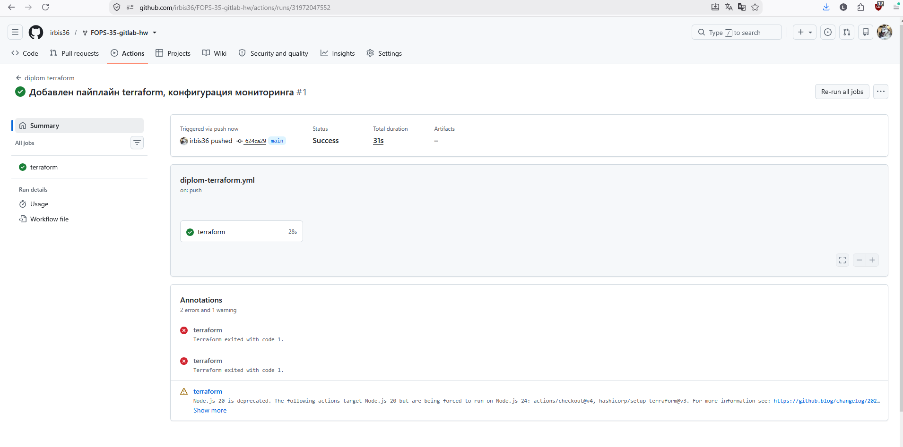

Разбор ошибки описан ниже, в разделе про проблемы. После исправления:

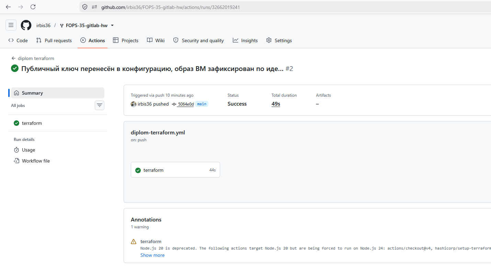

Оба запуска в списке:

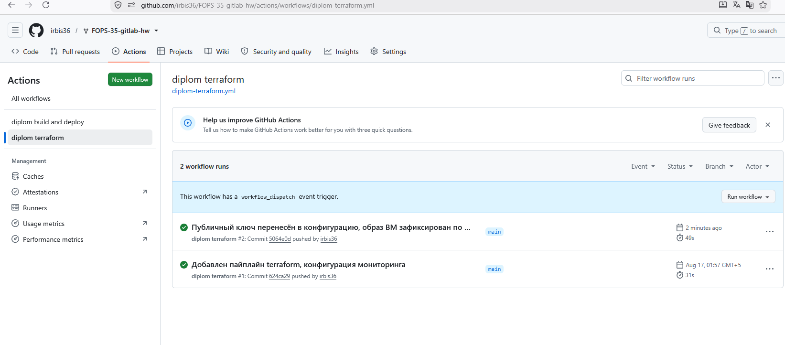

---

## 6. Установка и настройка CI/CD

Файл: [.github/workflows/diplom-build.yml](../.github/workflows/diplom-build.yml)

Логика такая:

| Событие | Что происходит |
|---|---|
| Коммит в main с изменениями в `diplom/app/` | Сборка образа с тегом `commit-<хеш>`, публикация в реестр |
| Создание тега `v*` | Сборка с тегом версии, публикация, деплой в кластер |

Job `deploy` выполняется только при наличии тега — за это отвечает условие
`if: needs.build.outputs.is_tag == 'true'`.

Сборка при обычном коммите, деплой пропущен:

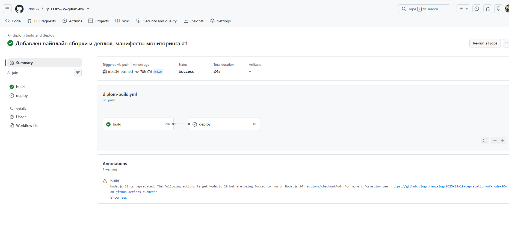

Сборка и деплой по тегу v1.0.0:

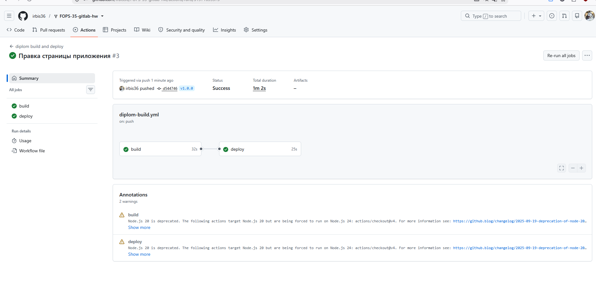

Приложение после деплоя — версия обновилась на v1.0.0:

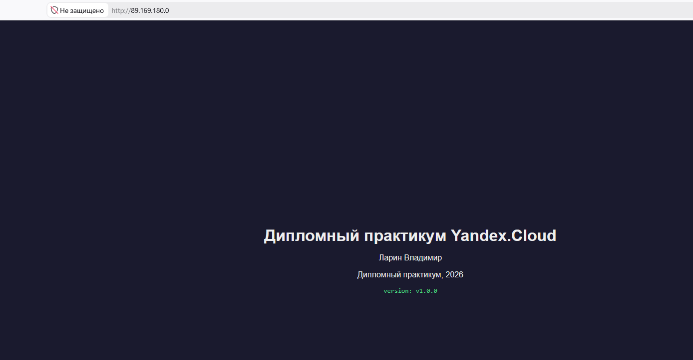

Вывод: [logs/11-cicd.md](logs/11-cicd.md)

Секреты, заведённые в репозитории:

| Секрет | Назначение |
|---|---|
| `YC_SA_JSON_CREDENTIALS` | ключ аккаунта для публикации образов |
| `YC_REGISTRY_ID` | идентификатор реестра |
| `KUBE_CONFIG` | доступ к кластеру, в base64 |
| `TF_SA_JSON` | ключ аккаунта для Terraform |
| `TF_S3_ACCESS_KEY` / `TF_S3_SECRET_KEY` | доступ к бакету с состоянием |
| `YC_CLOUD_ID` / `YC_FOLDER_ID` | идентификаторы облака и каталога |

---

## 7. Управление ресурсами через Rundeck

Rundeck использован как инструмент для операционных задач — он не заменяет
CI/CD, а дополняет его. Основная польза — останавливать и запускать машины
одной кнопкой, не заходя в консоль облака. Это заметно экономит купон.

Проекты Rundeck:

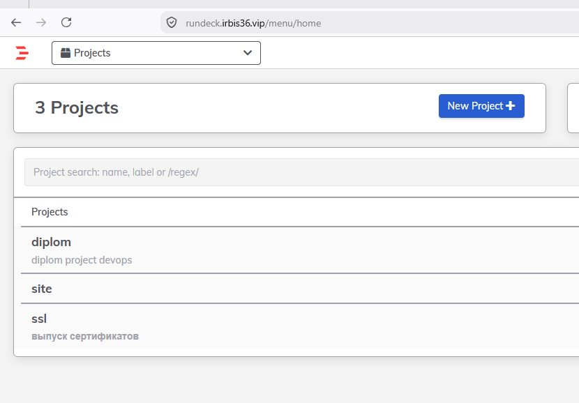

Джобы проекта:

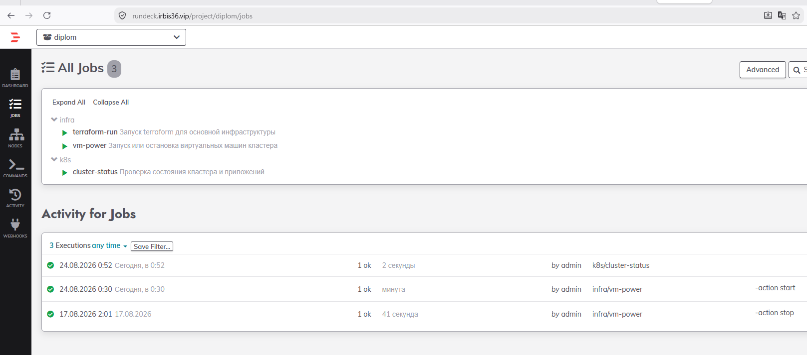

Список джоб:

| Джоба | Файл | Что делает |
|---|---|---|
| `infra/vm-power` | [rundeck/vm-power.yaml](rundeck/vm-power.yaml) | запуск и остановка машин кластера |
| `infra/terraform-run` | [rundeck/terraform-run.yaml](rundeck/terraform-run.yaml) | plan, apply или destroy с подтверждением |
| `k8s/cluster-status` | [rundeck/cluster-status.yaml](rundeck/cluster-status.yaml) | проверка состояния кластера и сервисов |

Джоба фильтрует машины по префиксу `diplom`, поэтому не затрагивает
посторонние ресурсы в том же каталоге.

Остановка:

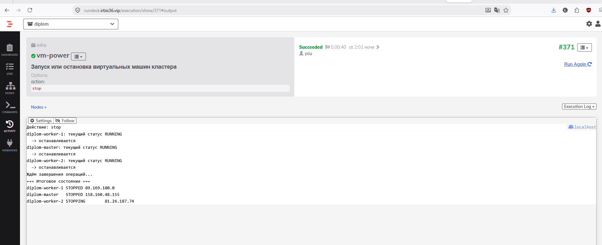

Запуск:

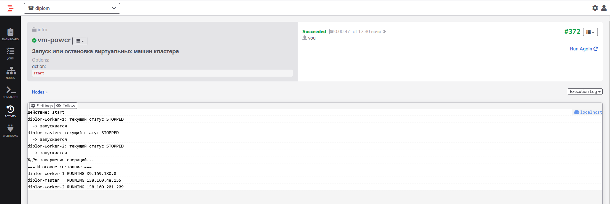

Проверка состояния:

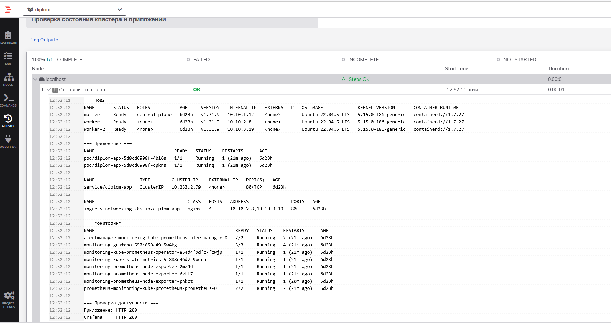

Вывод: [logs/12-rundeck.md](logs/12-rundeck.md)

### Про адреса при перезапуске

Адреса мастера и первого воркера зарезервированы, поэтому после остановки
и запуска сохраняются. У второго воркера адрес эфемерный и меняется —
закрепить его не удалось, квота каталога на статические адреса оказалась
исчерпана.

На работу кластера это не влияет: ноды общаются между собой по внутренней
сети, а kubeconfig и TLS-сертификат API-сервера завязаны на адрес мастера,
который остаётся неизменным. Ingress тоже привязан к первому воркеру.

Проверка после перезапуска:

```
Было до остановки:
diplom-worker-1 RUNNING 89.169.180.0
diplom-master   RUNNING 158.160.48.155
diplom-worker-2 RUNNING 81.26.187.74

Стало после запуска:
diplom-worker-1 RUNNING 89.169.180.0
diplom-master   RUNNING 158.160.48.155
diplom-worker-2 RUNNING 158.160.201.209

Приложение: HTTP 200
Grafana:    HTTP 200
API:        ok
```

Кластер поднялся сам, вмешательства не потребовалось.

---

## Доступы

| Ресурс | Адрес |
|---|---|
| Тестовое приложение | https://diplom.irbis36.vip/ |
| Grafana | https://grafana.irbis36.vip/ |
| Prometheus | https://prometheus.irbis36.vip/ |
| Alertmanager | https://alertmanager.irbis36.vip/ |
| Репозиторий | https://github.com/irbis36/FOPS-35-gitlab-hw/tree/main/diplom |
| Реестр образов | `cr.yandex/crp1oavjn6oftmsg31lk/diplom-app` |

Логин и пароль от Grafana переданы отдельно.

Сервисы также доступны напрямую по адресу воркера `http://89.169.180.0/` —
это исходный вариант без домена, требование задания про 80 порт он закрывает.

Разведение по доменам сделано на ingress-контроллере: все имена смотрят на один
адрес, а контроллер разбирает запросы по заголовку `Host`. Сертификаты и
ограничение доступа к Prometheus с Alertmanager настроены на обратном прокси,
у самих этих сервисов авторизации нет.

---

## Проблемы, с которыми столкнулся

### Мастер не отвечал по SSH

После создания машин воркеры отвечали, а мастер — нет, соединение отваливалось
по таймауту. Группа безопасности разрешала 22 порт, cloud-init отрабатывал.

Проверка изнутри сети через воркер показала, что sshd на мастере работает
и порт слушается. Значит, проблема была во внешнем адресе. Помогло
пересоздание машины через `terraform taint` — с новым адресом всё заработало.

Заодно убрал таблицу маршрутов с NAT-шлюзом: у всех машин есть публичные
адреса, отдельный шлюз им не нужен, а его наличие только усложняло схему.

### Terraform пытался пересоздать весь кластер

Через неделю после установки `terraform plan` внезапно показал
`3 to add, 3 to destroy`. Причина — в конфигурации образ брался через
`data "yandex_compute_image"` по семейству `ubuntu-2204-lts`, а Яндекс
выпустил новую версию образа. Смена `image_id` требует пересоздания машины,
и Terraform честно собирался снести живой кластер.

Решение — зафиксировать образ по идентификатору:

```hcl
variable "image_id" {
  description = "Идентификатор образа для загрузочного диска"
  type        = string
  default     = "fd8548a3jsnsqvdksljd"
}
```

Момент неочевидный: конфигурация выглядит корректно и проходит `validate`,
но при регулярных запусках пайплайна такая мина срабатывает рано или поздно.

### Пайплайн Terraform падал, но показывал успех

Первый запуск завершился со статусом Success, хотя в аннотациях висело
два `Terraform exited with code 1`.

Оказалось, две ошибки сразу:

1. В шагах стоял `| tail -30`, и код возврата брался от `tail`, а не от
   Terraform. Ошибки не всплывали наверх.
2. Путь к публичному ключу был абсолютным — `/home/larin/diplom/.ssh/diplom.pub`.
   На своей машине это работало, на раннере GitHub такого файла нет.

Исправил обе: убрал конвейеры из шагов и положил публичный ключ рядом
с конфигурацией, обращаясь к нему по относительному пути. Ключ публичный,
хранить его в репозитории безопасно.

### Квота на статические адреса

При попытке закрепить адреса за всеми тремя машинами третья упёрлась в
`Quota limit vpc.externalStaticAddresses.count exceeded`. Часть квоты была
занята другими ресурсами каталога.

Решил не расширять квоту, а закрепить адреса только там, где это критично —
у мастера и воркера с ingress. Второй воркер работает на эфемерном адресе.

### Место на диске

Kubespray со всеми зависимостями требует места, а на управляющем хосте
свободного оставалось около 600 МБ. Освободил примерно 350 МБ за счёт
журналов systemd (966 МБ ушло в ноль после `vacuum-size`) и кэша пакетов,
плюс выставил постоянный лимит на журнал, чтобы не разрасталось снова.

---

## Структура репозитория

```
diplom/
├── README.md              этот отчёт
├── terraform/
│   ├── 00-backend/        сервисный аккаунт и бакет
│   └── 01-infra/          сеть, машины, реестр
├── ansible/
│   └── inventory/         инвентарь Kubespray
├── app/                   Dockerfile и статика
├── k8s/
│   ├── app/               манифесты приложения
│   └── monitoring/        конфигурация мониторинга
├── rundeck/               описания джоб
├── logs/                  выводы команд
└── screenshot/            скриншоты
```

Пайплайны лежат в `.github/workflows/` в корне репозитория — это требование
GitHub Actions, оттуда их перенести нельзя.
