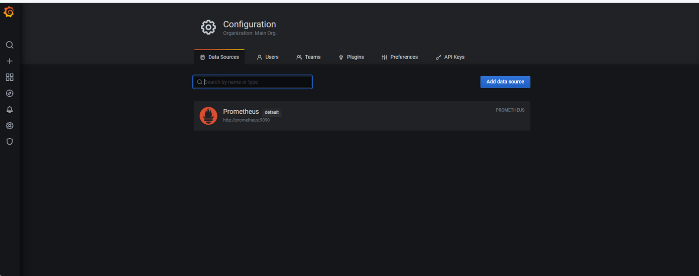
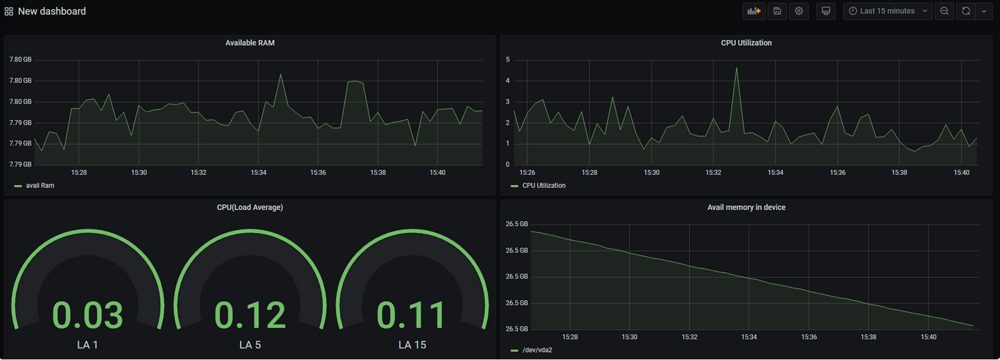
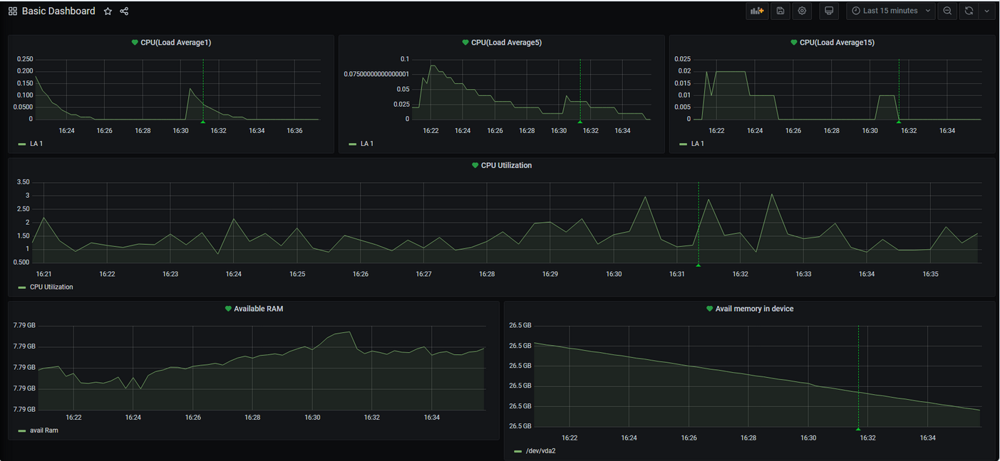
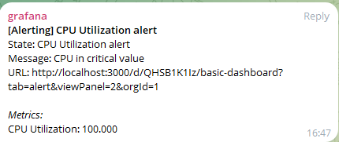

# Домашнее задание к занятию «Средство визуализации Grafana»

## Задание повышенной сложности

**При решении задания 1** не используйте директорию [help](./help) для сборки проекта. Самостоятельно разверните grafana, где в роли источника данных будет выступать prometheus, а сборщиком данных будет node-exporter:

- grafana;
- prometheus-server;
- prometheus node-exporter.

За дополнительными материалами можете обратиться в официальную документацию grafana и prometheus.

В решении к домашнему заданию также приведите все конфигурации, скрипты, манифесты, которые вы 
использовали в процессе решения задания.

**При решении задания 3** вы должны самостоятельно завести удобный для вас канал нотификации, например, Telegram или email, и отправить туда тестовые события.

В решении приведите скриншоты тестовых событий из каналов нотификаций.

## Обязательные задания

### Задание 1

1. Используя директорию [help](./help) внутри этого домашнего задания, запустите связку prometheus-grafana.
1. Зайдите в веб-интерфейс grafana, используя авторизационные данные, указанные в манифесте docker-compose.
1. Подключите поднятый вами prometheus, как источник данных.
1. Решение домашнего задания — скриншот веб-интерфейса grafana со списком подключенных Datasource.


*(На скриншоте отображена главная страница grafana)*

## Задание 2

Изучите самостоятельно ресурсы:

1. [PromQL tutorial for beginners and humans](https://valyala.medium.com/promql-tutorial-for-beginners-9ab455142085).
1. [Understanding Machine CPU usage](https://www.robustperception.io/understanding-machine-cpu-usage).
1. [Introduction to PromQL, the Prometheus query language](https://grafana.com/blog/2020/02/04/introduction-to-promql-the-prometheus-query-language/).

Создайте Dashboard и в ней создайте Panels:

- утилизация CPU для nodeexporter (в процентах, 100-idle);
```
100-avg(rate(node_cpu_seconds_total{mode="idle"}[15s]) * 100)
```

- CPULA 1/5/15;
```
node_load1
node_load5
node_load15
```
- количество свободной оперативной памяти;
```
node_memory_MemAvailable_bytes

```
- количество места на файловой системе.
```
node_filesystem_avail_bytes{device="/dev/vda2"}
```
Для решения этого задания приведите promql-запросы для выдачи этих метрик, а также скриншот получившийся Dashboard.


*(На скриншоте отображен скриншот получившийся Dashboard)*

## Задание 3

1. Создайте для каждой Dashboard подходящее правило alert — можно обратиться к первой лекции в блоке «Мониторинг».
1. В качестве решения задания приведите скриншот вашей итоговой Dashboard.


*(На скриншоте отображен скриншот итоговой Dashboard)*

```
Через stress загрузил CPU - нотификация приходит в ТГ

stress --cpu $(nproc) - процесс для каждого логического ядра, обеспечивая максимальную нагрузку.
stress --cpu 4 --timeout 45s - нагрузить 4 ядра на 45 секунд:


```

*(На скриншоте отображен скриншот уведомления в телеграм)*


## Задание 4

1. Сохраните ваш Dashboard.Для этого перейдите в настройки Dashboard, выберите в боковом меню «JSON MODEL». Далее скопируйте отображаемое json-содержимое в отдельный файл и сохраните его.
1. В качестве решения задания приведите листинг этого файла.


*(json-содержимое )*
---

### Как оформить решение задания

Выполненное домашнее задание пришлите в виде ссылки на .md-файл в вашем репозитории.

---
