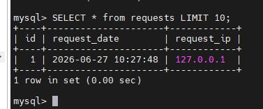
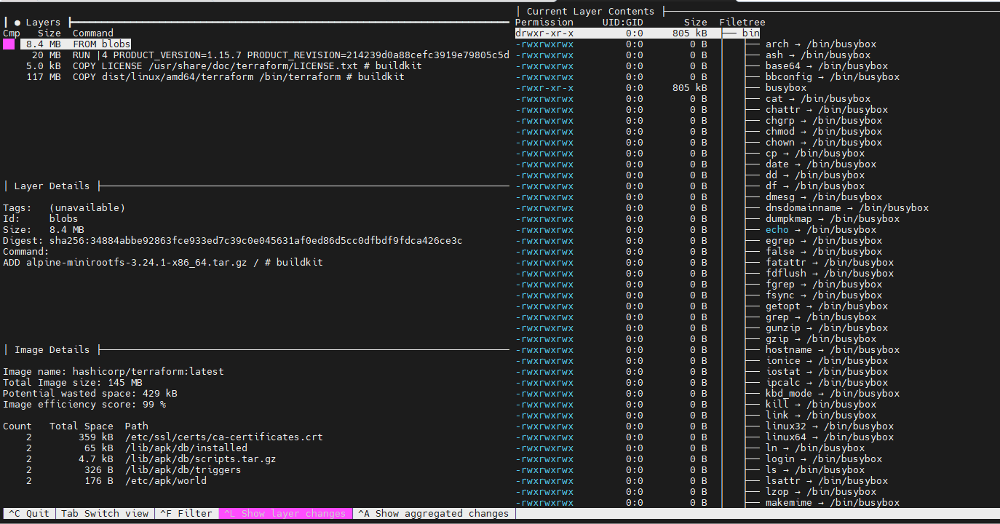
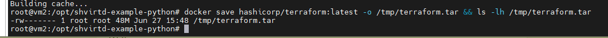
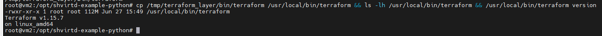

# Домашнее задание к занятию 5. «Практическое применение Docker»

> **Автор: Ларин Владимир**

**Ссылка на fork-репозиторий:** https://github.com/irbis36/shvirtd-example-python

---

## Задача 0 — Проверка окружения

Убеждаемся что `docker-compose` (со знаком тире) **не установлен**, а `docker compose` (плагин) **установлен** версии не ниже v2.24.X.

```bash
# docker-compose отсутствует
root@vm2:/home/larin# docker-compose --version
bash: docker-compose: command not found

# Устанавливаем Docker
curl -fsSL https://get.docker.com -o get-docker.sh && sudo sh get-docker.sh

# Проверяем версию docker compose
root@vm2:/home/larin# docker compose version
Docker Compose version v5.2.0
```

✅ Docker Engine 29.6.1, Docker Compose v5.2.0 установлены.

---

## Задача 1 — Fork репозитория и Dockerfile.python

### 1. Fork репозитория

Сделан fork репозитория https://github.com/netology-code/shvirtd-example-python в аккаунт `irbis36`.

```bash
git clone https://github.com/irbis36/shvirtd-example-python.git /opt/shvirtd-example-python
cd /opt/shvirtd-example-python
```

### 2. Dockerfile.python (multistage сборка)

```dockerfile
# Stage 1: builder
FROM python:3.12-slim AS builder
WORKDIR /app
COPY requirements.txt .
RUN pip install --no-cache-dir --prefix=/install -r requirements.txt

# Stage 2: runtime
FROM python:3.12-slim
WORKDIR /app
COPY --from=builder /install /usr/local
COPY . .
CMD ["uvicorn", "main:app", "--host", "0.0.0.0", "--port", "5000"]
```

### 3. .dockerignore

```
.git
.env
__pycache__
*.pyc
*.pyo
compose.yaml
README.md
schema.pdf
*.md
```

### 4. .gitignore

```
__pycache__
*.pyc
*.pyo
.env
```

---

## Задача 3 — compose.yaml и запуск проекта

### Изучение proxy.yaml

Файл `proxy.yaml` описывает два сервиса:
- `reverse-proxy` — HAProxy, слушает порт 8080, работает в сети `backend`
- `ingress-proxy` — Nginx, работает в режиме `network_mode: host`

Сеть `backend` — bridge-сеть с подсетью `172.20.0.0/24`.

### compose.yaml

```yaml
include:
  - proxy.yaml

services:
  web:
    build:
      context: .
      dockerfile: Dockerfile.python
    restart: always
    networks:
      backend:
        ipv4_address: 172.20.0.5
    environment:
      - DB_HOST=db
      - DB_USER=${MYSQL_USER}
      - DB_PASSWORD=${MYSQL_PASSWORD}
      - DB_NAME=${MYSQL_DATABASE}
    depends_on:
      - db

  db:
    image: mysql:8
    restart: on-failure
    networks:
      backend:
        ipv4_address: 172.20.0.10
    environment:
      - MYSQL_ROOT_PASSWORD=${MYSQL_ROOT_PASSWORD}
      - MYSQL_DATABASE=${MYSQL_DATABASE}
      - MYSQL_USER=${MYSQL_USER}
      - MYSQL_PASSWORD=${MYSQL_PASSWORD}
    env_file:
      - .env

networks:
  backend:
    driver: bridge
    ipam:
      config:
        - subnet: 172.20.0.0/24
```

> Переменные окружения для web-приложения: `DB_HOST`, `DB_USER`, `DB_PASSWORD`, `DB_NAME` — определены в `main.py`. Секретные переменные для MySQL берутся из `.env` файла.

### Запуск проекта

```bash
docker compose up -d --build
```

```
✔ Container shvirtd-example-python-db-1            Started
✔ Container shvirtd-example-python-ingress-proxy-1 Started
✔ Container shvirtd-example-python-reverse-proxy-1 Started
✔ Container shvirtd-example-python-web-1           Started
```

### Проверка работы

```bash
curl -L http://127.0.0.1:8090
"TIME: 2026-06-27 10:27:48, IP: 127.0.0.1"
```

✅ Сервис возвращает время и IP-адрес.

Цепочка прохождения трафика:
```
Пользователь → Nginx (ingress-proxy, host) → HAProxy (reverse-proxy, :8080) → FastAPI web (:5000) → MySQL db
```

### SQL-запрос к БД

```bash
docker exec -ti shvirtd-example-python-db-1 mysql -uroot -pYtReWq4321
```

```sql
show databases;
use virtd;
show tables;
SELECT * from requests LIMIT 10;
```



### Остановка проекта

```bash
docker compose down
```

---

## Задача 4 — Bash-скрипт развёртывания и проверка на удалённом сервере

### deploy.sh

```bash
#!/bin/bash
set -e

echo "=== Установка Docker ==="
if ! command -v docker &> /dev/null; then
    curl -fsSL https://get.docker.com -o get-docker.sh
    sudo sh get-docker.sh
    rm get-docker.sh
else
    echo "Docker уже установлен"
fi

echo "=== Клонирование репозитория ==="
if [ ! -d "/opt/shvirtd-example-python" ]; then
    git clone https://github.com/irbis36/shvirtd-example-python.git /opt/shvirtd-example-python
else
    echo "Репозиторий уже существует"
fi

echo "=== Запуск проекта ==="
cd /opt/shvirtd-example-python
docker compose up -d --build

echo "=== Проект запущен ==="
docker ps -a
```

Скрипт автоматически:
1. Устанавливает Docker если не установлен
2. Клонирует репозиторий в `/opt/shvirtd-example-python`
3. Запускает проект через `docker compose up -d --build`

### Проверка с удалённого сервера

Проект развёрнут на VPS1. Запросы отправлялись с трёх разных источников:

```
Локальная VM (Hyper-V) ──┐
                          ├──► VPS1:8090 ──► MySQL
VPS2 ────────────────────┘
```

**С самого VPS1:**
```bash
curl http://127.0.0.1:8090
"TIME: 2026-06-29 13:05:22, IP: 127.0.0.1"
```

**С VPS2:**
```bash
for i in {1..3}; do curl http://<VPS1_IP>:8090; echo; done
"TIME: 2026-06-29 13:06:17, IP: <VPS2_IP>"
"TIME: 2026-06-29 13:06:17, IP: <VPS2_IP>"
"TIME: 2026-06-29 13:06:17, IP: <VPS2_IP>"
```

**С локальной VM Hyper-V:**
```bash
for i in {1..3}; do curl http://<VPS1_IP>:8090; echo; done
"TIME: 2026-06-29 13:07:04, IP: <LOCAL_VM_IP>"
"TIME: 2026-06-29 13:07:04, IP: <LOCAL_VM_IP>"
"TIME: 2026-06-29 13:07:04, IP: <LOCAL_VM_IP>"
```

### SQL-запрос — записи из трёх источников

```bash
docker exec -ti shvirtd-example-python-db-1 \
  mysql -uroot -pYtReWq4321 virtd -e "SELECT * FROM requests LIMIT 10;"
```


В БД зафиксированы запросы с трёх разных источников:
- 🖥️ **VPS1** — `127.0.0.1` (локальный запрос)
- 🌐 **VPS2** — внешний IP VPS2
- 💻 **Локальная VM** — внешний IP локальной сети

### Очистка VPS1 после выполнения задания

```bash
cd /opt/shvirtd-example-python && docker compose down -v && cd / && rm -rf /opt/shvirtd-example-python
```

---

## Задача 6 — Извлечение бинарника terraform

### Скачиваем образ

```bash
docker pull hashicorp/terraform:latest
```

### Изучаем образ с помощью dive

```bash
docker run --rm -it \
  -v /var/run/docker.sock:/var/run/docker.sock \
  wagoodman/dive:latest hashicorp/terraform:latest
```

В dive видно 4 слоя образа, в том числе слой с файлом `/bin/terraform` размером 117 MB.



### Извлекаем бинарник через docker save

```bash
# Сохраняем образ в tar-архив
docker save hashicorp/terraform:latest -o /tmp/terraform.tar
```



```bash
# Распаковываем архив
mkdir /tmp/terraform_extract
tar -xf /tmp/terraform.tar -C /tmp/terraform_extract

# Находим слой с terraform (самый большой blob)
find /tmp/terraform_extract/blobs -type f | xargs ls -lh | sort -k5 -h

# Распаковываем нужный слой
mkdir /tmp/terraform_layer
tar -xf /tmp/terraform_extract/blobs/sha256/e2ac9ac71baf2ba700d0db15093441daaaad60351b56875312364046c6f09485 \
    -C /tmp/terraform_layer

# Копируем бинарник
cp /tmp/terraform_layer/bin/terraform /usr/local/bin/terraform
```

### Проверка



```
-rwxr-xr-x 1 root root 112M Jun 27 15:49 /usr/local/bin/terraform
Terraform v1.15.7
on linux_amd64
```

✅ Бинарник terraform v1.15.7 успешно извлечён из образа и скопирован на локальную машину.

---

## Итог

| Задача | Статус |
|--------|--------|
| Задача 0 — Проверка окружения | ✅ |
| Задача 1 — Dockerfile.python (multistage) | ✅ |
| Задача 3 — compose.yaml, запуск, SQL-запрос | ✅ |
| Задача 4 — Bash-скрипт + проверка с удалённых источников | ✅ |
| Задача 6 — Извлечение terraform через dive + docker save | ✅ |

**Ссылка на репозиторий:** https://github.com/irbis36/shvirtd-example-python
