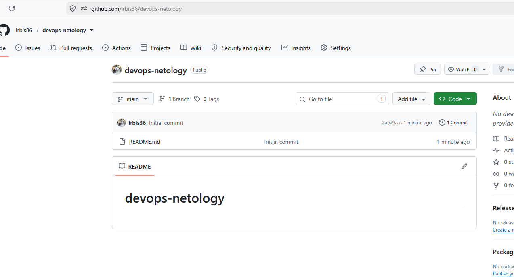
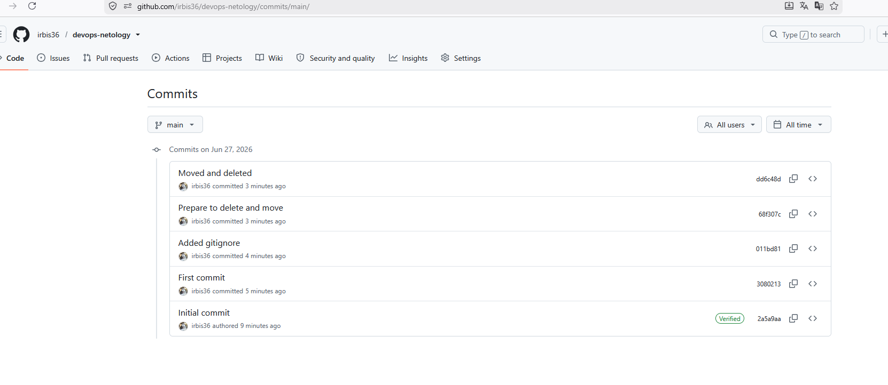

# Домашнее задание: Системы контроля версий

> **Автор: Ларин Владимир**

---

## Задание 1. Создать и настроить репозиторий

### Шаг 1. Настройка Git

Настройка имени пользователя и email:

```bash
git config --global user.name "Vladimir Larin"
git config --global user.email "lrnvv@mail.ru"
```

Проверка конфигурации:

```bash
git config --global --list
```

Вывод:
```
user.name=Vladimir Larin
user.email=lrnvv@mail.ru
```

---

### Шаг 2. Клонирование репозитория



```bash
cd ~
git clone https://github.com/irbis36/devops-netology.git
```

Вывод:
```
Cloning into 'devops-netology'...
remote: Enumerating objects: 3, done.
remote: Counting objects: 100% (3/3), done.
remote: Total 3 (delta 0), reused 0 (delta 0), pack-reused 0 (from 0)
Receiving objects: 100% (3/3), done.
```

---

### Шаг 3. Проверка статуса после клонирования

```bash
cd devops-netology
git status
```

Вывод:
```
On branch main
Your branch is up to date with 'origin/main'.
nothing to commit, working tree clean
```

---

### Шаг 4. Редактирование README.md — перевод в состояние Modified

```bash
echo "## Описание курса DevOps" >> README.md
git status
```

Вывод:
```
On branch main
Your branch is up to date with 'origin/main'.
Changes not staged for commit:
  (use "git add <file>..." to update what will be committed)
  (use "git restore <file>..." to discard changes in working directory)
        modified:   README.md
no changes added to commit (use "git add" and/or "git commit -a")
```

---

### Шаг 5. Просмотр изменений до добавления в staged

```bash
git diff
```

Вывод:
```diff
diff --git a/README.md b/README.md
index 647b370..8668442 100644
--- a/README.md
+++ b/README.md
@@ -1 +1 @@
-# devops-netology
\ No newline at end of file
+# devops-netology## Описание курса DevOps
```

```bash
git diff --staged
```

Вывод: *(пустой — файл ещё не добавлен в staged)*

---

### Шаг 6. Добавление файла в staged и повторный просмотр diff

```bash
git add README.md
git diff
```

Вывод: *(пустой — файл уже в staged)*

```bash
git diff --staged
```

Вывод:
```diff
diff --git a/README.md b/README.md
index 647b370..8668442 100644
--- a/README.md
+++ b/README.md
@@ -1 +1 @@
-# devops-netology
\ No newline at end of file
+# devops-netology## Описание курса DevOps
```

---

### Шаг 7. First commit

```bash
git commit -m 'First commit'
git status
```

Вывод:
```
[main 3080213] First commit
 1 file changed, 1 insertion(+), 1 deletion(-)

On branch main
Your branch is ahead of 'origin/main' by 1 commit.
  (use "git push" to publish your local commits)
nothing to commit, working tree clean
```

---

### Шаг 8. Создание .gitignore

```bash
touch .gitignore
git status
```

Вывод:
```
On branch main
Your branch is ahead of 'origin/main' by 1 commit.
  (use "git push" to publish your local commits)
Untracked files:
  (use "git add <file>..." to include in what will be committed)
        .gitignore
nothing added to commit but untracked files present (use "git add" to track)
```

---

### Шаг 9. Создание каталога terraform и Terraform .gitignore

```bash
mkdir terraform
curl -o terraform/.gitignore https://raw.githubusercontent.com/github/gitignore/master/Terraform.gitignore
cat terraform/.gitignore
```

Вывод:
```
# Local .terraform directories
.terraform/
# .tfstate files
*.tfstate
*.tfstate.*
# Crash log files
crash.log
crash.*.log
# Exclude all .tfvars files, which are likely to contain sensitive data
*.tfvars
*.tfvars.json
# Ignore override files
override.tf
override.tf.json
*_override.tf
*_override.tf.json
# Ignore transient lock info files created by terraform apply
.terraform.tfstate.lock.info
# Ignore CLI configuration files
.terraformrc
terraform.rc
```

---

### Шаг 10. Обновление README.md с описанием игнорируемых файлов

В файл README.md добавлено описание игнорируемых файлов:

```
## Игнорируемые файлы
Благодаря добавленному .gitignore будут игнорироваться следующие файлы:
- .terraform/               — локальные каталоги Terraform
- *.tfstate, *.tfstate.*    — файлы состояния Terraform
- crash.log, crash.*.log    — файлы логов аварийного завершения
- *.tfvars, *.tfvars.json   — файлы с чувствительными данными (пароли, ключи)
- override.tf, *_override.tf — файлы локальных переопределений
- .terraform.tfstate.lock.info — файлы блокировки
- .terraformrc, terraform.rc — файлы конфигурации CLI
```

```bash
git add .gitignore terraform/ README.md
git status
```

Вывод:
```
On branch main
Your branch is ahead of 'origin/main' by 1 commit.
Changes to be committed:
  (use "git restore --staged <file>..." to unstage)
        new file:   .gitignore
        modified:   README.md
        new file:   terraform/.gitignore
```

---

### Шаг 11. Added gitignore commit

```bash
git commit -m 'Added gitignore'
git status
```

Вывод:
```
[main 011bd81] Added gitignore
 3 files changed, 56 insertions(+), 1 deletion(-)
 create mode 100644 .gitignore
 create mode 100644 terraform/.gitignore

On branch main
Your branch is ahead of 'origin/main' by 2 commits.
nothing to commit, working tree clean
```

---

### Шаг 12. Создание временных файлов

```bash
echo "will_be_deleted" > will_be_deleted.txt
echo "will_be_moved" > will_be_moved.txt
git add will_be_deleted.txt will_be_moved.txt
git commit -m 'Prepare to delete and move'
git status
```

Вывод:
```
[main 68f307c] Prepare to delete and move
 2 files changed, 2 insertions(+)
 create mode 100644 will_be_deleted.txt
 create mode 100644 will_be_moved.txt

On branch main
Your branch is ahead of 'origin/main' by 3 commits.
nothing to commit, working tree clean
```

---

### Шаг 13. Удаление и переименование файлов

```bash
git rm will_be_deleted.txt
git mv will_be_moved.txt has_been_moved.txt
git status
```

Вывод:
```
rm 'will_be_deleted.txt'
On branch main
Your branch is ahead of 'origin/main' by 3 commits.
Changes to be committed:
  (use "git restore --staged <file>..." to unstage)
        renamed:    will_be_moved.txt -> has_been_moved.txt
        deleted:    will_be_deleted.txt
```

---

### Шаг 14. Moved and deleted commit

```bash
git commit -m 'Moved and deleted'
git status
```

Вывод:
```
[main dd6c48d] Moved and deleted
 2 files changed, 1 deletion(-)
 rename will_be_moved.txt => has_been_moved.txt (100%)
 delete mode 100644 will_be_deleted.txt

On branch main
Your branch is ahead of 'origin/main' by 4 commits.
nothing to commit, working tree clean
```

---

### Шаг 15. Проверка истории коммитов

```bash
git log
```

Вывод:
```
commit dd6c48d8e17de87cb33c96b52458a1c59ffb092a (HEAD -> main)
Author: Vladimir Larin <lrnvv@mail.ru>
Date:   Sat Jun 27 23:32:15 2026 +0500
    Moved and deleted

commit 68f307cd49afbb0bd0e02025cf64ca3d82d8f12a
Author: Vladimir Larin <lrnvv@mail.ru>
Date:   Sat Jun 27 23:31:39 2026 +0500
    Prepare to delete and move

commit 011bd8129c974c47c6a4d3c5b476ab0db4e65a3c
Author: Vladimir Larin <lrnvv@mail.ru>
Date:   Sat Jun 27 23:31:23 2026 +0500
    Added gitignore

commit 30802134176bbbd0524fb2f34ddf5841ec0672f9
Author: Vladimir Larin <lrnvv@mail.ru>
Date:   Sat Jun 27 23:29:35 2026 +0500
    First commit

commit 2a5a9aa2837a57d1653c323453f7d278be2c0076 (origin/main, origin/HEAD)
Author: Irbis36 <56014985+irbis36@users.noreply.github.com>
Date:   Sat Jun 27 23:26:01 2026 +0500
    Initial commit
```

В репозитории присутствуют все 5 требуемых коммитов:
- `Initial commit` — создан GitHub при инициализации репозитория
- `First commit` — после изменения README.md
- `Added gitignore` — после добавления .gitignore
- `Prepare to delete and move` — после добавления двух временных файлов
- `Moved and deleted` — после удаления и перемещения файлов

---

### Шаг 16. Отправка изменений на GitHub

```bash
git push
```

Вывод:
```
Enumerating objects: 17, done.
Counting objects: 100% (17/17), done.
Compressing objects: 100% (10/10), done.
Writing objects: 100% (15/15), 2.08 KiB | 2.08 MiB/s, done.
Total 15 (delta 2), reused 0 (delta 0), pack-reused 0 (from 0)
remote: Resolving deltas: (2/2), done.
To https://github.com/irbis36/devops-netology.git
   2a5a9aa..dd6c48d  main -> main
```



---

## Результат

Ссылка на репозиторий: **https://github.com/irbis36/devops-netology**
