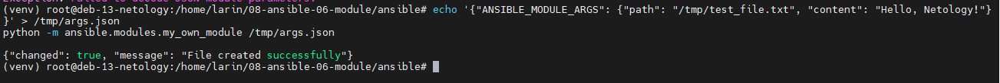
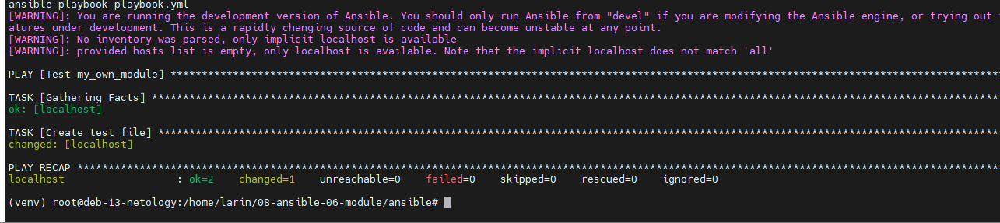
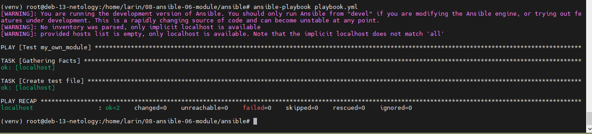
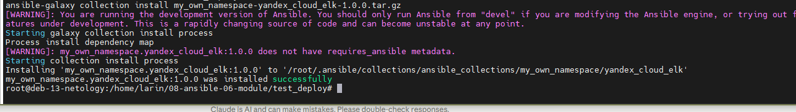
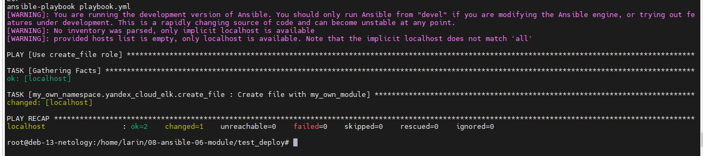

# Домашнее задание к занятию 6 «Создание собственных модулей»

## Автор: Ларин Владимир

---

## Подготовка к выполнению

Склонировал репозиторий Ansible, создал виртуальное окружение, поставил зависимости. Пришлось доставить пакет `python3.13-venv`, потому что на Debian 13 его не было из коробки.

```bash
git clone https://github.com/ansible/ansible.git
cd ansible
apt install -y python3.13-venv
python3 -m venv venv
. venv/bin/activate && . hacking/env-setup
pip install -r requirements.txt
```

---

## Основная часть

### Шаг 1-3. Создание модуля

Написал модуль `my_own_module.py`, который создаёт текстовый файл по указанному пути с нужным содержимым. Модуль проверяет, есть ли уже файл с таким же содержимым — если да, то ничего не меняет (`changed: false`), чтобы была идемпотентность.

Параметры модуля:
- `path` — путь до файла
- `content` — содержимое файла

### Шаг 4. Проверка модуля локально

Запустил модуль напрямую через Python, передав JSON с аргументами. Модуль отработал, файл создался.

```bash
echo '{"ANSIBLE_MODULE_ARGS": {"path": "/tmp/test_file.txt", "content": "Hello, Netology!"}}' > /tmp/args.json
python -m ansible.modules.my_own_module /tmp/args.json
```



### Шаг 5-6. Playbook и проверка идемпотентности

Написал простой playbook с одной задачей. Запустил его два раза подряд — первый раз `changed=1`, второй раз `changed=0`. Значит идемпотентность работает.

```yaml
---
- name: Test my_own_module
  hosts: localhost
  connection: local
  tasks:
    - name: Create test file
      my_own_module:
        path: /tmp/test_file.txt
        content: "Hello, Netology!"
```

Первый запуск — файл создаётся:



Второй запуск — ничего не изменилось:



### Шаг 7. Выход из виртуального окружения

```bash
deactivate
```

### Шаг 8. Инициализация collection

```bash
ansible-galaxy collection init my_own_namespace.yandex_cloud_elk
```

### Шаг 9. Перенос модуля в collection

Скопировал модуль в `plugins/modules/` внутри коллекции.

### Шаг 10. Создание роли

Создал роль `create_file` с defaults для параметров модуля.

`roles/create_file/defaults/main.yml`:
```yaml
---
file_path: /tmp/test_file.txt
file_content: "Hello, Netology!"
```

`roles/create_file/tasks/main.yml`:
```yaml
---
- name: Create file with my_own_module
  my_own_namespace.yandex_cloud_elk.my_own_module:
    path: "{{ file_path }}"
    content: "{{ file_content }}"
```

### Шаг 11. Playbook для роли

```yaml
---
- name: Use create_file role
  hosts: localhost
  connection: local
  roles:
    - my_own_namespace.yandex_cloud_elk.create_file
```

### Шаг 12-13. Сборка collection

Собрал архив коллекции:

```bash
cd my_own_namespace/yandex_cloud_elk
ansible-galaxy collection build
```

Получился файл `my_own_namespace-yandex_cloud_elk-1.0.0.tar.gz`.

### Шаг 14-15. Установка collection из архива

Создал отдельную директорию, перенёс туда playbook и архив, установил коллекцию:

```bash
ansible-galaxy collection install my_own_namespace-yandex_cloud_elk-1.0.0.tar.gz
```



### Шаг 16. Запуск playbook из установленной collection

Запустил playbook — роль из коллекции отработала, файл создался.

```bash
ansible-playbook playbook.yml
```



---

## Ссылки

- [Collection (исходники)](https://github.com/irbis36/FOPS-35-gitlab-hw/tree/main/homeworks/08-ansible-06-module/my_own_namespace/yandex_cloud_elk)
- [tar.gz архив](https://github.com/irbis36/FOPS-35-gitlab-hw/tree/main/homeworks/08-ansible-06-module/my_own_namespace/yandex_cloud_elk/my_own_namespace-yandex_cloud_elk-1.0.0.tar.gz)
