# Домашнее задание к занятию 11 «Teamcity»

## Автор: Ларин Владимир

---

## Подготовка к выполнению

### 1. Создание инстанса TeamCity Server

Создал виртуальную машину в Yandex Cloud через CLI с параметрами 4CPU/4RAM:

```bash
yc compute instance create \
  --name teamcity-server \
  --zone ru-central1-a \
  --cores 4 --memory 4 \
  --create-boot-disk image-family=ubuntu-2204-lts,image-folder-id=standard-images,size=15 \
  --network-interface subnet-name=default-ru-central1-a,nat-ip-version=ipv4 \
  --ssh-key ~/.ssh/id_rsa.pub
```

VM получила публичный IP `111.88.253.12`. Подключился по SSH и поставил Docker, потом запустил контейнер с TeamCity:

```bash
sudo apt update && sudo apt install -y docker.io
sudo docker run -d --name teamcity-server -p 8111:8111 jetbrains/teamcity-server
```

### 2. Первоначальная настройка TeamCity

Зашёл в браузере на `http://111.88.253.12:8111`, прошёл мастер настройки — оставил всё по умолчанию (Internal HSQLDB), принял лицензию, создал пользователя `larin`.

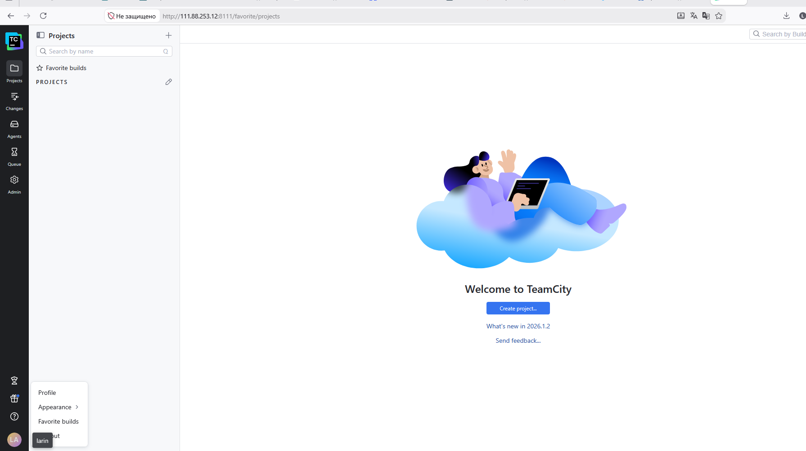

### 3. Создание инстанса TeamCity Agent

#### Проблемы с квотами Yandex Cloud

При создании второй VM столкнулся с ограничением rate limit на создание внешних IP-адресов:

```
ERROR: operation failed: rpc error: code = ResourceExhausted 
desc = RESOURCE_EXHAUSTED: Quota limit vpc.externalAddressesCreation.rate exceeded
```

Яндекс резал лимиты и не давал нормально развернуть несколько VM подряд. Пришлось создавать агента без внешнего IP (в серую):

```bash
yc compute instance create \
  --name teamcity-agent \
  --zone ru-central1-a \
  --cores 2 --memory 4 \
  --create-boot-disk image-family=ubuntu-2204-lts,image-folder-id=standard-images,size=15 \
  --network-interface subnet-name=default-ru-central1-a \
  --ssh-key ~/.ssh/id_rsa.pub
```

VM агента получила только внутренний IP — `10.128.0.13`.

#### Настройка прокси через Squid

Так как агент без внешнего IP не мог ни скачать пакеты, ни подключиться к интернету, пришлось поднять Squid на сервере TeamCity:

```bash
sudo apt install -y squid
sudo sed -i "s/http_access deny all/http_access allow all/" /etc/squid/squid.conf
sudo systemctl restart squid
```

На агенте прописал прокси для apt и Docker:

```bash
# apt proxy
sudo sh -c 'echo "Acquire::http::Proxy \"http://10.128.0.29:3128\";" > /etc/apt/apt.conf.d/99proxy'
sudo sh -c 'echo "Acquire::https::Proxy \"http://10.128.0.29:3128\";" >> /etc/apt/apt.conf.d/99proxy'

# Docker proxy
sudo mkdir -p /etc/systemd/system/docker.service.d
sudo sh -c 'cat > /etc/systemd/system/docker.service.d/proxy.conf << EOF
[Service]
Environment="HTTP_PROXY=http://10.128.0.29:3128"
Environment="HTTPS_PROXY=http://10.128.0.29:3128"
EOF'
```

После этого поставил Docker и запустил агента:

```bash
sudo docker run -d --name teamcity-agent \
  -e SERVER_URL="http://10.128.0.29:8111" \
  -e JAVA_TOOL_OPTIONS="-Dhttp.proxyHost=10.128.0.29 -Dhttp.proxyPort=3128 -Dhttps.proxyHost=10.128.0.29 -Dhttps.proxyPort=3128" \
  jetbrains/teamcity-agent
```

Ещё пришлось отдельно настроить git proxy внутри контейнера:

```bash
sudo docker exec teamcity-agent bash -c 'git config --global http.proxy http://10.128.0.29:3128'
sudo docker exec teamcity-agent bash -c 'git config --global https.proxy http://10.128.0.29:3128'
```

### 4. Авторизация агента

Зашёл в TeamCity → Agents → Unauthorized → нажал Authorize.

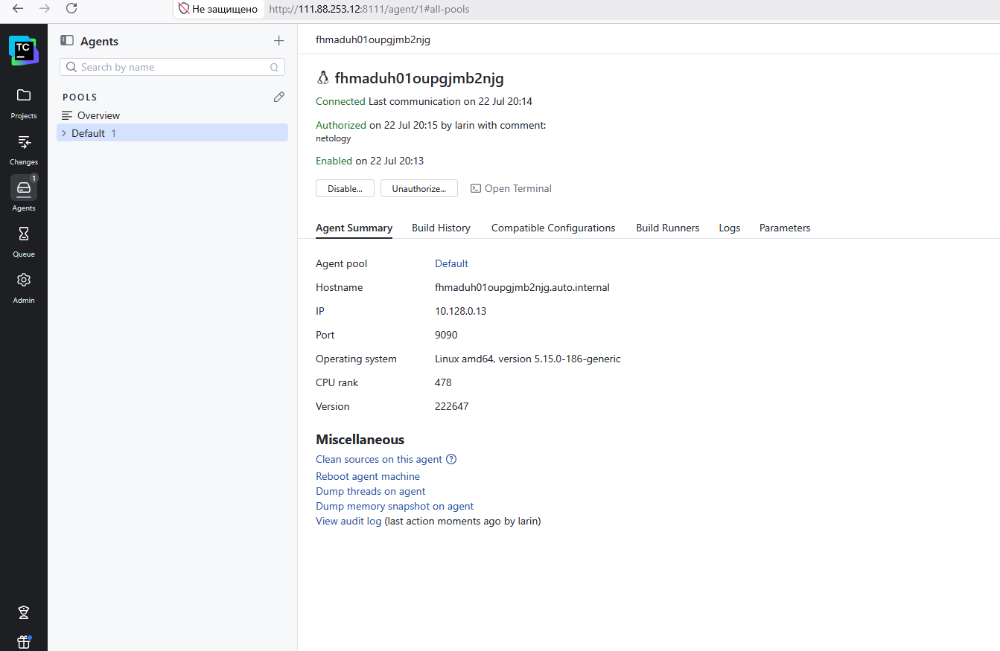

### 5. Fork репозитория

Сделал fork репозитория `https://github.com/aragastmatb/example-teamcity` в свой аккаунт:

Ссылка: [https://github.com/irbis36/example-teamcity](https://github.com/irbis36/example-teamcity)

### 6. VM с Nexus

Nexus тоже пришлось создавать без внешнего IP из-за тех же лимитов YC. Внутренний IP — `10.128.0.18`. Поставил Docker через прокси и запустил Nexus:

```bash
sudo docker run -d --name nexus -p 8081:8081 sonatype/nexus3
```

Чтобы попасть в веб-интерфейс Nexus, пришлось делать SSH-туннель через MobaXterm — настроил Local Port Forwarding: `localhost:8081 → 10.128.0.18:8081` через сервер `111.88.253.12`.

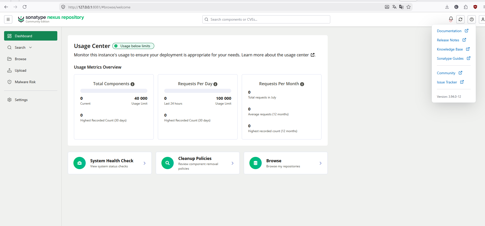

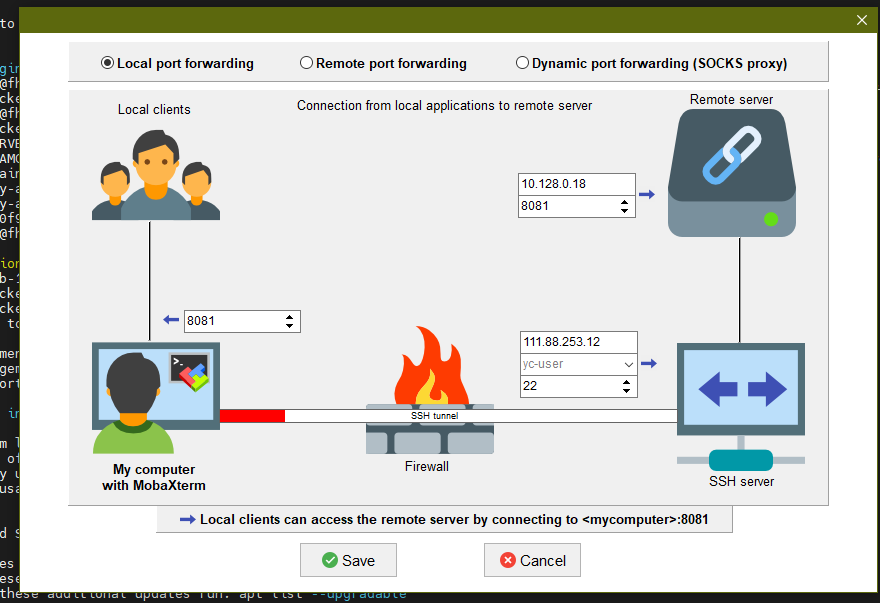

---

## Основная часть

### 1-2. Создание проекта и autodetect

Создал проект в TeamCity из URL форка. TeamCity автоматически нашёл Maven конфигурацию: `pom.xml` с goals `clean test`.

### 3. Первая успешная сборка master

Запустил первую сборку, она прошла — 5 тестов пройдено.

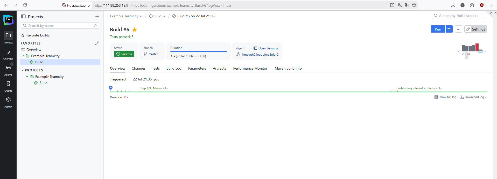

### 4. Настройка условий сборки

Настроил два шага:
- Шаг 1: Maven `clean deploy` — выполняется только если `teamcity.build.branch` equals `master`
- Шаг 2: Maven `clean test` — выполняется только если `teamcity.build.branch` does not equal `master`

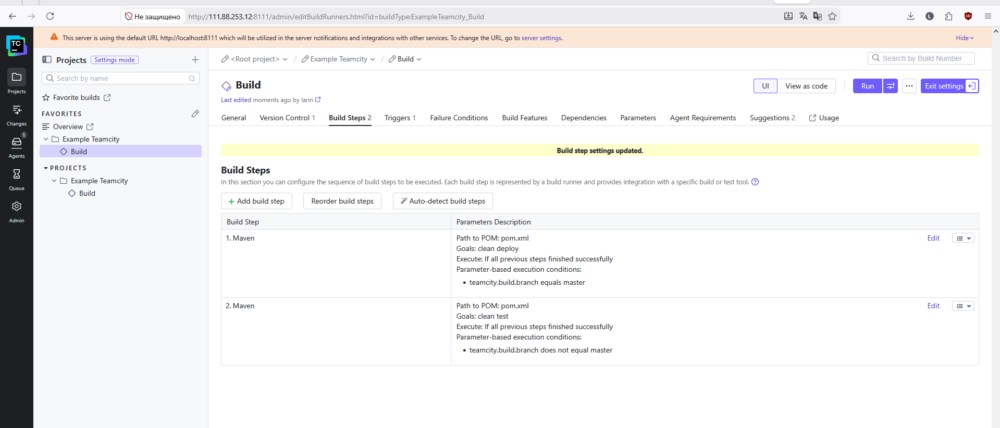

### 5. Загрузка settings.xml

Загрузил `settings.xml` в Maven Settings проекта с кредами для Nexus и настройками прокси (без прокси Maven не мог качать зависимости из central).

### 6. Изменение pom.xml

Добавил в `pom.xml` секцию `distributionManagement` с URL нексуса:

```xml
<distributionManagement>
    <repository>
        <id>nexus</id>
        <url>http://10.128.0.18:8081/repository/maven-releases/</url>
    </repository>
</distributionManagement>
```

### 7. Сборка и deploy в Nexus

Запустил сборку по master — deploy прошёл, артефакт `plaindoll-0.0.2` появился в Nexus.

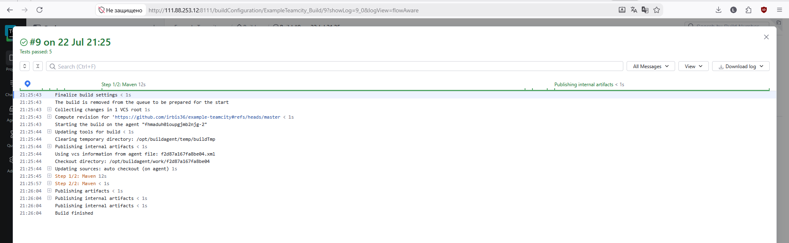

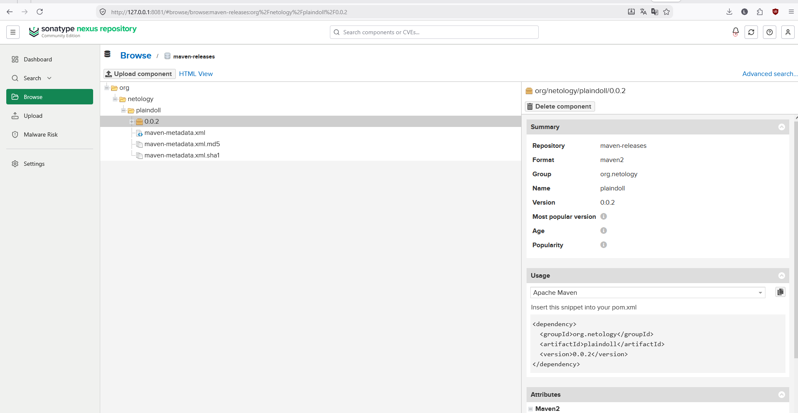

### 8. Миграция build configuration в репозиторий

Включил Versioned Settings в проекте, выбрал формат Kotlin. Пришлось настроить аутентификацию через GitHub Personal Access Token, чтобы TeamCity мог коммитить в репозиторий.

Папка `.teamcity` появилась в репозитории:

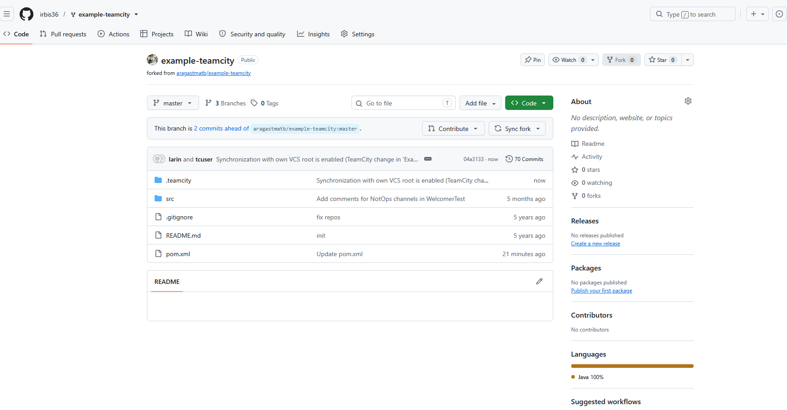

### 9-12. Ветка feature/add_reply и новый код

Создал ветку `feature/add_reply` на GitHub. Добавил новый метод в `Welcomer.java`:

```java
public String sayHunter(){
    return "Welcome, hunter!";
}
```

И тест в `WelcomerTest.java`:

```java
@Test
public void welcomerSaysHunterReply(){
    assertThat(welcomer.sayHunter(), containsString("hunter"));
}
```

### 13. Автосборка feature ветки

Сборка по ветке `feature/add_reply` запустилась автоматически по VCS trigger — 6 тестов прошло, сработал шаг `clean test` (не master).

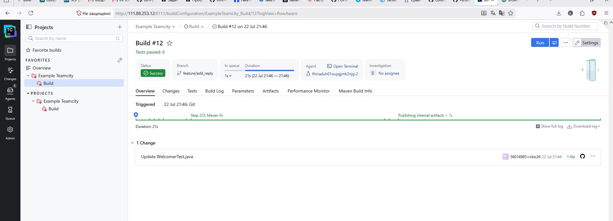

### 14. Merge в master

Сделал Pull Request из `feature/add_reply` в `master` и замержил.

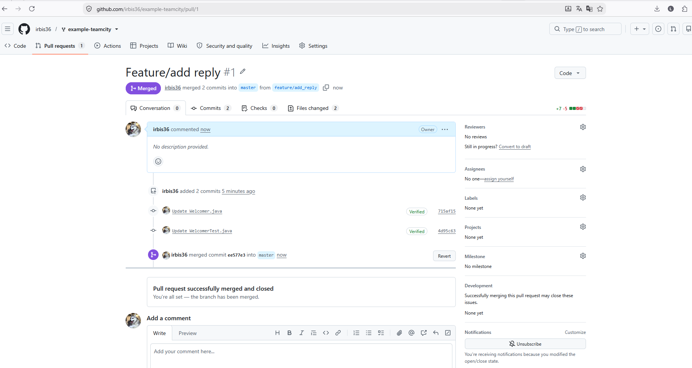

### 15. Сборка master после merge — ожидаемый fail

После merge автоматически запустилась сборка по master. Она упала, потому что версия `0.0.2` уже была в Nexus и повторный deploy не прошёл — это ожидаемое поведение.

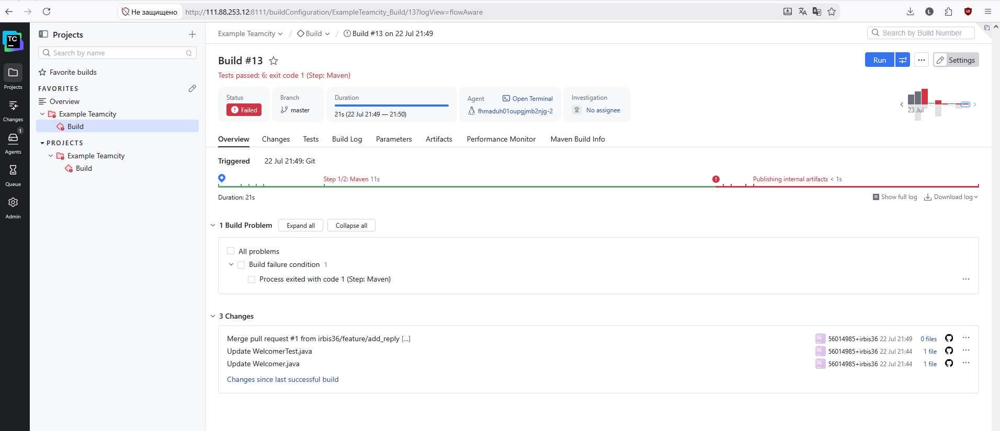

### 16-17. Настройка артефактов и повторная сборка

Добавил `target/*.jar` в Artifact Paths в General Settings. Поменял версию в `pom.xml` на `0.0.3`. Запустил сборку — всё прошло, jar-файлы собраны.

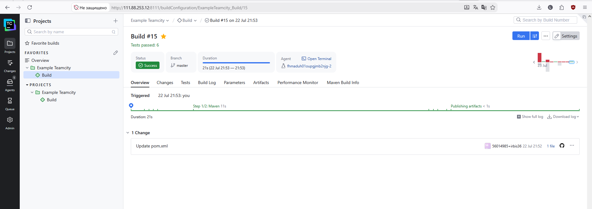

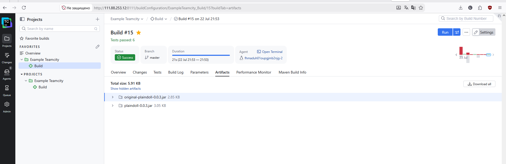

### 18. Конфигурация в репозитории

Проверил — папка `.teamcity` в репозитории содержит все настройки, включая `settings.kts` и `settings.xml` с Maven настройками.

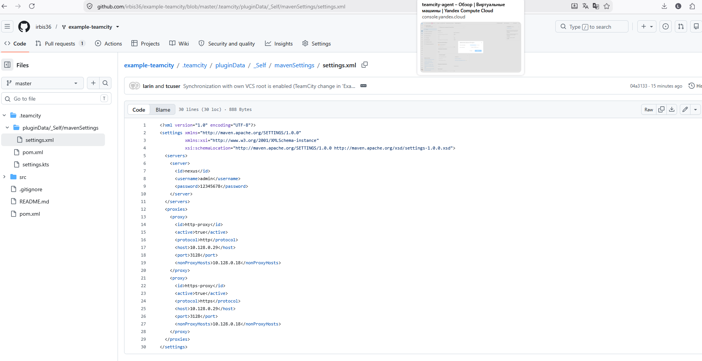

Nexus тоже содержит обе версии — `0.0.2` и `0.0.3`:

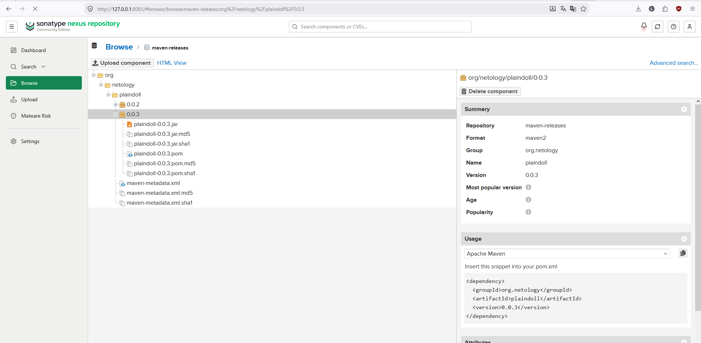

### 19. Ссылка на репозиторий

[https://github.com/irbis36/example-teamcity](https://github.com/irbis36/example-teamcity)
