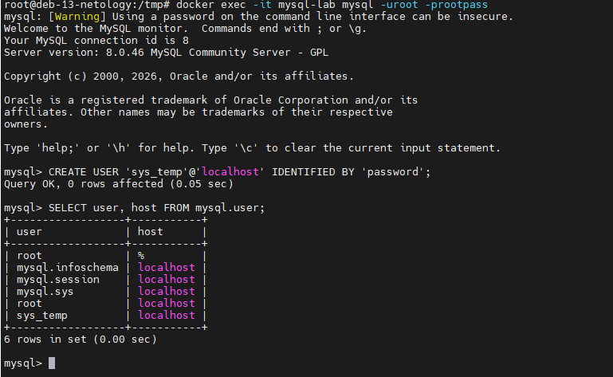
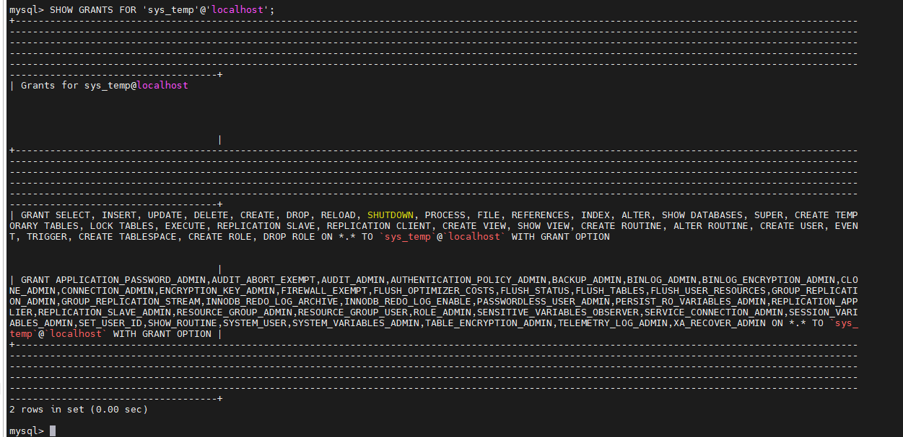
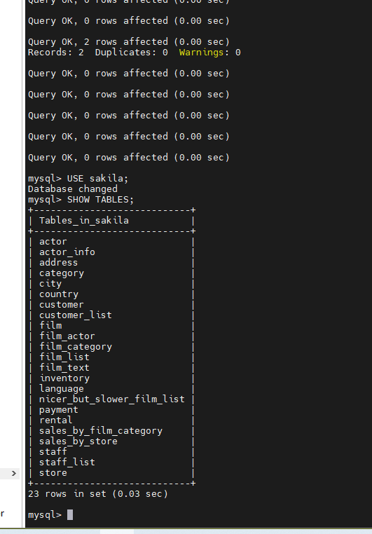
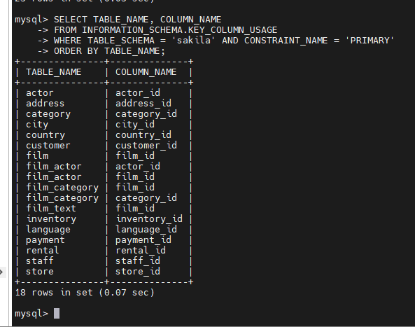
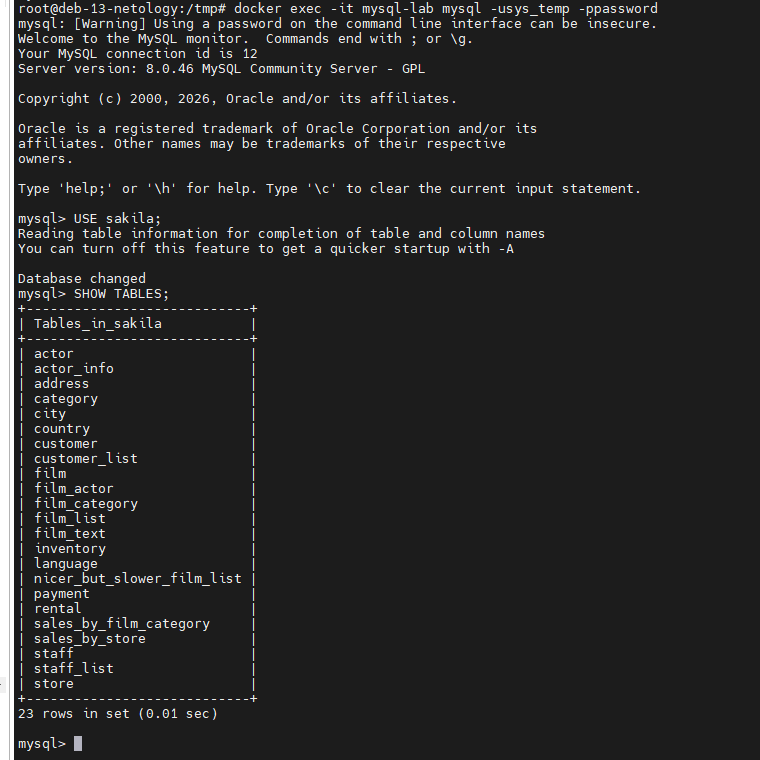

# Домашнее задание к занятию «Работа с данными (DDL/DML)»

**Автор: Ларин Владимир**

> Для удобства выполнения MySQL развёрнут в Docker-контейнере.

---

## Задание 1. Работа с пользователями и восстановление базы данных

### 1.1. Запуск MySQL 8.0 в Docker

```bash
docker run -d \
  --name mysql-lab \
  -e MYSQL_ROOT_PASSWORD=rootpass \
  -p 3306:3306 \
  mysql:8.0

# Необходимо подождать 10-15 секунд, пока MySQL стартует, иначе будет ошибка
docker exec -it mysql-lab mysql -uroot -prootpass
```

---

### 1.2. Создание учётной записи `sys_temp`

```sql
CREATE USER 'sys_temp'@'localhost' IDENTIFIED BY 'password';
```

---

### 1.3. Список пользователей в базе данных

```sql
SELECT user, host FROM mysql.user;
```

**Скриншот 1 — список пользователей (`sys_temp` присутствует в списке):**



---

### 1.4. Выдача всех прав пользователю `sys_temp`

```sql
GRANT ALL PRIVILEGES ON *.* TO 'sys_temp'@'localhost' WITH GRANT OPTION;
FLUSH PRIVILEGES;
```

---

### 1.5. Список прав пользователя `sys_temp`

```sql
SHOW GRANTS FOR 'sys_temp'@'localhost';
```

**Скриншот 2 — права пользователя `sys_temp`:**



---

### 1.6. Смена типа аутентификации и переподключение от имени `sys_temp`

```sql
-- Смена типа аутентификации
ALTER USER 'sys_temp'@'localhost' IDENTIFIED WITH mysql_native_password BY 'password';
FLUSH PRIVILEGES;

-- Выйти из сессии root
exit
```

```bash
# Переподключиться от имени sys_temp
docker exec -it mysql-lab mysql -usys_temp -ppassword
```

---

### 1.7. Скачивание и восстановление дампа базы Sakila

```bash
# Скачивание дампа на докер хост
curl -L -o /tmp/sakila-db.zip https://downloads.mysql.com/docs/sakila-db.zip
cd /tmp && unzip sakila-db.zip

# Перенос файлов в контейнер
docker cp /tmp/sakila-db/sakila-schema.sql mysql-lab:/tmp/
docker cp /tmp/sakila-db/sakila-data.sql   mysql-lab:/tmp/

# Восстановление дампа базы (внутри контейнера от root)
docker exec -it mysql-lab mysql -uroot -prootpass
```

```sql
-- Создание базы и загрузка схемы
SOURCE /tmp/sakila-schema.sql;
SOURCE /tmp/sakila-data.sql;

-- Проверка
USE sakila;
SHOW TABLES;
```

---

### 1.8. Список таблиц базы данных Sakila

```sql
USE sakila;
SHOW TABLES;
```

**Скриншот 3 — список таблиц базы `sakila`:**



---

### Все запросы — список комманд

```sql
-- 1.2 Создание пользователя
CREATE USER 'sys_temp'@'localhost' IDENTIFIED BY 'password';

-- 1.3 Список пользователей
SELECT user, host FROM mysql.user;

-- 1.4 Выдача прав
GRANT ALL PRIVILEGES ON *.* TO 'sys_temp'@'localhost' WITH GRANT OPTION;
FLUSH PRIVILEGES;

-- 1.5 Просмотр прав
SHOW GRANTS FOR 'sys_temp'@'localhost';

-- 1.6 Смена типа аутентификации
ALTER USER 'sys_temp'@'localhost' IDENTIFIED WITH mysql_native_password BY 'password';
FLUSH PRIVILEGES;

-- 1.7 Восстановление дампа
SOURCE /tmp/sakila-schema.sql;
SOURCE /tmp/sakila-data.sql;

-- 1.8 Просмотр таблиц
USE sakila;
SHOW TABLES;
```

---

## Задание 2. Таблица первичных ключей базы Sakila

| Название таблицы | Название первичного ключа |
|------------------|--------------------------|
| actor | actor_id |
| address | address_id |
| category | category_id |
| city | city_id |
| country | country_id |
| customer | customer_id |
| film | film_id |
| film_actor | actor_id, film_id |
| film_category | film_id, category_id |
| film_text | film_id |
| inventory | inventory_id |
| language | language_id |
| payment | payment_id |
| rental | rental_id |
| staff | staff_id |
| store | store_id |

> Таблицы `film_actor` и `film_category` имеют составной первичный ключ (два поля).

Получить список программно можно запросом:

```sql
SELECT
    TABLE_NAME,
    COLUMN_NAME
FROM
    INFORMATION_SCHEMA.KEY_COLUMN_USAGE
WHERE
    TABLE_SCHEMA = 'sakila'
    AND CONSTRAINT_NAME = 'PRIMARY'
ORDER BY
    TABLE_NAME;
```

**Скриншот 4 — результат запроса по первичным ключам:**



**Скриншот 5 — результат запроса по первичным ключам от пользователя sys_temp:**


