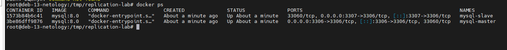
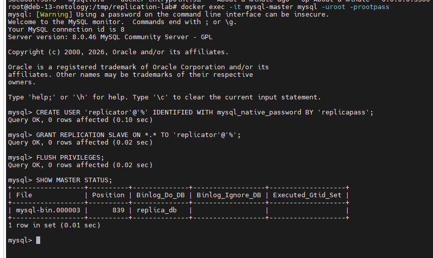
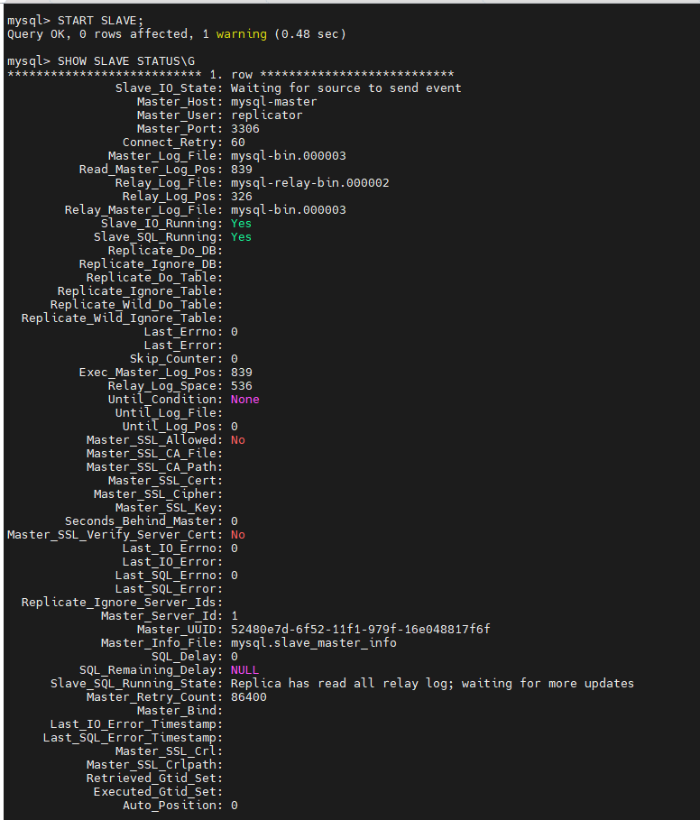
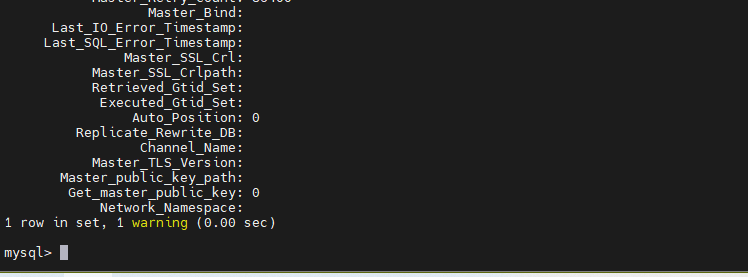
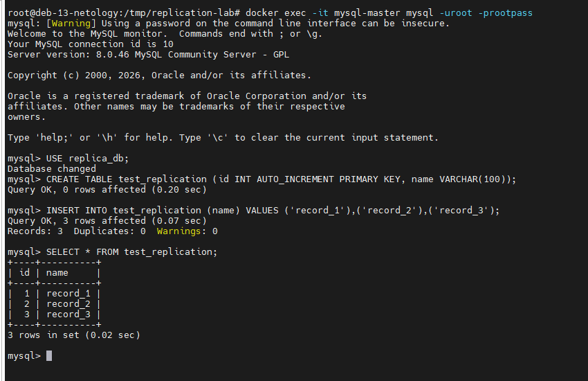
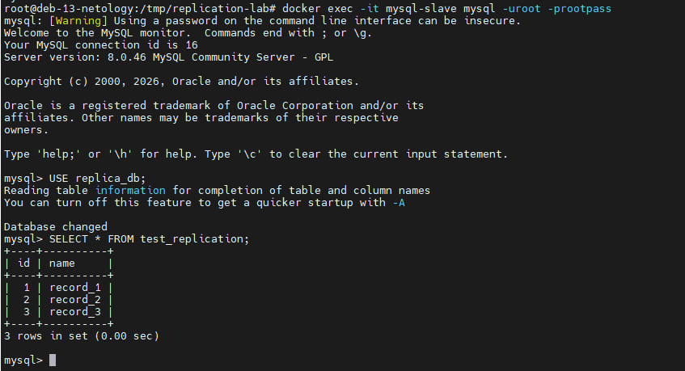

# Домашнее задание к занятию «Репликация и масштабирование. Часть 1»

**Автор: Ларин Владимир**

> Репликация развёрнута в Docker-контейнерах: два независимых инстанса MySQL 8.0 в одной сети.  
> Master доступен на порту `3306`, Slave — на порту `3307`.

---

## Задание 1. Различия режимов репликации master-slave и master-master

### Master-Slave

В схеме master-slave выделен один ведущий сервер (master), который принимает все операции записи. Slave-серверы получают изменения через бинарный лог (binlog) и воспроизводят их у себя, оставаясь доступными только для чтения.

**Преимущества:**
- простая настройка и предсказуемое поведение
- горизонтальное масштабирование чтения: нагрузку SELECT можно распределять между несколькими slave-серверами
- slave удобно использовать для резервного копирования без нагрузки на master

**Недостатки:**
- единая точка записи — master является узким местом
- при падении master требуется ручное или автоматическое переключение (failover)
- репликация асинхронная по умолчанию: slave может отставать от master

**Типичное применение:** веб-приложения с большим количеством операций чтения, системы отчётности и аналитики.

---

### Master-Master

В схеме master-master оба сервера одновременно принимают операции записи и реплицируют изменения друг другу. Каждый узел является и master, и slave одновременно.

**Преимущества:**
- нет единой точки отказа по записи: при падении одного узла второй продолжает работу
- возможность распределить запись между двумя узлами

**Недостатки:**
- риск конфликтов при одновременной записи в одни и те же данные на обоих узлах
- сложная настройка и поддержка, требуется тщательное управление `auto_increment`
- при конфликте данных разрешение происходит по правилам, которые могут привести к потере части изменений

**Типичное применение:** системы с требованием высокой доступности записи, геораспределённые приложения.

---

### Сравнительная таблица

| Критерий | Master-Slave | Master-Master |
|---|---|---|
| Запись | Только на master | На любой из узлов |
| Чтение | Master + все Slave | Оба узла |
| Сложность настройки | Низкая | Высокая |
| Риск конфликтов | Отсутствует | Присутствует |
| Отказоустойчивость | Требует failover | Выше из коробки |
| Масштабирование чтения | Хорошее | Среднее |

---

## Задание 2. Конфигурация Master-Slave репликации

### Структура проекта

```
replication-lab/
├── docker-compose.yml
├── master.cnf
└── slave.cnf
```

---

### Конфигурация Master (`master.cnf`)

```ini
[mysqld]
server-id           = 1
log_bin             = /var/log/mysql/mysql-bin.log
binlog_do_db        = replica_db
bind-address        = 0.0.0.0
```

### Конфигурация Slave (`slave.cnf`)

```ini
[mysqld]
server-id           = 2
log_bin             = /var/log/mysql/mysql-bin.log
binlog_do_db        = replica_db
bind-address        = 0.0.0.0
relay-log           = /var/log/mysql/mysql-relay-bin.log
read_only           = 1
```

---

### Запуск контейнеров

```bash
cd replication-lab
docker compose up -d

# Убедились что оба контейнера запущены
docker ps
```

**Скриншот 1 — вывод `docker ps`, оба контейнера `mysql-master` и `mysql-slave` в статусе `Up`:**



---

### Настройка Master

Подключились к master и создали пользователя для репликации:

```bash
docker exec -it mysql-master mysql -uroot -prootpass
```

```sql
-- Создали пользователя репликации
CREATE USER 'replicator'@'%' IDENTIFIED WITH mysql_native_password BY 'replicapass';
GRANT REPLICATION SLAVE ON *.* TO 'replicator'@'%';
FLUSH PRIVILEGES;

-- Посмотрели текущую позицию бинлога — значения File и Position нужны для slave
SHOW MASTER STATUS;
```

**Скриншот 2 — вывод `SHOW MASTER STATUS` на master (запомнили `File` и `Position`):**



---

### Настройка Slave

Подключились к slave и указали параметры master:

```bash
docker exec -it mysql-slave mysql -uroot -prootpass
```

```sql
-- Указали параметры подключения к master
-- Вместо mysql-master можно указать IP контейнера, но т.к. у меня всё на одном хосте, можно по имени
CHANGE MASTER TO
    MASTER_HOST='mysql-master',
    MASTER_USER='replicator',
    MASTER_PASSWORD='replicapass',
    MASTER_LOG_FILE='mysql-bin.000003',   -- значение из SHOW MASTER STATUS
    MASTER_LOG_POS=839;                   -- значение из SHOW MASTER STATUS

-- Запустили репликацию
START SLAVE;

-- Проверили состояние
SHOW SLAVE STATUS\G
```

**Скриншот 3 — вывод `SHOW SLAVE STATUS\G` на slave.  
Строки `Slave_IO_Running: Yes` и `Slave_SQL_Running: Yes` говорят об успешной репликации:**



---

### Проверили репликацию — создали данные на Master

```bash
docker exec -it mysql-master mysql -uroot -prootpass
```

```sql
USE replica_db;

-- Создали таблицу и вставили данные на master
CREATE TABLE test_replication (
    id   INT AUTO_INCREMENT PRIMARY KEY,
    name VARCHAR(100),
    created_at DATETIME DEFAULT NOW()
);

INSERT INTO test_replication (name) VALUES ('record_1'), ('record_2'), ('record_3');

SELECT * FROM test_replication;
```

**Скриншот 4 — таблица с данными на Master:**



---

### Проверили репликацию — убедились в наличии данных на Slave

```bash
docker exec -it mysql-slave mysql -uroot -prootpass
```

```sql
USE replica_db;
SELECT * FROM test_replication;
```

**Скриншот 5 — те же данные появились на Slave автоматически:**


