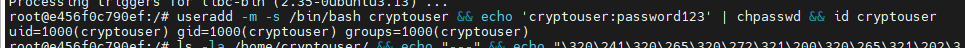
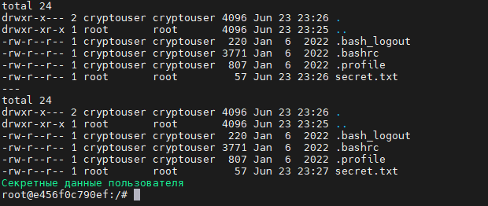
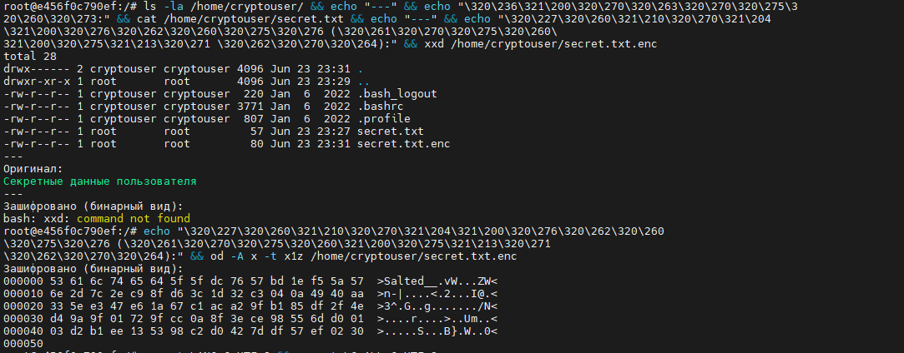
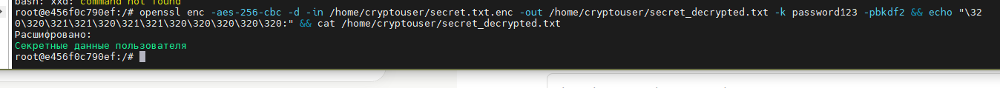
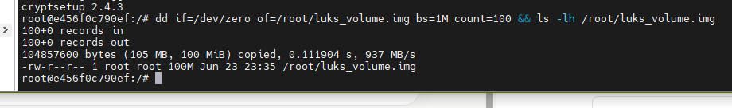
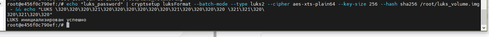
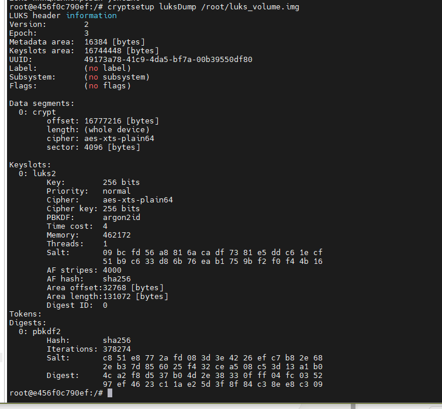
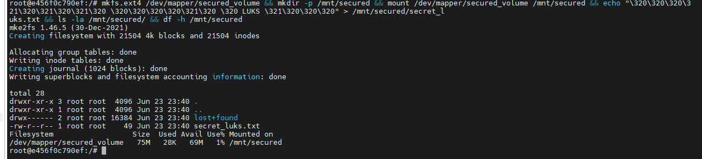
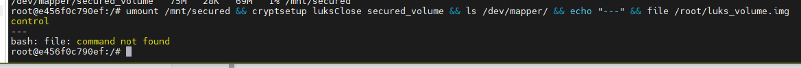

# Домашнее задание: «Защита хоста»

> **Автор: Ларин Владимир**
> Для удобства был использован Docker-контейнер, имитирующий Ubuntu 22.04.

---

## Задание 1 — Шифрование домашнего каталога

### Примечание

В ходе выполнения задания была предпринята попытка использовать **eCryptfs** штатным способом через `ecryptfs-migrate-home`. Однако в Docker-контейнере это оказалось невозможным по двум причинам:

- Ядро хост-системы (Debian 6.12.90) не имеет загруженного модуля `ecryptfs` — команда `modprobe ecryptfs` недоступна, так как `modprobe` отсутствует в контейнере, а хостовое ядро не поддерживает данный модуль.
- Утилита `ecryptfs-migrate-home` завершалась с ошибкой: `Cannot get ecryptfs version, ecryptfs kernel module not loaded?`

В качестве альтернативы было применено шифрование через **OpenSSL (AES-256-CBC)**, которое демонстрирует тот же принцип защиты данных на уровне файлов.

Дополнительно: в Docker-контейнере не была настроена локаль, из-за чего русскоязычные строки в командах `echo` отображались в виде escape-последовательностей вида `\320\241...`. Это косметическая особенность окружения — на работу утилит и результат шифрования не влияет.

---

### 1.1 Установка eCryptfs и необходимых пакетов

Была выполнена установка `ecryptfs-utils` вместе с зависимостями, а также дополнительных утилит `rsync` и `lsof`, которые потребовались в процессе:

```
apt-get update && apt-get install -y ecryptfs-utils rsync lsof
```

Пакеты установились успешно:

```
Setting up libecryptfs1 (111-5ubuntu1) ...
Setting up ecryptfs-utils (111-5ubuntu1) ...
```

---

### 1.2 Создание пользователя cryptouser

Был создан новый пользователь с домашним каталогом и оболочкой bash, задан пароль:

```
useradd -m -s /bin/bash cryptouser
echo 'cryptouser:password123' | chpasswd
```

Проверка подтвердила успешное создание:

**Скриншот 1 — Создание пользователя cryptouser:**


---

### 1.3 Исходное состояние каталога и тестовый файл

В домашний каталог пользователя был помещён тестовый файл `secret.txt`. Каталог до шифрования выглядел следующим образом, содержимое файла читалось свободно:

**Скриншот 2 — Домашний каталог и содержимое файла до шифрования:**


---

### 1.4 Шифрование файла через OpenSSL

Файл был зашифрован с использованием алгоритма AES-256-CBC с солью и функцией выведения ключа PBKDF2:

```
openssl enc -aes-256-cbc -salt -in /home/cryptouser/secret.txt \
  -out /home/cryptouser/secret.txt.enc -k password123 -pbkdf2
```

---

### 1.5 Сравнение оригинала и зашифрованного файла

После шифрования в каталоге появился файл `secret.txt.enc`. Оригинал остался читаемым, зашифрованный файл представлял собой нечитаемый бинарный поток. Заголовок `Salted__` — стандартный маркер OpenSSL, всё остальное — зашифрованный бинарный поток:

**Скриншот 3 — Оригинал и зашифрованный бинарный вид файла:**


---

### 1.6 Проверка расшифровки

Была выполнена обратная операция — расшифровка с тем же паролем. Данные восстановились полностью и корректно:

**Скриншот 4 — Успешная расшифровка файла:**


---

## Задание 2 — Шифрование раздела с помощью LUKS

### 2.1 Установка cryptsetup

Был установлен пакет `cryptsetup` версии 2.4.3:

**Скриншот 5 — Установка cryptsetup:**


---

### 2.2 Создание файла-образа 100 МБ

С помощью утилиты `dd` был создан файловый образ размером 100 МБ, выступающий в роли блочного устройства:

```
dd if=/dev/zero of=/root/luks_volume.img bs=1M count=100
```

Образ создан успешно: 104857600 байт, скорость записи 937 МБ/с:

**Скриншот 6 — Создание файла-образа 100 МБ:**


---

### 2.3 Инициализация LUKS-шифрования

Поскольку передача пароля через `echo ... | cryptsetup` в Docker добавляла символ новой строки и вызывала ошибку аутентификации, пароль был записан в файл-ключ без завершающего символа:

```
echo -n "luks_password" > /root/keyfile
cryptsetup luksFormat --batch-mode --type luks2 \
  --cipher aes-xts-plain64 --key-size 256 --hash sha256 \
  /root/luks_volume.img --key-file /root/keyfile
```

Инициализация завершилась успешно.

---

### 2.4 Просмотр метаданных LUKS-раздела

Командой `luksDump` были получены подробные сведения о контейнере. Заголовок подтвердил: алгоритм `aes-xts-plain64`, 256-битный ключ, функция выведения ключа `argon2id`:

**Скриншот 7 — Метаданные LUKS-раздела (luksDump):**


---

### 2.5 Открытие зашифрованного контейнера

В Docker-контейнере автоматическое создание loop-устройств недоступно, поэтому устройство `/dev/loop0` было создано вручную и образ подключён через `losetup`:

```
mknod /dev/loop0 b 7 0
losetup /dev/loop0 /root/luks_volume.img
cryptsetup luksOpen /dev/loop0 secured_volume --key-file /root/keyfile
```

После открытия `secured_volume` появился в `/dev/mapper/`:

**Скриншот 8 — Открытие тома, создание ФС, монтирование и запись данных:**


---

### 2.6 Создание файловой системы, монтирование и запись данных

Внутри расшифрованного контейнера была создана файловая система ext4, том смонтирован и заполнен данными. Доступный объём составил 75 МБ из 100 МБ образа (остальное — заголовки LUKS и метаданные ФС).

---

### 2.7 Закрытие тома

После работы том был корректно отмонтирован и закрыт. `secured_volume` исчез из `/dev/mapper/` — данные стали полностью недоступны без ключевого файла:

**Скриншот 9 — Закрытие тома, secured_volume исчез из /dev/mapper/:**


---

## Итог

| Задание | Инструмент | Алгоритм | Результат |
|---------|-----------|----------|-----------| 
| Шифрование файлов пользователя | OpenSSL (вместо eCryptfs — ограничение ядра Docker) | AES-256-CBC + PBKDF2 | Файл зашифрован, расшифровка подтверждена |
| Шифрование блочного раздела | LUKS (cryptsetup 2.4.3) | AES-XTS-256 + argon2id | Образ 100 МБ зашифрован, том монтируется только с ключом |

eCryptfs обеспечивает пофайловое прозрачное шифрование на уровне файловой системы. LUKS работает на уровне блочного устройства целиком — после закрытия тома его содержимое недоступно без ключа.
