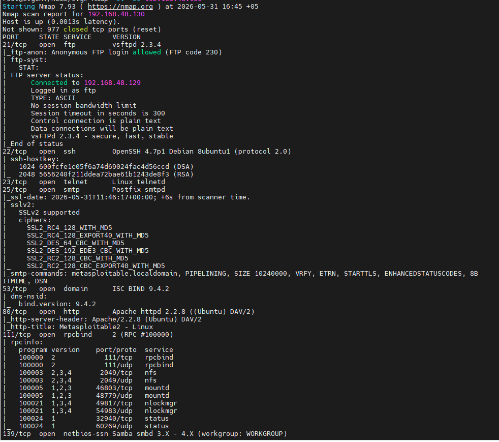
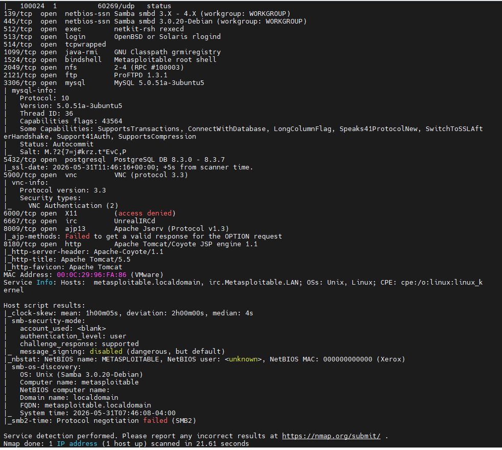
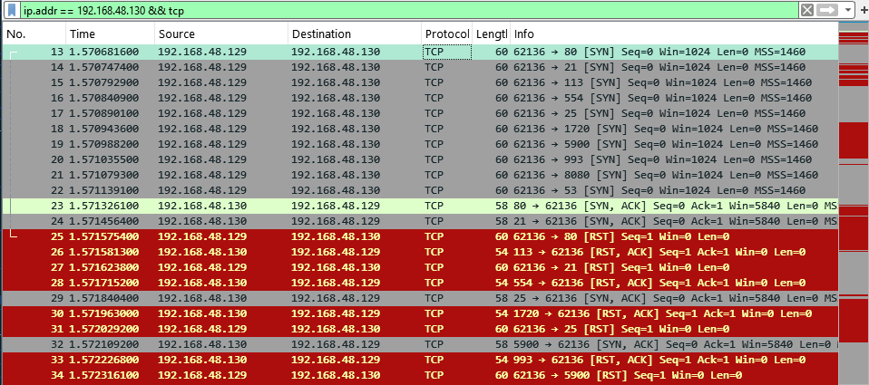
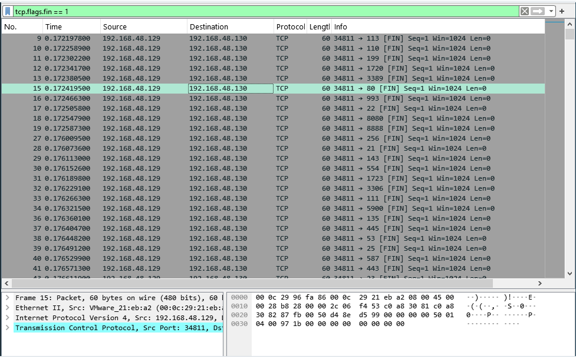
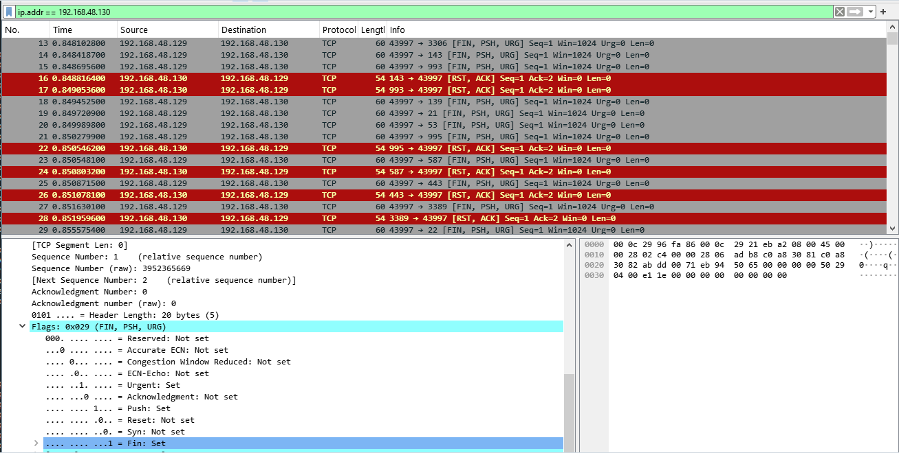
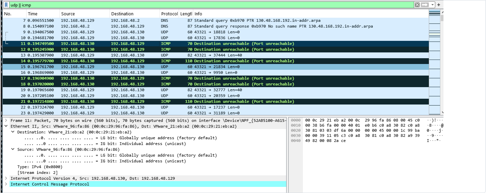

# Домашнее задание к занятию «Уязвимости и атаки на информационные системы»

**Автор: Ларин Владимир**

---

## Задание 1. Сканирование Metasploitable с помощью Nmap

> Скачали и установили виртуальную машину [Metasploitable](https://sourceforge.net/projects/metasploitable/).  
> Просканировали машину через **nmap**, уязвимости искали на [exploit-db.com](https://www.exploit-db.com/).

### Результаты сканирования





В ходе сканирования было обнаружено **23 открытых TCP-порта**.

**Запущенные сетевые службы:**

| Служба | Порт | Примечание |
|--------|------|------------|
| FTP | 21 | Анонимный доступ разрешён |
| SSH | 22 | |
| Telnet | 23 | |
| SMTP | 25 | |
| DNS | 53 | |
| HTTP | 80 | Apache |
| Samba | 139, 445 | |
| NFS | 2049 | |
| MySQL | 3306 | |
| PostgreSQL | 5432 | |
| VNC | 5900 | |
| IRC | 6667 | UnrealIRCd |
| Apache Tomcat | 8180 | |
| Root shell | 1524 | Предустановленный бэкдор |

### Обнаруженные уязвимости

Анализ версий сервисов показал большое количество устаревшего программного обеспечения. Также обнаружены анонимный FTP-доступ и предустановленный root shell на порту 1524.

Наиболее значимые уязвимости:

1. [Vsftpd 2.3.4 — Backdoor Command Execution](https://www.exploit-db.com/exploits/49757)  
   Бэкдор во FTP-сервере vsftpd 2.3.4, позволяющий выполнить произвольные команды на сервере.

2. [Samba 3.0.20 — Username Map Script Command Execution](https://www.exploit-db.com/exploits/16320)  
   Уязвимость в Samba позволяет выполнить команды на сервере через поле username без аутентификации.

3. [UnrealIRCd — Backdoor Command Execution](https://www.exploit-db.com/exploits/16922)  
   Бэкдор в IRC-сервере UnrealIRCd, дающий возможность удалённого выполнения команд.

Полученные результаты подтверждают, что Metasploitable является специально уязвимой системой, предназначенной для обучения методам поиска и эксплуатации уязвимостей.

---

## Задание 2. Режимы сканирования: SYN, FIN, Xmas, UDP

> Провели сканирование в четырёх режимах, трафик записали в **Wireshark**.

---

### SYN-сканирование (`-sS`)

На порты отправляется SYN-пакет, как при установке настоящего соединения.  
- Ответ `SYN|ACK` → порт **открыт**  
- Ответ `RST` → порт **закрыт**

```bash
nmap -sS 192.168.48.130
```

Фильтр Wireshark:
```
tcp.flags.syn == 1
```



---

### FIN-сканирование (`-sF`)

На порты отправляется TCP-пакет с флагом `FIN`.  
- Ответ `RST` → порт **закрыт**  
- Нет ответа → порт **открыт**

```bash
nmap -sF 192.168.48.130
```

Фильтр Wireshark:
```
tcp.flags.fin == 1
```



---

### Xmas-сканирование (`-sX`)

TCP-пакеты отправляются с тремя установленными флагами: `PSH`, `URG` и `FIN` — пакет «светится» как новогодняя ёлка.  
- Ответ `RST` → порт **закрыт**  
- Нет ответа → порт **открыт**

```bash
nmap -sX 192.168.48.130
```



---

### UDP-сканирование (`-sU`)

На порты отправляется UDP-пакет без данных.  
- Ответ `ICMP port unreachable` → порт **закрыт**  
- Нет ответа → порт **открыт**

```bash
nmap -sU 192.168.48.130
```

Фильтр Wireshark:
```
udp || icmp
```



---

### Сравнение режимов сканирования

| Режим | Флаг nmap | Отправляемый пакет | Открытый порт | Закрытый порт |
|-------|-----------|--------------------|---------------|---------------|
| SYN | `-sS` | `SYN` | `SYN\|ACK` | `RST` |
| FIN | `-sF` | `FIN` | Нет ответа | `RST` |
| Xmas | `-sX` | `FIN+PSH+URG` | Нет ответа | `RST` |
| UDP | `-sU` | UDP (пусто) | Нет ответа | `ICMP unreachable` |
