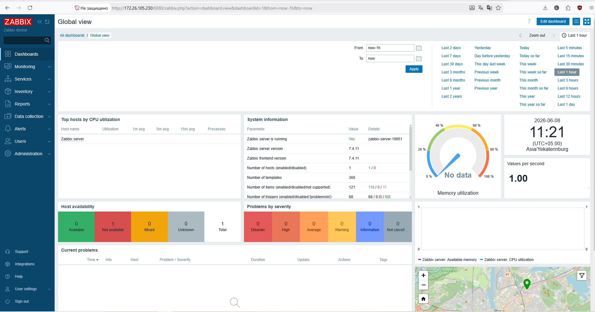
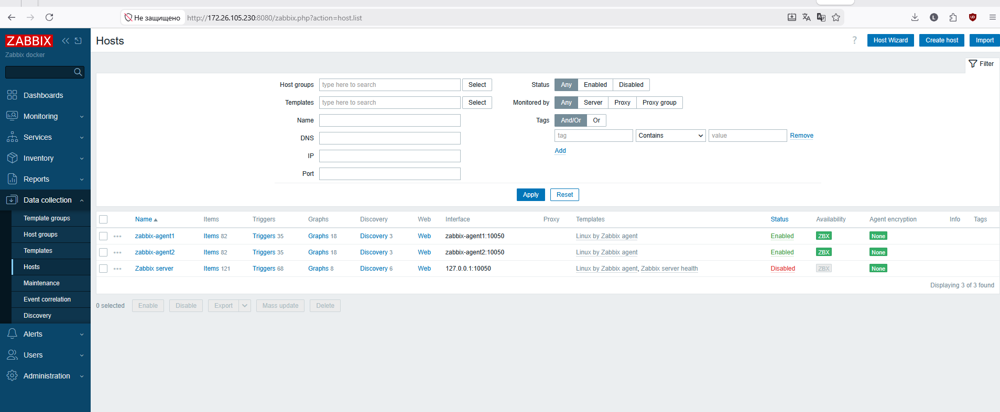
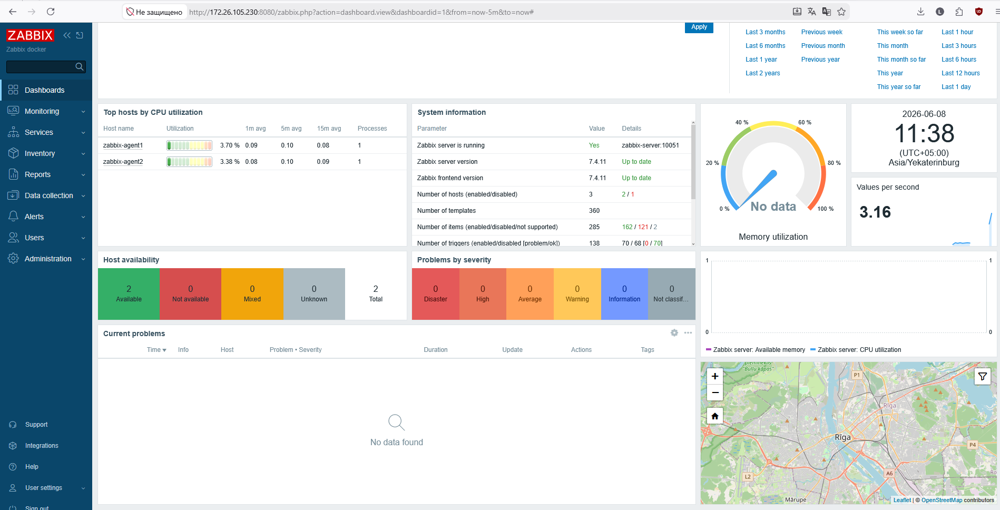

# Домашнее задание: Система мониторинга Zabbix

**Автор:** Ларин Владимир

---

## Описание

Для удобства выполнения вся система развёрнута в Docker-контейнерах.

---

## Подготовка окружения

```bash
mkdir -p /opt/zabbix
cd /opt/zabbix
```

---

## docker-compose.yml

```yaml
version: "3.8"

services:

  postgres:
    image: postgres:15
    container_name: postgres-zabbix
    restart: unless-stopped
    environment:
      TZ: Asia/Yekaterinburg
      POSTGRES_DB: zabbix
      POSTGRES_USER: zabbix
      POSTGRES_PASSWORD: zabbixpass
    volumes:
      - postgres_data:/var/lib/postgresql/data
    networks:
      - zbx

  zabbix-server:
    image: zabbix/zabbix-server-pgsql:latest
    container_name: zabbix-server
    restart: unless-stopped
    depends_on:
      - postgres
    environment:
      TZ: Asia/Yekaterinburg
      DB_SERVER_HOST: postgres
      POSTGRES_DB: zabbix
      POSTGRES_USER: zabbix
      POSTGRES_PASSWORD: zabbixpass
    ports:
      - "10051:10051"
    networks:
      - zbx

  zabbix-web:
    image: zabbix/zabbix-web-apache-pgsql:latest
    container_name: zabbix-web
    restart: unless-stopped
    depends_on:
      - zabbix-server
    environment:
      TZ: Asia/Yekaterinburg
      PHP_TZ: Asia/Yekaterinburg
      DB_SERVER_HOST: postgres
      POSTGRES_DB: zabbix
      POSTGRES_USER: zabbix
      POSTGRES_PASSWORD: zabbixpass
      ZBX_SERVER_HOST: zabbix-server
    ports:
      - "8080:8080"
    networks:
      - zbx

  zabbix-agent1:
    image: zabbix/zabbix-agent2:latest
    container_name: zabbix-agent1
    hostname: zabbix-agent1
    restart: unless-stopped
    privileged: true
    environment:
      TZ: Asia/Yekaterinburg
      ZBX_HOSTNAME: zabbix-agent1
      ZBX_SERVER_HOST: zabbix-server
    networks:
      - zbx

  zabbix-agent2:
    image: zabbix/zabbix-agent2:latest
    container_name: zabbix-agent2
    hostname: zabbix-agent2
    restart: unless-stopped
    privileged: true
    environment:
      TZ: Asia/Yekaterinburg
      ZBX_HOSTNAME: zabbix-agent2
      ZBX_SERVER_HOST: zabbix-server
    networks:
      - zbx

volumes:
  postgres_data:

networks:
  zbx:
    driver: bridge
```

---

## Проверка запущенных контейнеров

```bash
root@deb-13-netology:/opt/zabbix# docker ps
```

```
CONTAINER ID   IMAGE                                   COMMAND                  CREATED         STATUS                   PORTS                                                   NAMES
fbbfbad98182   zabbix/zabbix-web-apache-pgsql:latest   "docker-entrypoint.sh"   5 minutes ago   Up 5 minutes (healthy)   0.0.0.0:8080->8080/tcp, [::]:8080->8080/tcp, 8443/tcp   zabbix-web
02b5d442adbe   zabbix/zabbix-server-pgsql:latest       "/usr/bin/docker-ent…"   5 minutes ago   Up 5 minutes             0.0.0.0:10051->10051/tcp, [::]:10051->10051/tcp         zabbix-server
4e84ab0de94d   postgres:15                             "docker-entrypoint.s…"   5 minutes ago   Up 5 minutes             5432/tcp                                                postgres-zabbix
f67bece62c01   zabbix/zabbix-agent2:latest             "/usr/bin/docker-ent…"   5 minutes ago   Up 5 minutes             10050/tcp, 31999/tcp                                    zabbix-agent2
cb4ea3f2a51c   zabbix/zabbix-agent2:latest             "/usr/bin/docker-ent…"   5 minutes ago   Up 5 minutes             10050/tcp, 31999/tcp                                    zabbix-agent1
```

---

## Получение IP-адресов контейнеров

```bash
root@deb-13-netology:/opt/zabbix# docker inspect -f '{{range.NetworkSettings.Networks}}{{.IPAddress}}{{end}}' zabbix-agent1
172.18.0.2

root@deb-13-netology:/opt/zabbix# docker inspect -f '{{range.NetworkSettings.Networks}}{{.IPAddress}}{{end}}' zabbix-agent2
172.18.0.3

root@deb-13-netology:/opt/zabbix# docker inspect -f '{{range.NetworkSettings.Networks}}{{.IPAddress}}{{end}}' zabbix-server
172.18.0.5
```

---

## Веб-интерфейс Zabbix



---

## Проверка логов агента

```bash
root@deb-13-netology:/opt/zabbix# docker logs zabbix-agent1
```

```
2026-06-08T06:18:20Z [info]: ** Preparing Zabbix agent 2
2026-06-08T06:18:20Z [info]: ** Using 'zabbix-server' servers for passive checks
2026-06-08T06:18:20Z [info]: ** Using 'zabbix-server' servers for active checks
2026-06-08T06:18:20Z [info]: ** Preparing Zabbix agent 2 plugin configuration files
2026-06-08T06:18:20Z [info]: ** Updating /etc/zabbix/zabbix_agent2.d/plugins.d/mongodb.conf parameter 'Plugins.MongoDB.System.Path': '/usr/sbin/zabbix-agent2-plugin/mongodb'... added
2026-06-08T06:18:20Z [info]: ** Updating /etc/zabbix/zabbix_agent2.d/plugins.d/postgresql.conf parameter 'Plugins.PostgreSQL.System.Path': '/usr/sbin/zabbix-agent2-plugin/postgresql'... added
2026-06-08T06:18:20Z [info]: ** Updating /etc/zabbix/zabbix_agent2.d/plugins.d/mssql.conf parameter 'Plugins.MSSQL.System.Path': '/usr/sbin/zabbix-agent2-plugin/mssql'... added
2026-06-08T06:18:20Z [info]: ** Updating /etc/zabbix/zabbix_agent2.d/plugins.d/ember.conf parameter 'Plugins.EmberPlus.System.Path': '/usr/sbin/zabbix-agent2-plugin/ember-plus'... added
2026/06/08 11:18:24.151314 Starting Zabbix Agent 2 (7.4.11)
2026/06/08 11:18:24.190496 OpenSSL library (OpenSSL 3.5.6 7 Apr 2026) initialized
2026/06/08 11:18:24.440387 using configuration file: /etc/zabbix/zabbix_agent2.conf
...
2026/06/08 11:18:24.442348 Zabbix Agent2 hostname: [zabbix-agent1]
Press Ctrl+C to exit.
2026/06/08 11:18:26.023481 [101] cannot connect to [zabbix-server:10051]: dial tcp :0->172.18.0.5:10051: connect: connection refused
2026/06/08 11:18:26.023494 [101] active check configuration update from host [zabbix-agent1] started to fail
2026/06/08 11:18:26.024304 [101] cannot connect to [zabbix-server:10051]: dial tcp :0->172.18.0.5:10051: connect: connection refused
2026/06/08 11:18:26.024311 [101] sending of heartbeat message for [zabbix-agent1] started to fail
2026/06/08 11:19:26.027149 [101] active check configuration update from [zabbix-server:10051] is working again
2026/06/08 11:19:26.027237 [101] no active checks on server [zabbix-server:10051]: host [zabbix-agent1] not found
2026/06/08 11:19:26.027241 [101] active checks on server started to fail
2026/06/08 11:19:26.031497 [101] sending of heartbeat message to [zabbix-server:10051] is working again
```

> Начальные ошибки подключения (`connection refused`) ожидаемы — агент стартовал раньше, чем сервер успел поднять порт `10051`. Через минуту соединение восстановилось автоматически.

---

## Добавление хостов в Zabbix



---

## Итог: два агента подключены


