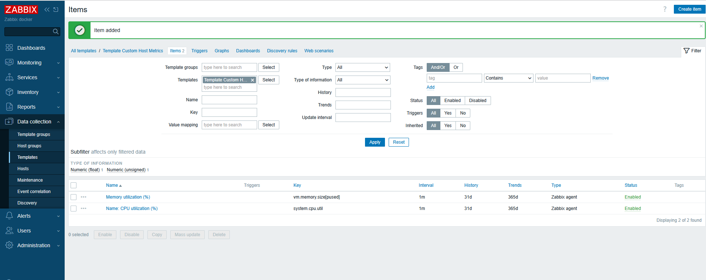
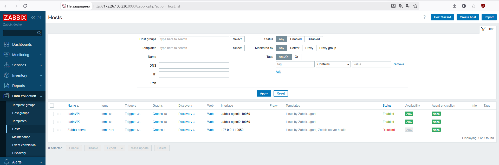
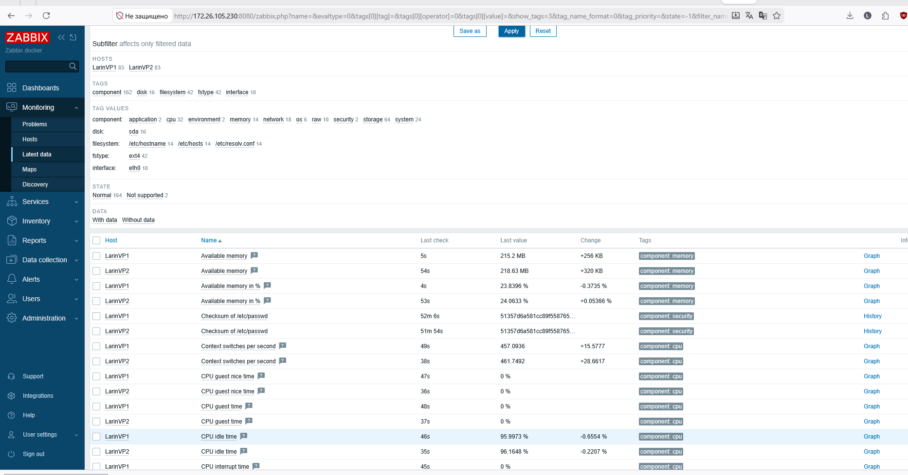
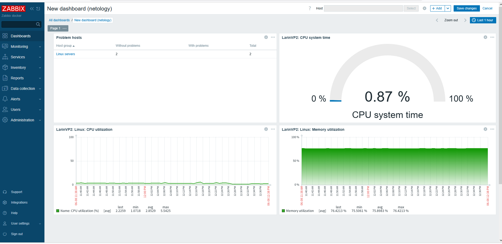

# Домашнее задание: Система мониторинга Zabbix Часть 2

**Автор:** Ларин Владимир

---

## Задание 1

Создан шаблон с элементами данных для мониторинга загрузки CPU и RAM хоста.

- Item 1: загрузка CPU в процентах (`system.cpu.util`)
- Item 2: загрузка RAM в процентах (`vm.memory.size[pused]`)

---

## Задание 2

Добавлены два хоста с именами согласно требованиям. На каждую виртуальную машину установлен Zabbix Agent, Zabbix Server добавлен в список разрешённых серверов. Хосты добавлены в раздел **Configuration > Hosts** и привязан шаблон **Linux by Zabbix Agent**.

---

## Задание 3

К обоим хостам привязаны шаблоны:
- **Linux by Zabbix Agent** — стандартный шаблон мониторинга Linux
- Кастомный шаблон из Задания 1 (мониторинг CPU и RAM) (возникает конфликт, между стандартным и текущим шаблоном, т.к. они содержат одинаковые метрики, для скрина убрал стандартный)

В разделе **Latest Data** начали поступать данные с обоих агентов.

---

## Задание 4

Создан кастомный дашборд с несколькими графиками: загрузка CPU, использование RAM, сетевой трафик.

