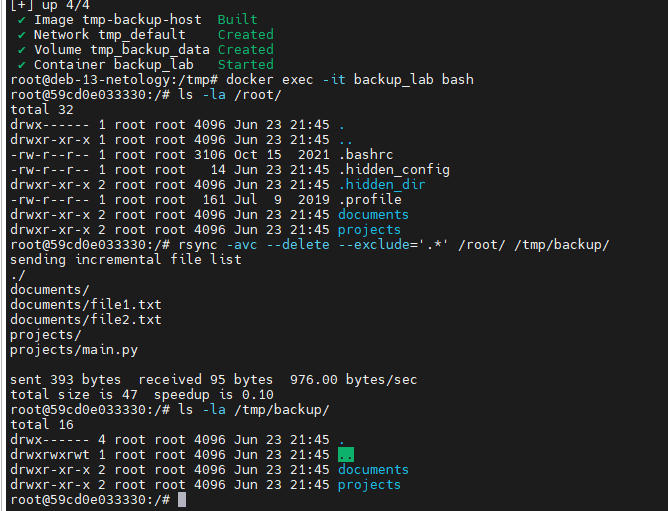
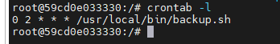
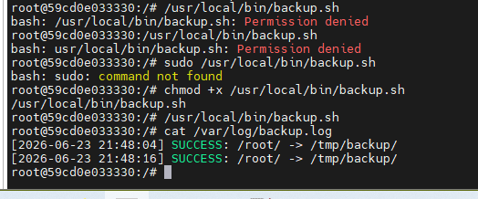

# Домашнее задание к занятию 3 «Резервное копирование»

**Автор: Ларин Владимир**

> Для удобства выполнения вся система развёрнута в Docker-контейнерах.  
> Контейнер эмулирует среду Ubuntu с установленными `rsync` и `cron`.

---

## Задание 1. Зеркальная копия домашней директории с помощью rsync

### Описание

Составлена команда `rsync`, которая:
- создаёт **зеркальную копию** домашней директории пользователя в `/tmp/backup`
- **исключает** все скрытые директории (начинающиеся с точки)
- **подсчитывает хэш-суммы** для всех файлов, игнорируя время модификации и размер (`-c`)

### Команда

```bash
rsync -avc --delete --exclude='.*' /root/ /tmp/backup/
```

### Пояснение флагов

| Флаг | Описание |
|------|----------|
| `-a` | Архивный режим: рекурсия, сохранение прав, владельца, времени |
| `-v` | Verbose — подробный вывод |
| `-c` | Подсчёт хэш-сумм для каждого файла (checksum), не ориентируясь на время и размер |
| `--delete` | Удалять в приёмнике файлы, которых нет в источнике (зеркало) |
| `--exclude='.*'` | Исключить все скрытые файлы и директории (начинающиеся с точки) |

### Результат выполнения

**Скриншот 1 — выполнение команды rsync в терминале (видны скопированные файлы и итоговая статистика):**



---

## Задание 2. Регулярное резервное копирование через rsync + cron

### Описание

Написан скрипт резервного копирования и настроена задача `cron` для его ежедневного запуска.  
Результат каждого запуска (успех или ошибка) фиксируется в системном логе через `logger`.

### Скрипт `/usr/local/bin/backup.sh`

```bash
#!/bin/bash

SOURCE="/root/"
DEST="/tmp/backup/"
LOGFILE="/var/log/backup.log"
DATE=$(date '+%Y-%m-%d %H:%M:%S')

rsync -ac --delete --exclude='.*' "$SOURCE" "$DEST"

if [ $? -eq 0 ]; then
    logger -t backup "SUCCESS: Резервная копия $SOURCE -> $DEST выполнена успешно [$DATE]"
    echo "[$DATE] SUCCESS: $SOURCE -> $DEST" >> "$LOGFILE"
else
    logger -t backup "ERROR: Ошибка при резервном копировании $SOURCE -> $DEST [$DATE]"
    echo "[$DATE] ERROR: $SOURCE -> $DEST" >> "$LOGFILE"
fi
```

### Установка скрипта

```bash
# Скопировать скрипт
cp backup.sh /usr/local/bin/backup.sh

# Выдать права на исполнение
chmod +x /usr/local/bin/backup.sh

# Создать директорию назначения
mkdir -p /tmp/backup
```

### Настройка cron

```bash
crontab -e
```

### Файл crontab

```cron
# Резервное копирование домашней директории — каждый день в 02:00
0 2 * * * /usr/local/bin/backup.sh
```

**Скриншот 2 — содержимое crontab (`crontab -l`):**



---

### Проверка работы скрипта вручную

```bash
# Запустить скрипт вручную для проверки
/usr/local/bin/backup.sh

# Проверить системный лог
grep backup /var/log/syslog | tail -5

# Или в контейнере через /var/log/backup.log
cat /var/log/backup.log
```

**Скриншот 3 — ручной запуск скрипта и запись в системном логе (видно сообщение SUCCESS/ERROR):**


