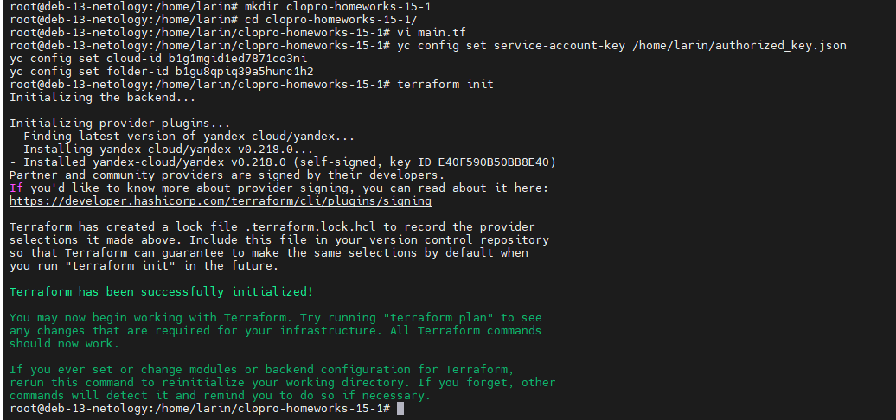
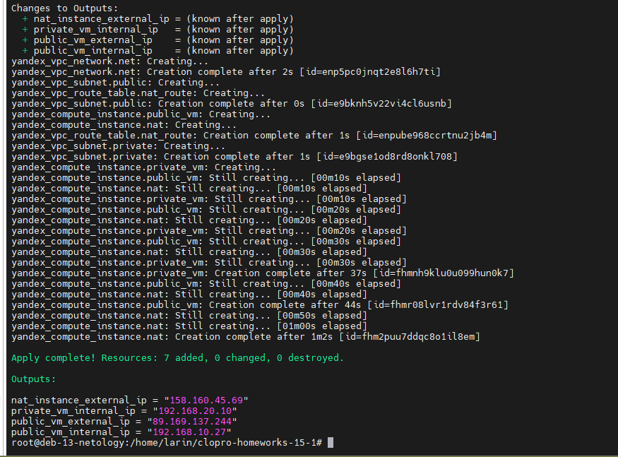
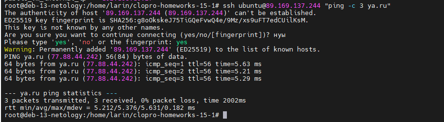
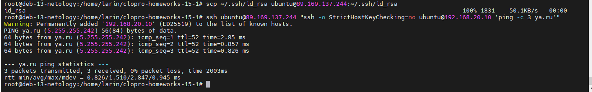

# Домашнее задание к занятию «Организация сети»

## Автор: Ларин Владимир

---

## Задание 1. Yandex Cloud

### 1. Создание VPC и подсетей

Для начала я установил провайдер Yandex Cloud через `terraform init`. Всё скачалось штатно, провайдер версии 0.218.0.



### 2. Применение конфигурации

Запустил `terraform apply -auto-approve`. Terraform создал 7 ресурсов — сеть, две подсети, таблицу маршрутизации, NAT-инстанс, публичную и приватную ВМ. Всё создалось без ошибок.

Результаты:

- NAT-инстанс внешний IP: `158.160.45.69`
- Публичная ВМ внешний IP: `89.169.137.244`
- Публичная ВМ внутренний IP: `192.168.10.27`
- Приватная ВМ внутренний IP: `192.168.20.10`



### 3. Проверка доступа в интернет с публичной ВМ

Подключился по SSH к публичной ВМ и запустил `ping ya.ru`. Пинг прошёл, пакеты не теряются — значит интернет работает.

```
PING ya.ru (77.88.44.242) 56(84) bytes of data.
64 bytes from ya.ru (77.88.44.242): icmp_seq=1 ttl=56 time=5.63 ms
64 bytes from ya.ru (77.88.44.242): icmp_seq=2 ttl=56 time=5.21 ms
64 bytes from ya.ru (77.88.44.242): icmp_seq=3 ttl=56 time=5.29 ms
--- ya.ru ping statistics ---
3 packets transmitted, 3 received, 0% packet loss, time 2002ms
```



### 4. Проверка доступа в интернет с приватной ВМ

Через публичную ВМ подключился к приватной (192.168.20.10) и тоже пинганул `ya.ru`. Тоже работает — трафик идёт через NAT-инстанс, как и задумано.

```
PING ya.ru (5.255.255.242) 56(84) bytes of data.
64 bytes from ya.ru (5.255.255.242): icmp_seq=1 ttl=52 time=2.85 ms
64 bytes from ya.ru (5.255.255.242): icmp_seq=2 ttl=52 time=0.857 ms
64 bytes from ya.ru (5.255.255.242): icmp_seq=3 ttl=52 time=0.826 ms
--- ya.ru ping statistics ---
3 packets transmitted, 3 received, 0% packet loss, time 2003ms
```



Конфигурация Terraform: [main.tf](main.tf)

---

В общем всё получилось — VPC создана, подсети настроены, NAT работает, с обеих ВМ есть доступ в интернет. Приватная ВМ ходит в интернет через NAT-инстанс благодаря таблице маршрутизации.
