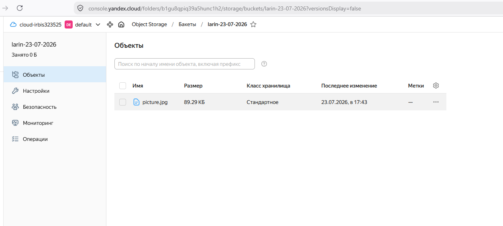

# Домашнее задание: Вычислительные мощности. Балансировщики нагрузки

## Автор: Ларин Владимир

---

## Задание 1. Yandex Cloud

### 1. Создание бакета Object Storage

Создал бакет `larin-23-07-2026` в Object Storage и загрузил туда картинку `picture.jpg`. Настроил публичный доступ на чтение, чтобы картинка была доступна из интернета.

Ссылка на картинку: `https://storage.yandexcloud.net/larin-23-07-2026/picture.jpg`

Проверил доступность через curl — получил ответ 200:

```
curl -s -o /dev/null -w "%{http_code}" https://storage.yandexcloud.net/larin-23-07-2026/picture.jpg
200
```



### 2. Создание группы ВМ с шаблоном LAMP

Создал Instance Group из 3 виртуальных машин с образом LAMP (`image_id = fd827b91d99psvq5fjit`). В `user-data` прописал скрипт, который при запуске генерирует `index.html` со ссылкой на картинку из бакета.

Настроил health check по HTTP на порт 80.

Список созданных ВМ:

```
+----------------------+---------------------------+---------------+---------+----------------+-------------+
|          ID          |           NAME            |    ZONE ID    | STATUS  |  EXTERNAL IP   | INTERNAL IP |
+----------------------+---------------------------+---------------+---------+----------------+-------------+
| fhm3pd33fi82rb9qualv | cl12abfrk03bca2r2hp8-yjiz | ru-central1-a | RUNNING | 158.160.32.196 | 10.128.0.22 |
| fhm46c7mdihdld605tt6 | cl12abfrk03bca2r2hp8-imiq | ru-central1-a | RUNNING | 158.160.37.217 | 10.128.0.29 |
| fhma622vc0lm23rkdkau | cl12abfrk03bca2r2hp8-avem | ru-central1-a | RUNNING | 158.160.50.60  | 10.128.0.11 |
+----------------------+---------------------------+---------------+---------+----------------+-------------+
```


### 3. Сетевой балансировщик

Создал Network Load Balancer `lamp-load-balancer`, который слушает на порту 80 и направляет трафик на target group из Instance Group.

IP-адрес балансировщика: `158.160.140.31`

Проверка — страница открывается, curl возвращает 200:

```
curl -s -o /dev/null -w "%{http_code}" http://158.160.140.31
200
```

### 4. Проверка отказоустойчивости

Удалил одну ВМ вручную командой `yc compute instance delete`. После удаления балансировщик продолжил работать, а Instance Group автоматически начала создавать новую ВМ на замену:

```
+----------------------+---------------------------+---------------+--------------+----------------+-------------+
|          ID          |           NAME            |    ZONE ID    |    STATUS    |  EXTERNAL IP   | INTERNAL IP |
+----------------------+---------------------------+---------------+--------------+----------------+-------------+
| fhm46c7mdihdld605tt6 | cl12abfrk03bca2r2hp8-imiq | ru-central1-a | RUNNING      | 158.160.37.217 | 10.128.0.29 |
| fhma622vc0lm23rkdkau | cl12abfrk03bca2r2hp8-avem | ru-central1-a | RUNNING      | 158.160.50.60  | 10.128.0.11 |
| fhmmd700dp008974skus | cl12abfrk03bca2r2hp8-yjiz | ru-central1-a | PROVISIONING | 93.77.183.196  | 10.128.0.33 |
+----------------------+---------------------------+---------------+--------------+----------------+-------------+
```

Видно что новая ВМ уже в статусе PROVISIONING — группа сама восстанавливает нужное количество.

Сайт при этом продолжал работать без перебоев.


---

## Код Terraform

Конфигурация Terraform: [main.tf](main.tf)

---

В целом всё получилось — бакет работает, картинка доступна, группа ВМ автоматически восстанавливается, балансировщик раздаёт трафик. При удалении одной ВМ сайт не падал, новая машина поднялась сама.
