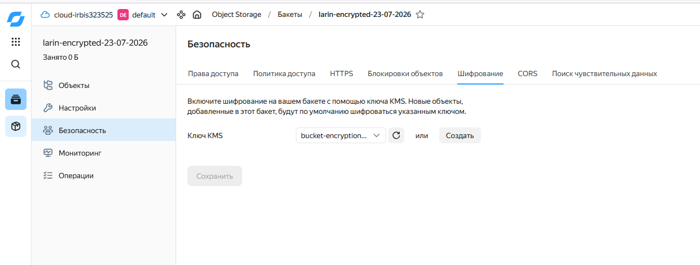
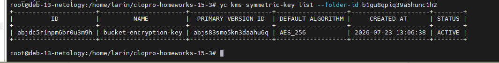
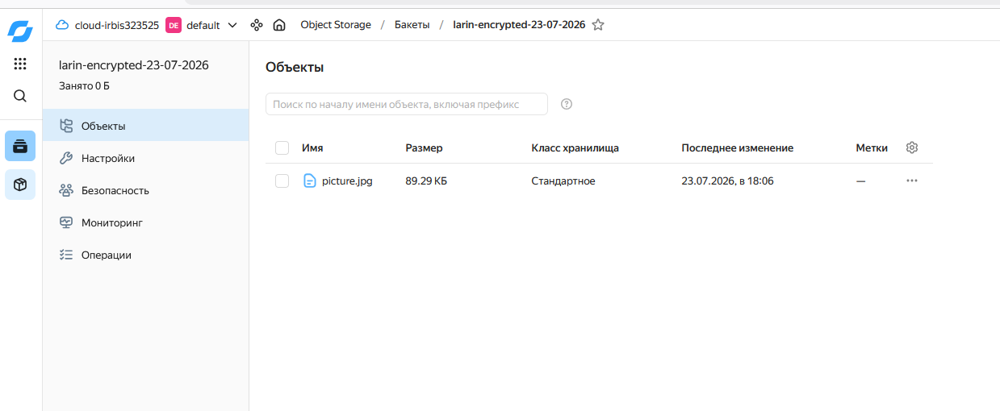

# Домашнее задание: Безопасность в облачных провайдерах

## Автор: Ларин Владимир

---

## Задание 1. Yandex Cloud — Шифрование бакета с помощью KMS

### 1. Создание ключа в KMS

Создал симметричный ключ шифрования `bucket-encryption-key` с алгоритмом AES_256 и периодом ротации 1 год.

```
+----------------------+-----------------------+----------------------+-------------------+---------------------+--------+
|          ID          |         NAME          |  PRIMARY VERSION ID  | DEFAULT ALGORITHM |     CREATED AT      | STATUS |
+----------------------+-----------------------+----------------------+-------------------+---------------------+--------+
| abjdc5r1npm6br0u3m9h | bucket-encryption-key | abjs83smo5kn3daahu6q | AES_256           | 2026-07-23 13:06:38 | ACTIVE |
+----------------------+-----------------------+----------------------+-------------------+---------------------+--------+
```

Сервисному аккаунту `terraform-sa` заранее назначил роли `editor` и `kms.admin` через консоль, чтобы он мог и создавать ключи, и шифровать/расшифровывать данные.



### 2. Шифрование бакета

Создал новый бакет `larin-encrypted-23-07-2026` с включённым server-side шифрованием через KMS-ключ. В Terraform использовал блок `server_side_encryption_configuration`, где указал созданный ключ.

Загрузил в бакет ту же картинку из предыдущего задания — она автоматически шифруется при загрузке.




---

## Код Terraform

Конфигурация Terraform: [main.tf](main.tf)


---

В общем всё заработало — ключ создался, бакет шифруется через KMS. Объекты которые загружаются в бакет теперь автоматически шифруются на стороне сервера, при скачивании расшифровка тоже происходит автоматически, для пользователя это незаметно.
