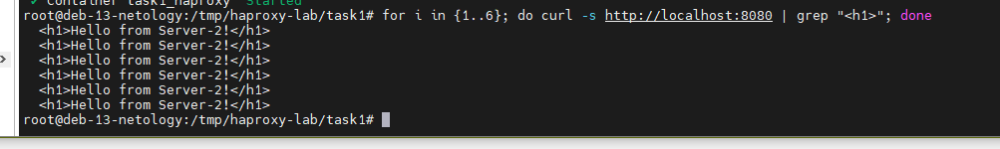
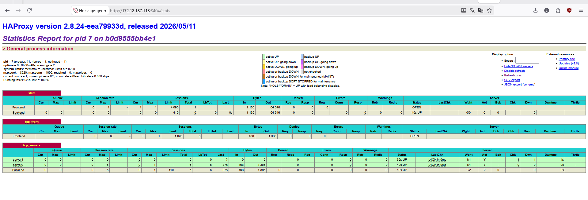
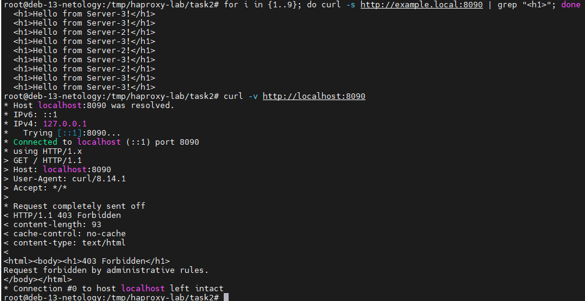
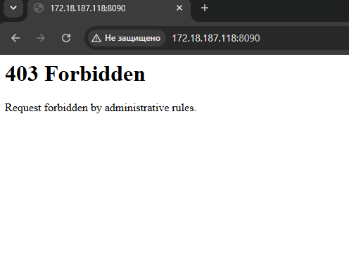
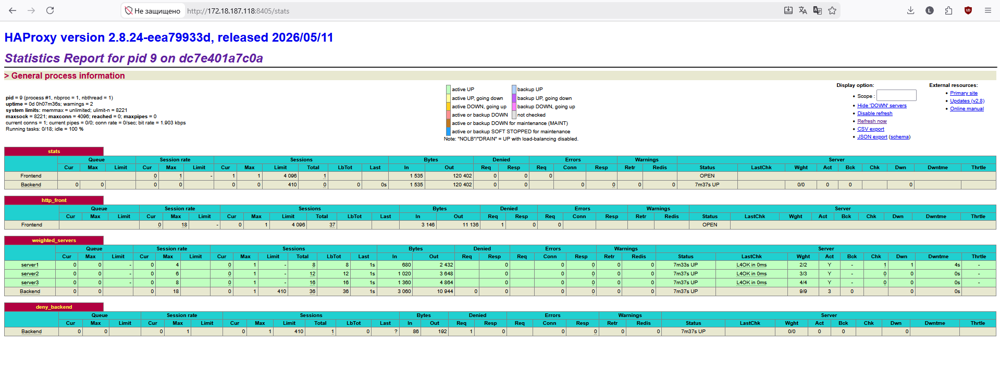

# Домашнее задание к занятию 2 «Кластеризация и балансировка нагрузки»

**Автор: Ларин Владимир**

> Для удобства выполнения вся система развёрнута в Docker-контейнерах.  
> Проверка выполняется с виртуальной машины по адресу `172.18.187.118`.

---

## Задание 1. HAProxy — балансировка Round-robin на 4 уровне

### Описание

Запущены два Python HTTP-сервера в Docker-контейнерах на разных портах (8080 и 8081).  
HAProxy настроен на балансировку входящего TCP-трафика (L4) методом Round-robin между двумя серверами.

### Запуск окружения

```bash
cd task1
docker compose up -d
```

### Конфигурационный файл `haproxy.cfg`
[task1-haproxy.cfg](haproxy-configs/task1-haproxy.cfg)

### Проверка балансировки

Команда для проверки — запросы поочерёдно уходят на Server-1 и Server-2:

```bash
for i in {1..6}; do curl -s http://172.18.187.118:8080 | grep "<h1>"; done
```

**Скриншот 1 — вывод команды curl в терминале (видно чередование Server-1 / Server-2):**



---

**Скриншот 2 — страница статистики HAProxy (`http://172.18.187.118:8404/stats`), видны оба сервера в состоянии UP:**



---

## Задание 2. HAProxy — Weighted Round Robin на 7 уровне с фильтром по домену

### Описание

Запущены три Python HTTP-сервера в Docker-контейнерах на портах 8080, 8081 и 8082.  
HAProxy настроен на L7-балансировку с весами: Server-1 — вес 2, Server-2 — вес 3, Server-3 — вес 4.  
Балансировка выполняется **только** для запросов с заголовком `Host: example.local`.  
Все остальные запросы получают ответ **403 Forbidden**.

### Запуск окружения

```bash
cd task2
docker compose up -d

# Добавить домен в /etc/hosts (один раз):
echo "172.18.187.118 example.local" | sudo tee -a /etc/hosts
```

### Конфигурационный файл `haproxy.cfg`

[task2-haproxy.cfg](haproxy-configs/task2-haproxy.cfg)

### Проверка балансировки С доменом `example.local`

```bash
for i in {1..9}; do curl -s http://example.local:8090 | grep "<h1>"; done
```

За 9 запросов сервера получат трафик пропорционально весам: Server-1 — 2 раза, Server-2 — 3 раза, Server-3 — 4 раза.

**Скриншот 3 — вывод curl с доменом `example.local` (видно распределение запросов по весам):**



---

### Проверка запроса БЕЗ домена `example.local`

```bash
curl -v http://172.18.187.118:8090
```

HAProxy должен вернуть **403 Forbidden**, так как Host-заголовок не совпадает с `example.local`.

**Скриншот 4 — ответ 403 Forbidden при обращении без домена (напрямую по IP `172.18.187.118`):**



---

**Скриншот 5 — страница статистики HAProxy (`http://172.18.187.118:8405/stats`), видны три сервера с весами 2, 3, 4:**


