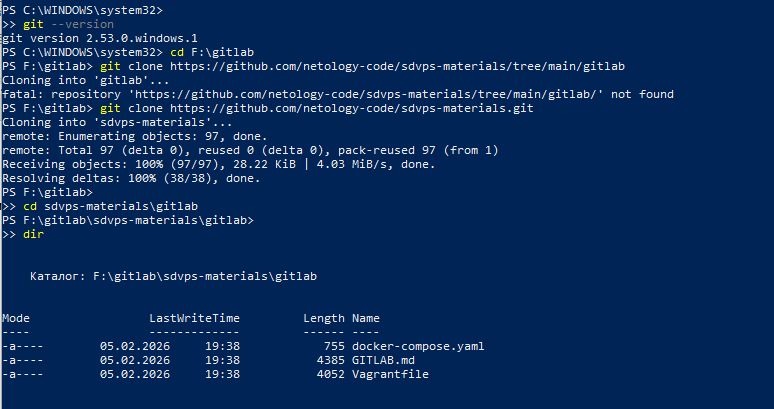
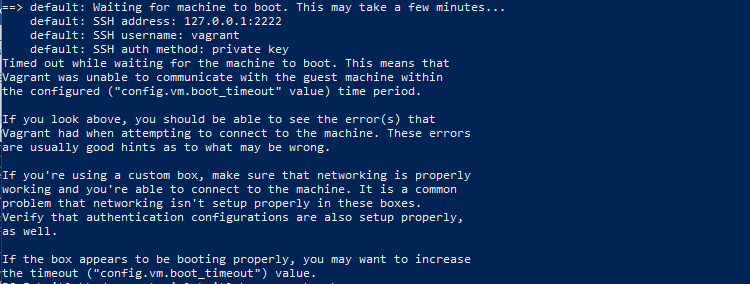
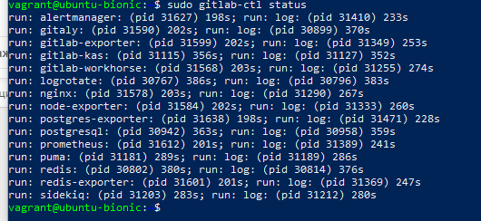
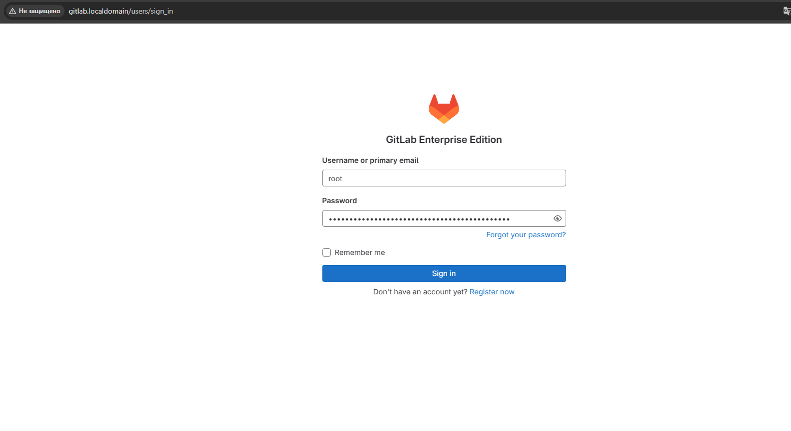
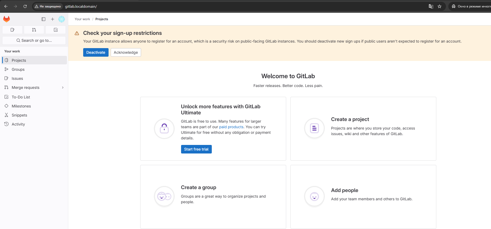
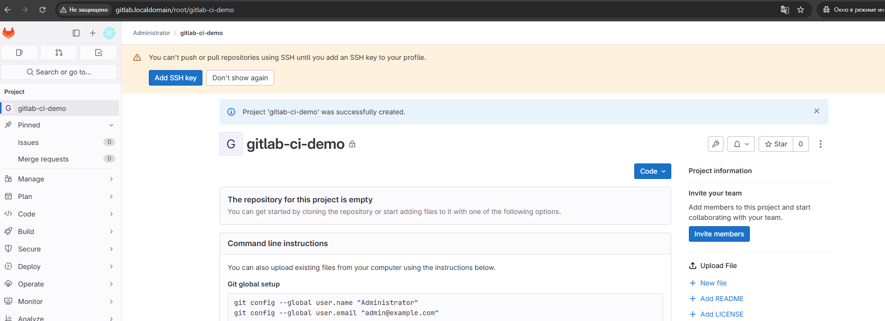
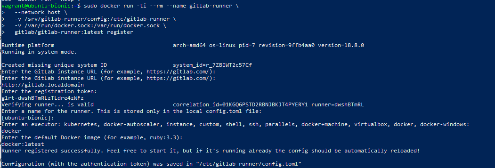
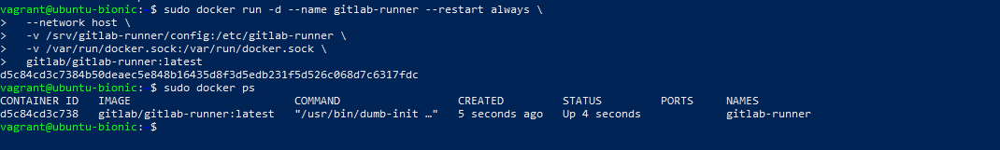
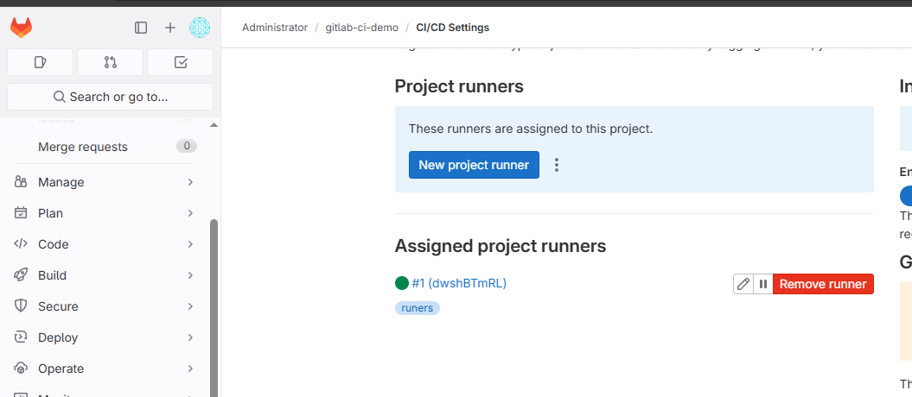
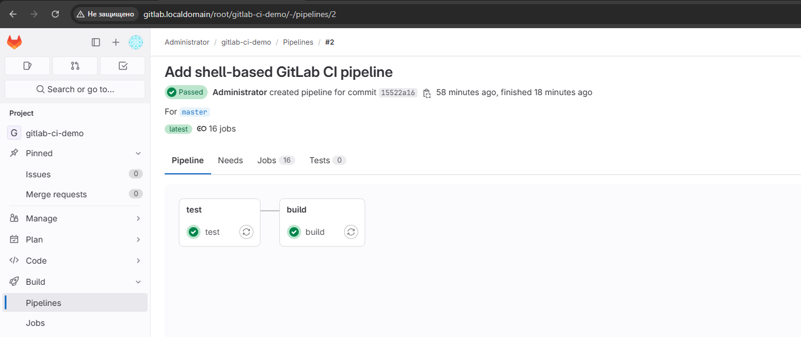

# Домашнее задание к занятию «GitLab»

**Ларин Владимир Павлович**

---

## Задание 1

### Что нужно сделать

1. Развернуть GitLab локально, используя `Vagrantfile` и инструкцию из репозитория.
2. Создать новый проект и пустой репозиторий в нём.
3. Зарегистрировать `gitlab-runner` для этого проекта и запустить его в режиме **Docker**.
4. В качестве ответа добавить скриншоты с настройками раннера в проекте.

---

### Ход выполнения

#### 1. Клонируем репозиторий



#### 2. Изменяем значение диска и запускаем Vagrant




#### 3. Ошибка по таймауту

VM физически была создана, но `vagrant up` завершился по таймауту.


Причины:
- GitLab очень тяжёлый;
- установка занимает **20–40 минут**;
- Vagrant по умолчанию ждёт SSH ~5 минут и завершает выполнение.

#### 4. Проверяем VM вручную


#### 5. Проверяем, что GitLab запущен



#### 6. Проверяем веб-интерфейс GitLab



Пароль root получен командой:

```bash
cat /etc/gitlab/initial_root_password
```
Входим в web-interface:



#### 7. Создание нового проекта в GitLab



#### 8. Регистрация gitlab-runner (Docker)








## Задание 2

### Что нужно сделать

1. Запушить репозиторий на GitLab, изменив `origin` (изучалось на занятии по Git).
2. Создать файл `.gitlab-ci.yml`, описав в нём необходимые этапы.
3. В качестве ответа добавить:
   - файл `.gitlab-ci.yml` для своего проекта или вставить его содержимое;
   - скриншоты с успешно собранными сборками.

---

### Содержимое `.gitlab-ci.yml`

```yaml
stages:
  - test
  - build

# Тестирование кода Go
test:
  stage: test
  image: golang:1.17
  script:
    - go version
    - go test .

# Сборка Docker-образа на Shell runner
build:
  stage: build
  tags:
    - runers  # тег Shell runner
  script:
    - echo "Сборка Docker образа на Shell runner"
    - docker version
    - docker build -t my-app .
```


