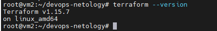
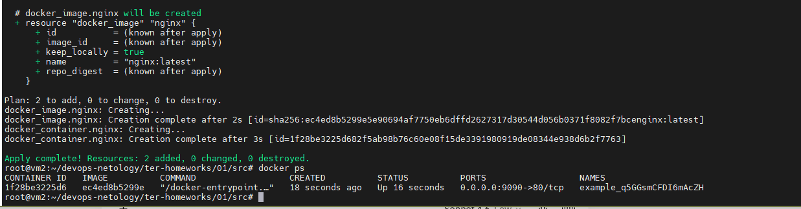
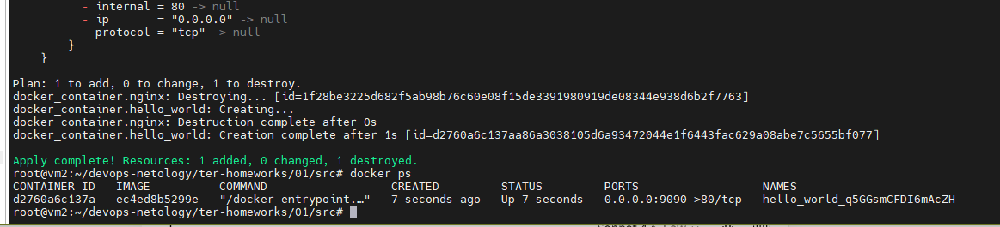

# Домашнее задание к занятию «Введение в Terraform»

## Автор: Ларин Владимир

---

## Чек-лист готовности

### 1. Установка Terraform

Установлен Terraform версии **1.15.7**.

```bash
terraform --version
```



---

## Задание 1

### 1.1. Клонирование репозитория и инициализация проекта

```bash
git clone https://github.com/netology-code/ter-homeworks.git
cd ter-homeworks/01/src
terraform init
```

При выполнении `terraform init` были установлены провайдеры:
- `hashicorp/random v3.9.0`
- `kreuzwerker/docker v4.5.0`

> **Примечание:** В файле `main.tf` было указано ограничение версии `~>1.12.0`, что не совместимо с установленной версией Terraform 1.15.7. Ограничение было изменено на `>=1.12.0` для продолжения работы.

---

### 1.2. Файл для хранения секретной информации

Изучив файл `.gitignore`:

```
# Local .terraform directories and files
**/.terraform/*
.terraform*
!.terraformrc
# .tfstate files
*.tfstate
*.tfstate.*
# own secret vars store.
personal.auto.tfvars
```

**Ответ:** Для хранения личной и секретной информации (логины, пароли, ключи, токены) предназначен файл **`personal.auto.tfvars`** — он явно добавлен в `.gitignore` и не попадёт в репозиторий.

---

### 1.3. Секретное содержимое ресурса random_password

После выполнения `terraform apply` в файле `terraform.tfstate` было найдено секретное значение:

```bash
cat terraform.tfstate | grep '"result"'
```

**Результат:**

```
"result": "q5GGsmCFDI6mAcZH"
```

> **Важно:** В выводе `terraform apply` это значение скрыто как `(sensitive value)`, однако в файле `terraform.tfstate` оно хранится **в открытом виде**. Именно поэтому файлы `.tfstate` нельзя хранить в публичных репозиториях.

---

### 1.4. Разбор ошибок terraform validate

После раскомментирования блока кода (строки 29–42 файла `main.tf`) была выполнена команда:

```bash
terraform validate
```

Были обнаружены следующие **намеренно допущенные ошибки**:

| № | Ошибка | Описание |
|---|--------|----------|
| 1 | `resource "docker_image" {` | Отсутствует имя ресурса — требуется два лейбла: тип и имя |
| 2 | `resource "docker_container" "1nginx"` | Имя ресурса начинается с цифры — запрещено; имя должно начинаться с буквы или `_` |
| 3 | `docker_image.nginx.image_id` | Ссылка на несуществующий ресурс `nginx` (у `docker_image` не было имени) |
| 4 | `random_password.random_string_FAKE.resulT` | Неверное имя ресурса (`random_string_FAKE` вместо `random_string`) и неверный атрибут (`resulT` вместо `result`) |

**Исправленный фрагмент кода:**

```hcl
resource "docker_image" "nginx" {
  name         = "nginx:latest"
  keep_locally = true
}

resource "docker_container" "nginx" {
  image = docker_image.nginx.image_id
  name  = "example_${random_password.random_string.result}"
  ports {
    internal = 80
    external = 9090
  }
}
```

После исправлений:

```
Success! The configuration is valid.
```

---

### 1.5. Выполнение кода после исправлений

```bash
terraform apply -auto-approve
docker ps
```

**Вывод `docker ps`:**

```
CONTAINER ID   IMAGE          COMMAND                  CREATED          STATUS          PORTS                  NAMES
1f28be3225d6   ec4ed8b5299e   "/docker-entrypoint.…"   18 seconds ago   Up 16 seconds   0.0.0.0:9090->80/tcp   example_q5GGsmCFDI6mAcZH
```



Контейнер успешно запущен с именем `example_q5GGsmCFDI6mAcZH`, где суффикс — это сгенерированный `random_password`.

---

### 1.6. Переименование контейнера в `hello_world`

В блоке `docker_container` было изменено имя ресурса с `nginx` на `hello_world` (имя образа `nginx:latest` осталось без изменений):

```hcl
resource "docker_container" "hello_world" {
  image = docker_image.nginx.image_id
  name  = "hello_world_${random_password.random_string.result}"
  ports {
    internal = 80
    external = 9090
  }
}
```

```bash
terraform apply -auto-approve
docker ps
```

**Вывод `docker ps`:**

```
CONTAINER ID   IMAGE          COMMAND                  CREATED         STATUS         PORTS                  NAMES
d2760a6c137a   ec4ed8b5299e   "/docker-entrypoint.…"   7 seconds ago   Up 7 seconds   0.0.0.0:9090->80/tcp   hello_world_q5GGsmCFDI6mAcZH
```



**Опасность ключа `-auto-approve`:**

Ключ `-auto-approve` пропускает интерактивное подтверждение плана перед применением изменений. Это опасно в production-среде, так как Terraform может **уничтожить и пересоздать критические ресурсы** без возможности проверить план вручную — как и произошло в данном примере: старый контейнер `nginx` был удалён и создан новый `hello_world` без предупреждения.

**Где пригождается:** в CI/CD пайплайнах (GitHub Actions, GitLab CI и т.д.), где интерактивный ввод невозможен, и план уже был проверен на предыдущем этапе (`terraform plan`).

---

### 1.7. Уничтожение ресурсов

```bash
terraform destroy -auto-approve
```

Все ресурсы уничтожены:

```
Destroy complete! Resources: 3 destroyed.
```

**Содержимое `terraform.tfstate` после destroy:**

```json
{
  "version": 4,
  "terraform_version": "1.15.7",
  "serial": 11,
  "lineage": "41f8fd5b-6951-ac6e-6cf6-7be4421f63d6",
  "outputs": {},
  "resources": [],
  "check_results": null
}
```

Массив `resources` пуст — все ресурсы удалены. Проверка `docker ps` подтверждает отсутствие запущенных контейнеров:

```
CONTAINER ID   IMAGE     COMMAND   CREATED   STATUS    PORTS     NAMES
```

---

### 1.8. Почему не был удалён образ `nginx:latest`

В файле `main.tf` у ресурса `docker_image` указан параметр:

```hcl
resource "docker_image" "nginx" {
  name         = "nginx:latest"
  keep_locally = true   # <-- этот параметр запрещает удаление образа
}
```

Параметр `keep_locally = true` указывает Terraform **не удалять образ с локального хоста** при выполнении `destroy`.

Это подтверждается документацией провайдера [kreuzwerker/docker — resource docker_image](https://library.tf/providers/kreuzwerker/docker/latest/docs/resources/image):

> `keep_locally` (Boolean) — If true, then the Docker image won't be deleted on destroy operation. If this is false, it will delete the image from the docker local storage on destroy operation.

Проверка после `terraform destroy`:

```bash
docker images | grep nginx
```

```
nginx:latest    ec4ed8b5299e    241MB
```

Образ остался локально, несмотря на уничтожение всех Terraform-ресурсов.

---

## Итог

| Задание | Статус |
|---------|--------|
| 1.1 Инициализация проекта | ✅ |
| 1.2 Файл для секретов (`personal.auto.tfvars`) | ✅ |
| 1.3 Секрет `result: q5GGsmCFDI6mAcZH` | ✅ |
| 1.4 Исправление 4 ошибок в main.tf | ✅ |
| 1.5 Запуск контейнера nginx | ✅ |
| 1.6 Переименование в `hello_world`, разбор `-auto-approve` | ✅ |
| 1.7 Уничтожение ресурсов, пустой tfstate | ✅ |
| 1.8 Объяснение `keep_locally = true` | ✅ |
