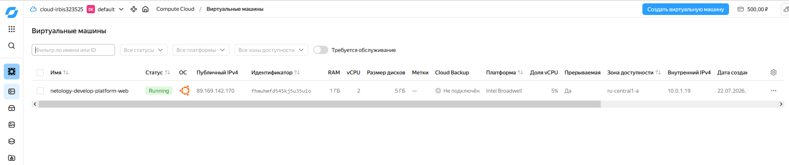
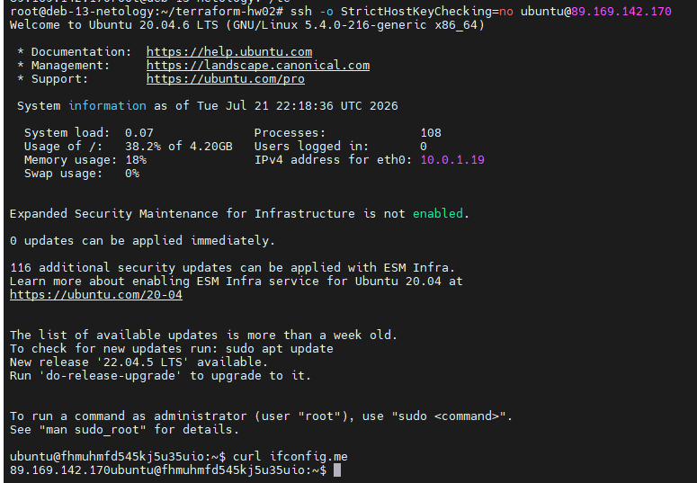

# Домашнее задание к занятию «Основы Terraform. Yandex Cloud»

### Автор: Ларин Владимир

---

## Задание 1

Развернул проект, запустил `terraform apply` и получил две ошибки.

**Ошибка 1** — `Platform "standart-v4" not found`. Написано `standart` вместо `standard`, и версия `v4` не существует. Исправил на `standard-v1`.

**Ошибка 2** — `the specified number of cores is not available on platform "standard-v1"; allowed core number: 2, 4`. Было `cores = 1`, поставил `cores = 2`.

После исправлений ВМ создалась.

**Скриншот ЛК Yandex Cloud:**



**Скриншот SSH + curl ifconfig.me:**

```
ubuntu@fhmuhmfd545kj5u35uio:~$ curl ifconfig.me
89.169.142.170
```



IP совпадает.

**Про `preemptible = true` и `core_fraction = 5`:**

`preemptible = true` — ВМ прерываемая, может быть остановлена Яндексом, но стоит дешевле. Для учёбы подходит.

`core_fraction = 5` — ВМ использует только 5% CPU. Тоже экономит деньги, для тестов хватает.

---

## Задание 2

Вынес все хардкод-значения в переменные с префиксом `vm_web_`. `terraform plan` — изменений нет.

Файлы: [variables.tf](./variables.tf), [main.tf](./main.tf)

---

## Задание 3

Создал `vms_platform.tf`, перенёс туда переменные web-ВМ. Добавил вторую ВМ `netology-develop-platform-db` в зоне `ru-central1-b` (2 ядра, 2 ГБ, core_fraction=20). Переменные db-ВМ объявил с префиксом `vm_db_`.

Файлы: [main.tf](./main.tf), [vms_platform.tf](./vms_platform.tf)

---

## Задание 4

Сделал `outputs.tf` — выводит имя, IP и fqdn обеих ВМ.

Файл: [outputs.tf](./outputs.tf)

**Вывод `terraform output`:**

```
vm_info = {
  "db" = {
    "external_ip" = "62.84.121.84"
    "fqdn" = "epdh7ck4gf5vc5sbb4c3.auto.internal"
    "instance_name" = "netology-develop-platform-db"
  }
  "web" = {
    "external_ip" = "89.169.142.170"
    "fqdn" = "fhmuhmfd545kj5u35uio.auto.internal"
    "instance_name" = "netology-develop-platform-web"
  }
}
```

---

## Задание 5

В `locals.tf` собрал имена ВМ через интерполяцию из нескольких переменных. В `main.tf` заменил `var.vm_web_name` на `local.vm_web_name`. `terraform plan` — без изменений.

Файл: [locals.tf](./locals.tf)

---

## Задание 6

Объединил `cores`, `memory`, `core_fraction` в map-переменную `vms_resources`. Метаданные вынес в отдельную переменную `metadata`. Старые переменные закомментировал. `terraform plan` — без изменений.

Файлы: [terraform.tfvars](./terraform.tfvars), [vms_platform.tf](./vms_platform.tf), [main.tf](./main.tf)

---

## Все файлы проекта

| Файл | Описание |
|------|----------|
| [providers.tf](./providers.tf) | Провайдер Yandex Cloud |
| [variables.tf](./variables.tf) | Общие переменные (cloud, folder, ssh) |
| [main.tf](./main.tf) | Ресурсы: сеть, подсети, обе ВМ |
| [vms_platform.tf](./vms_platform.tf) | Переменные ВМ + map-переменные |
| [locals.tf](./locals.tf) | Локальные переменные (имена ВМ) |
| [outputs.tf](./outputs.tf) | Вывод информации о ВМ |
| [terraform.tfvars](./terraform.tfvars) | Значения map-переменных |
