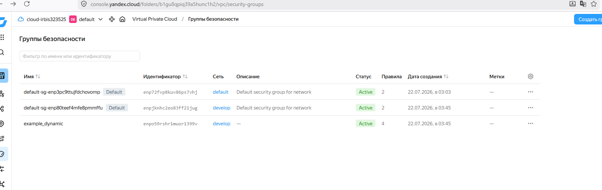
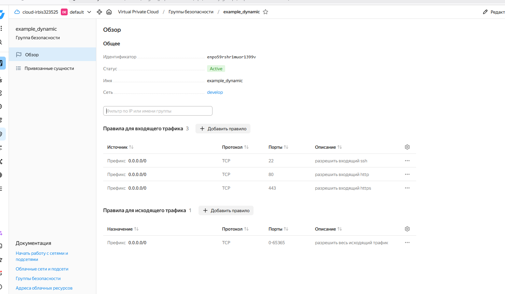
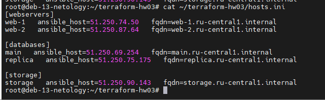

# Домашнее задание: Управляющие конструкции в коде Terraform

### Автор: Ларин Владимир

---

## Задание 1

Склонировал исходный код из репозитория `ter-homeworks/03/src`, настроил провайдер.

Т.к. у меня сервисный аккаунт, а не OAuth-токен, пришлось поменять `providers.tf` — вместо `token` используется `service_account_key_file`.

Также версия Terraform у меня 1.15.8, а в проекте стояло ограничение `~>1.12.0`. Поменял на `>=1.12.0`, иначе `terraform init` падал с ошибкой.

Выполнил `terraform init` и `terraform apply` — создались сеть, подсеть и группа безопасности.

Скриншоты группы безопасности в Yandex Cloud:





---

## Задание 2

Создал файлы для ВМ:

- [count-vm.tf](count-vm.tf) — две ВМ `web-1` и `web-2` через `count`. Нумерация с 1 сделана через `count.index + 1`. Добавил `depends_on` на `yandex_compute_instance.db`, чтобы web-ки создавались после БД. Группа безопасности назначена через `security_group_ids`.

- [for_each-vm.tf](for_each-vm.tf) — две ВМ `main` и `replica` через `for_each`. Переменная `each_vm` типа `list(object(...))` задаёт разные параметры cpu/ram/disk для каждой ВМ.

- [locals.tf](locals.tf) — SSH-ключ читается через `file("~/.ssh/id_rsa.pub")`, а образ берётся через `data "yandex_compute_image"`.

При apply сначала создались db (main, replica), потом web — значит `depends_on` сработал.

---

## Задание 3

- [disk_vm.tf](disk_vm.tf) — 3 диска по 1 ГБ через `count`, и одиночная ВМ `storage`. Дополнительные диски подключены через `dynamic "secondary_disk"` с `for_each`.

---

## Задание 4

- [ansible.tf](ansible.tf) — генерация inventory через `templatefile`. Передаются все 3 группы ВМ (webservers, databases, storage).

- [hosts.tftpl](hosts.tftpl) — шаблон для inventory. Используется `fqdn` из атрибутов ВМ.

Результат — файл `hosts.ini`:



```
[webservers]
web-1   ansible_host=51.250.74.50   fqdn=web-1.ru-central1.internal
web-2   ansible_host=51.250.87.64   fqdn=web-2.ru-central1.internal

[databases]
main   ansible_host=51.250.69.254   fqdn=main.ru-central1.internal
replica   ansible_host=51.250.75.175   fqdn=replica.ru-central1.internal

[storage]
storage   ansible_host=51.250.90.143   fqdn=storage.ru-central1.internal
```

После проверки все ресурсы удалены через `terraform destroy`.

---

## Файлы проекта

| Файл | Описание |
|------|----------|
| [providers.tf](providers.tf) | Провайдер Yandex Cloud (сервисный аккаунт) |
| [variables.tf](variables.tf) | Основные переменные |
| [main.tf](main.tf) | Сеть и подсеть |
| [security.tf](security.tf) | Группа безопасности с dynamic-блоками |
| [locals.tf](locals.tf) | SSH-ключ и data source для образа |
| [count-vm.tf](count-vm.tf) | ВМ web-1, web-2 (count) |
| [for_each-vm.tf](for_each-vm.tf) | ВМ main, replica (for_each) |
| [disk_vm.tf](disk_vm.tf) | Диски и ВМ storage |
| [ansible.tf](ansible.tf) | Генерация inventory |
| [hosts.tftpl](hosts.tftpl) | Шаблон inventory |
