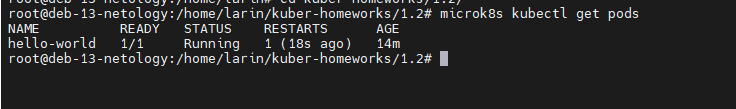
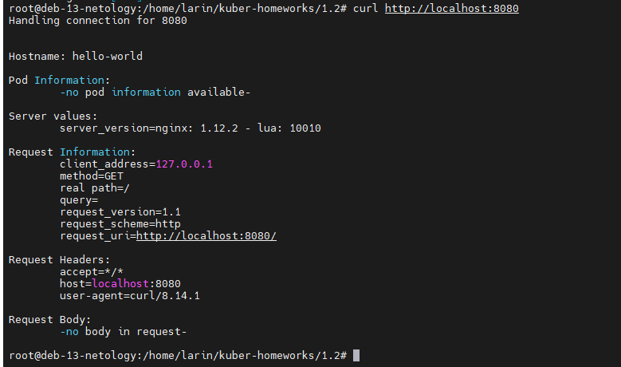
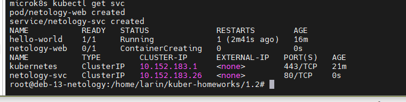
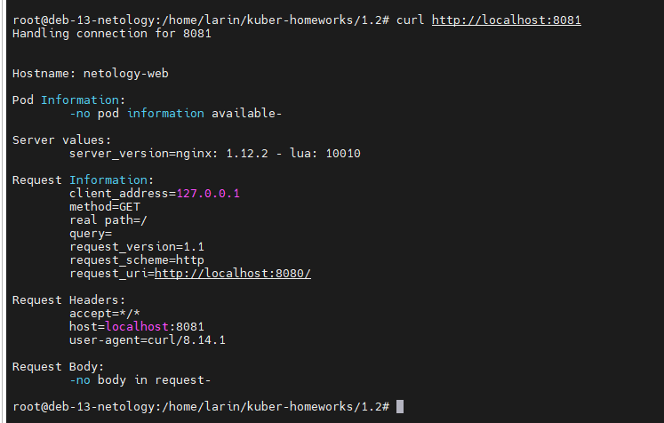
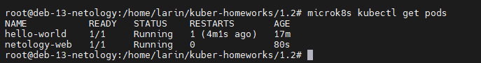

# Домашнее задание к занятию «Базовые объекты K8S»

### Автор: Ларин Владимир

---

## Задание 1. Создать Pod с именем hello-world

Сначала написал манифест для пода. Использовал образ echoserver как указано в задании.

Манифест: [hello-world.yaml](hello-world.yaml)

Применил манифест командой `microk8s kubectl apply -f hello-world.yaml`, под создался.

Потом проверил что под запустился через `microk8s kubectl get pods` — статус Running, всё ок.

Далее пробросил порт командой `microk8s kubectl port-forward pod/hello-world 8080:8080` и сделал curl на localhost:8080. Echoserver вернул информацию о запросе, значит под работает нормально.

---

## Задание 2. Создать Service и подключить его к Pod

Тут надо было создать под netology-web и сервис netology-svc который к нему подключается. Добавил label `app: netology-web` в под, чтобы сервис мог его найти через selector.

Манифесты:
- [netology-web.yaml](netology-web.yaml)
- [netology-svc.yaml](netology-svc.yaml)

В сервисе указал `port: 80` — это порт самого сервиса, а `targetPort: 8080` — порт контейнера куда сервис будет перенаправлять трафик.

Применил оба манифеста, проверил что под и сервис появились:

Потом пробросил порт уже через сервис: `microk8s kubectl port-forward svc/netology-svc 8081:80` и проверил curl-ом. В ответе видно `Hostname: netology-web` — значит сервис правильно отправляет запросы в нужный под.

Финально проверил все поды — оба Running:

