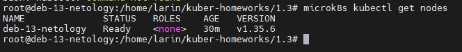
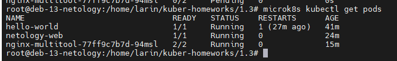
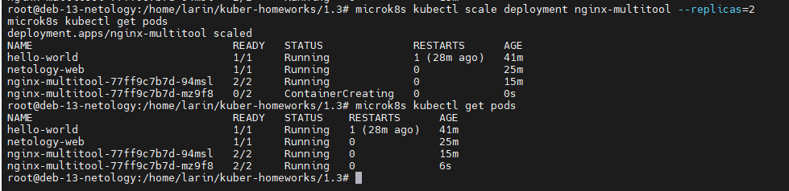
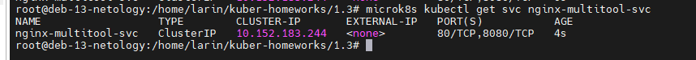
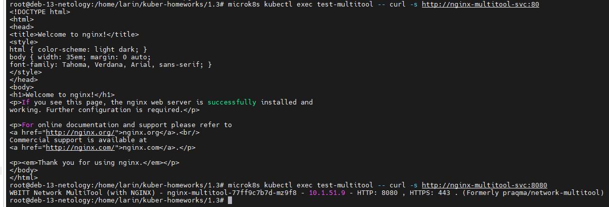
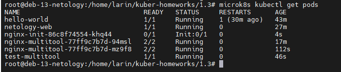
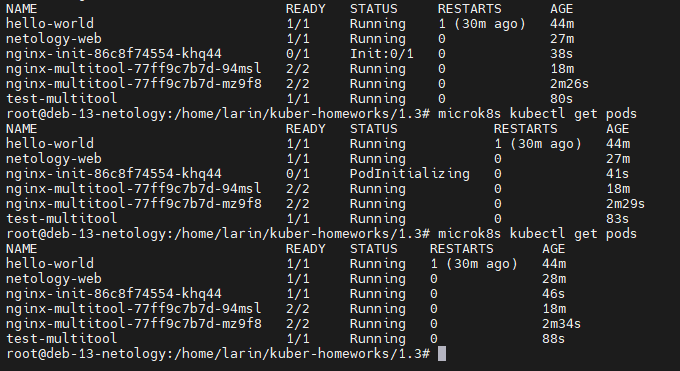

# Домашнее задание к занятию «Запуск приложений в K8S»

### Автор: Ларин Владимир

---

## Задание 1. Создать Deployment и обеспечить доступ к репликам приложения из другого Pod

### 1. Создание Deployment с nginx и multitool

Сначала я проверил что кластер вообще работает:

Потом написал манифест для Deployment с двумя контейнерами — nginx и multitool. Тут была проблема — они оба по умолчанию слушают порт 80 и из-за этого под не запускается. Чтобы это исправить, я задал переменную окружения `HTTP_PORT=8080` для multitool, и он стал слушать на порту 8080.

Файл манифеста: [deployment-task1.yaml](deployment-task1.yaml)

Применил манифест и проверил что под запустился, видно что READY 2/2, значит оба контейнера работают:

### 2-3. Масштабирование до 2 реплик

Увеличил количество реплик командой `microk8s kubectl scale deployment nginx-multitool --replicas=2`. Видно что появился второй под и тоже 2/2:

### 4. Создание Service

Создал сервис типа ClusterIP с двумя портами — 80 для nginx и 8080 для multitool.

Файл манифеста: [service-task1.yaml](service-task1.yaml)

Применил и проверил что сервис появился:

### 5. Проверка доступа из отдельного Pod

Запустил отдельный под с multitool и через curl проверил доступ к сервису. Nginx отдал стандартную страницу, а multitool ответил своим баннером — значит всё ок, доступ есть к обоим контейнерам через сервис:

---

## Задание 2. Создать Deployment и обеспечить старт основного контейнера при выполнении условий

### 1-2. Deployment с init-контейнером

Создал Deployment где nginx запускается только после того как init-контейнер на базе busybox проверит что сервис `nginx-init-svc` доступен через DNS. Init-контейнер делает nslookup в цикле и ждёт пока сервис не появится.

Файл манифеста: [deployment-task2.yaml](deployment-task2.yaml)

Пока сервис не создан, под висит в статусе `Init:0/1` — nginx не запускается:

### 3-4. Создание Service и запуск пода

Создал сервис для nginx-init.

Файл манифеста: [service-task2.yaml](service-task2.yaml)

После создания сервиса init-контейнер смог сделать nslookup, завершился, и основной контейнер nginx запустился. Видно как статус поменялся `Init:0/1` → `PodInitializing` → `Running`:

