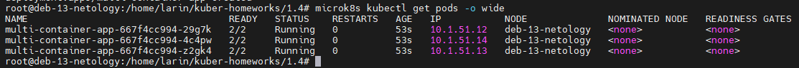
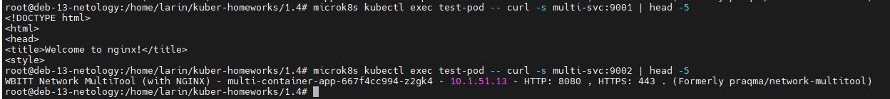
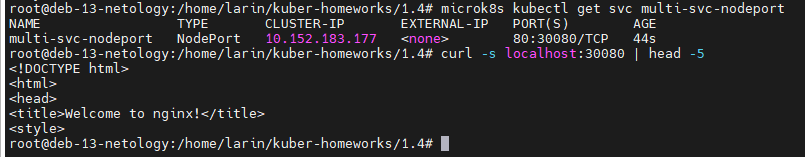
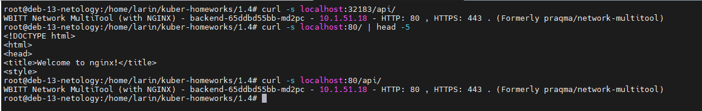

# Домашнее задание к занятию «Сетевое взаимодействие в Kubernetes»

## Автор: Ларин Владимир

---

## Задание 1: Настройка Service (ClusterIP и NodePort)

### Что нужно было сделать

Развернуть приложение из двух контейнеров (nginx и multitool) с 3 репликами, настроить доступ через ClusterIP и NodePort.

### Манифесты

- [deployment-multi-container.yaml](deployment-multi-container.yaml)
- [service-clusterip.yaml](service-clusterip.yaml)
- [service-nodeport.yaml](service-nodeport.yaml)

### Выполнение

1. Создал Deployment с двумя контейнерами — nginx на порту 80 и multitool на порту 8080, указал 3 реплики. Применил манифест, все поды поднялись.

2. Создал Service типа ClusterIP с именем `multi-svc`, который пробрасывает порт 9001 на nginx и 9002 на multitool. Запустил тестовый под и проверил доступ через curl — оба сервиса отвечают нормально.

3. Создал Service типа NodePort с именем `multi-svc-nodeport`, который открывает nginx на порту 30080. Проверил доступ с хоста через curl — nginx отвечает.

---

## Задание 2: Настройка Ingress

### Что нужно было сделать

Развернуть два приложения (frontend и backend), создать для них Service и настроить Ingress для маршрутизации по путям `/` и `/api`.

### Манифесты

- [deployment-frontend.yaml](deployment-frontend.yaml)
- [deployment-backend.yaml](deployment-backend.yaml)
- [service-frontend.yaml](service-frontend.yaml)
- [service-backend.yaml](service-backend.yaml)
- [ingress.yaml](ingress.yaml)
- [strip-api-middleware.yaml](strip-api-middleware.yaml)

### Выполнение

1. Создал два Deployment — frontend на базе nginx и backend на базе multitool. Для каждого создал свой Service.

2. Включил Ingress-контроллер командой `microk8s enable ingress`. В моём случае установился Traefik.

3. Создал Ingress-ресурс, который направляет `/` на frontend-svc, а `/api` на backend-svc. Так как Traefik передаёт путь целиком, пришлось дополнительно создать Middleware для stripPrefix, чтобы `/api` не уходил в backend как есть (иначе получаем 404).

4. Проверил доступ — по `/` отвечает nginx (frontend), по `/api/` отвечает multitool (backend).

---

