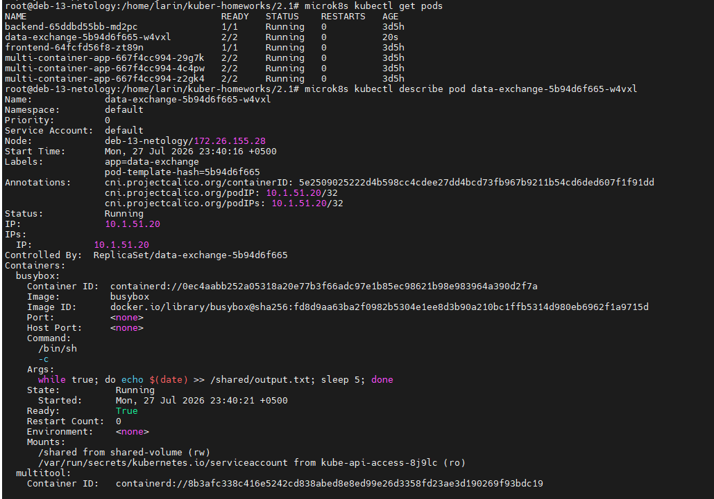
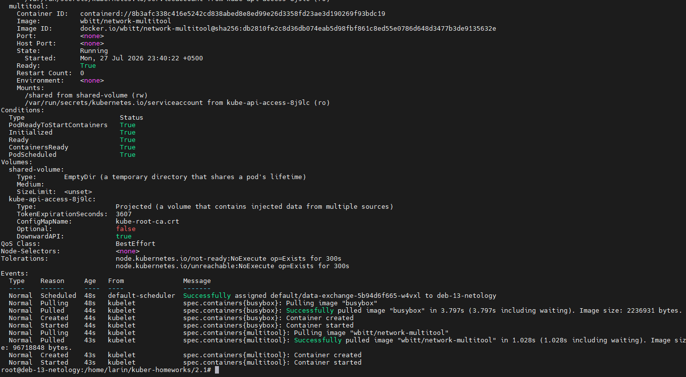
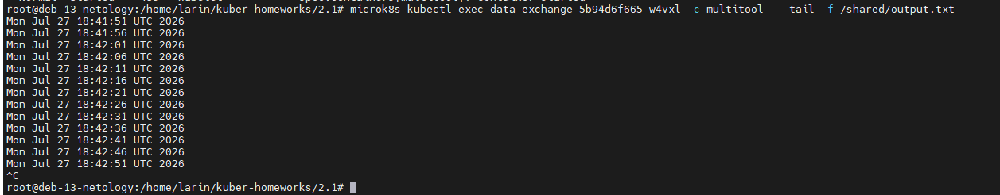
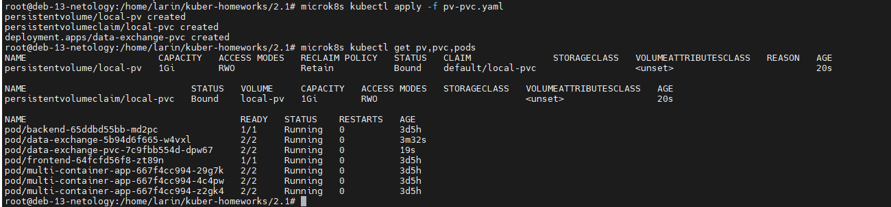
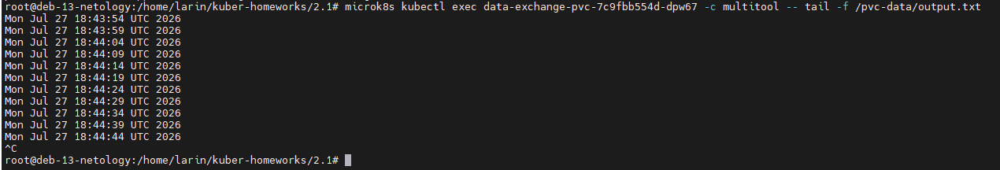
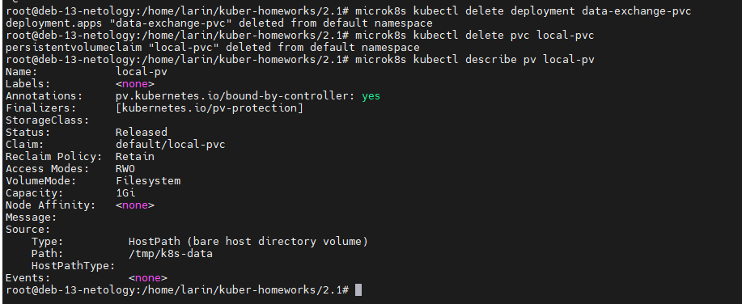
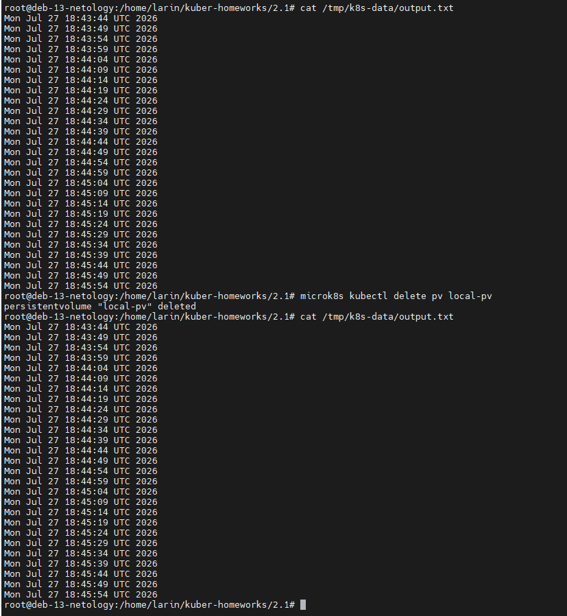
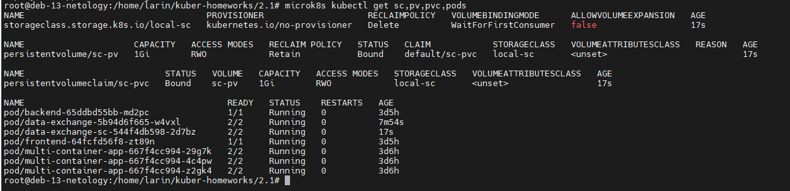
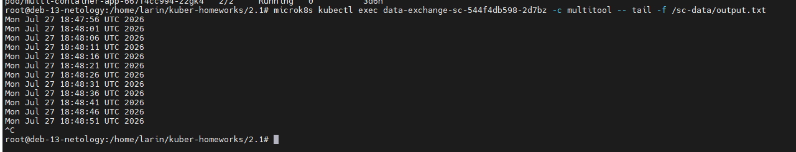

# Домашнее задание к занятию «Хранение в K8s»

## Автор: Ларин Владимир

---

## Задание 1. Volume: обмен данными между контейнерами в поде

Создал Deployment с двумя контейнерами — busybox и multitool. Между ними общий том типа `emptyDir`, который монтируется в `/shared`. Busybox в цикле каждые 5 секунд пишет дату в файл `output.txt`, а multitool может его читать из той же директории.

Манифест: [containers-data-exchange.yaml](containers-data-exchange.yaml)

Применил манифест, под запустился, оба контейнера Running. Вот `describe` пода — видно что volume `shared-volume` имеет тип EmptyDir и оба контейнера его монтируют в `/shared`:

Проверяю чтение файла из контейнера multitool с помощью `tail -f`. Видно что данные появляются каждые 5 секунд — значит busybox пишет, а multitool читает, обмен работает:

---

## Задание 2. PV, PVC

Создал PersistentVolume на 1Gi с hostPath `/tmp/k8s-data`, PersistentVolumeClaim и Deployment с busybox и multitool которые используют этот PVC.

Манифест: [pv-pvc.yaml](pv-pvc.yaml)

Применил манифест, PV и PVC оба в статусе Bound, под поднялся 2/2:

Multitool читает файл через `tail -f`, данные обновляются каждые 5 секунд:

Удалил Deployment и PVC. Сделал `describe pv` — PV перешёл в статус `Released`:

PV стал Released потому что PVC к которому он был привязан удалили. Но сам PV не удалился, т.к. у него стоит `persistentVolumeReclaimPolicy: Retain`. Эта политика говорит что данные надо сохранить, и PV просто ждёт пока админ решит что с ним делать дальше.

Проверил что файл на ноде на месте командой `cat`. Потом удалил PV и снова проверил — файл всё равно остался:

Файл остался на диске потому что удаление PV — это удаление объекта в Kubernetes, а не данных на диске. PV просто ссылался на папку `/tmp/k8s-data`, и когда мы его удалили, ссылка пропала, а сама папка и файлы в ней никуда не делись. Это как удалить ярлык — файл на который он указывал останется.

---

## Задание 3. StorageClass

Создал StorageClass с provisioner `no-provisioner` (без автоматического создания томов), PV с указанием `storageClassName: local-sc`, PVC ссылающийся на этот SC, и Deployment.

Манифест: [sc.yaml](sc.yaml)

Применил, SC создался, PV и PVC в Bound, под работает:

Multitool читает данные из файла, busybox пишет каждые 5 секунд — всё работает:

