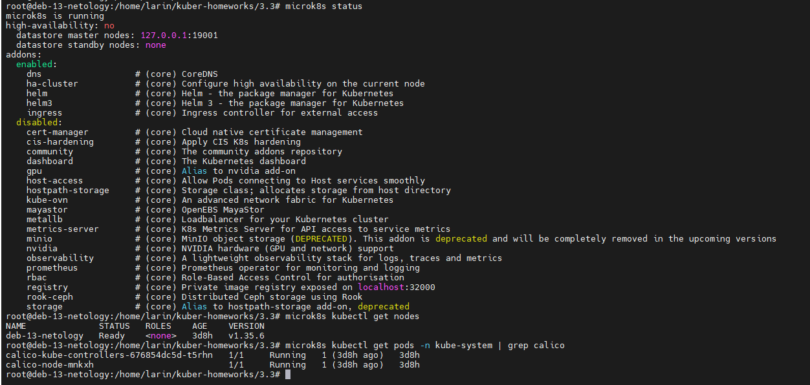
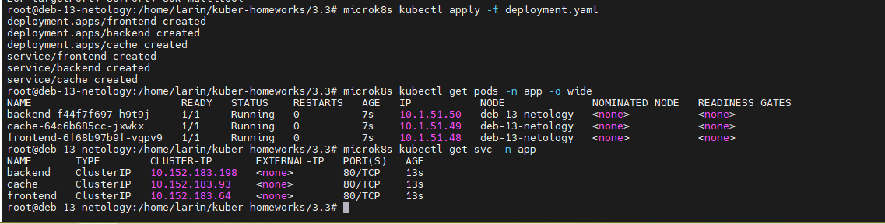
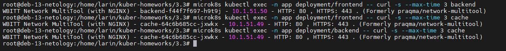
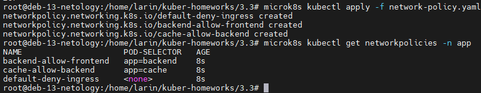
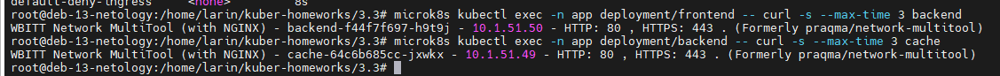
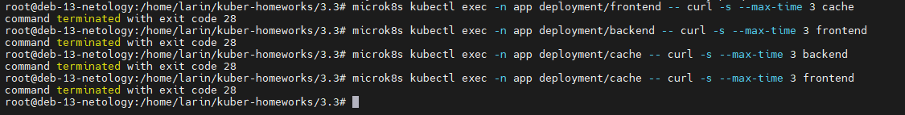

# Домашнее задание к занятию «Как работает сеть в K8s»

### Автор: Ларин Владимир

---

## Задание 1. Создать сетевую политику для обеспечения доступа

### Подготовка окружения

Для начала я убедился, что кластер microk8s работает и плагин Calico установлен. Calico нужен, потому что стандартный сетевой плагин microk8s не поддерживает NetworkPolicy.



Как видно, нода в статусе Ready, поды calico-node и calico-kube-controllers запущены и работают.

### Создание namespace и деплойментов

Создал отдельный namespace `app` для изоляции наших приложений:

```bash
microk8s kubectl create namespace app
```

Потом написал манифест, в котором описаны три Deployment (frontend, backend, cache) и три Service к ним. Во всех используется образ `wbitt/network-multitool` — он удобный, потому что внутри есть curl и другие сетевые утилиты для проверки связности.

Манифест: [deployment.yaml](deployment.yaml)

Применил манифест и проверил, что всё поднялось:

```bash
microk8s kubectl apply -f deployment.yaml
microk8s kubectl get pods -n app -o wide
microk8s kubectl get svc -n app
```



Все три пода в статусе Running, сервисы получили свои ClusterIP — значит всё нормально.

### Проверка связности до применения политик

Перед тем как настраивать политики, решил проверить, что без них все поды могут свободно обращаться друг к другу. Это нужно чтобы потом было видно разницу.

```bash
microk8s kubectl exec -n app deployment/frontend -- curl -s --max-time 3 backend
microk8s kubectl exec -n app deployment/frontend -- curl -s --max-time 3 cache
microk8s kubectl exec -n app deployment/backend -- curl -s --max-time 3 cache
```



Все запросы проходят успешно — ответ приходит от nginx внутри multitool. Пока никаких ограничений нет.

### Создание сетевых политик

Теперь самое главное. Нужно сделать так, чтобы трафик шёл только по цепочке: frontend → backend → cache. Всё остальное должно быть запрещено.

Для этого я создал три NetworkPolicy:

1. `default-deny-ingress` — запрещает весь входящий трафик ко всем подам в namespace app. Это как бы базовое правило, от которого дальше делаем исключения.
2. `backend-allow-frontend` — разрешает входящие подключения к backend только от подов с меткой `app: frontend`.
3. `cache-allow-backend` — разрешает входящие подключения к cache только от подов с меткой `app: backend`.

Манифест: [network-policy.yaml](network-policy.yaml)

Применил и проверил:

```bash
microk8s kubectl apply -f network-policy.yaml
microk8s kubectl get networkpolicies -n app
```



Три политики создались, в колонке POD-SELECTOR видно к каким подам они привязаны.

### Проверка разрешённого трафика

Проверяю, что разрешённые направления работают — frontend может достучаться до backend, а backend до cache:

```bash
microk8s kubectl exec -n app deployment/frontend -- curl -s --max-time 3 backend
microk8s kubectl exec -n app deployment/backend -- curl -s --max-time 3 cache
```



Оба запроса прошли, ответ пришёл — значит политики правильно пропускают нужный трафик.

### Проверка запрещённого трафика

Теперь проверяю, что всё остальное заблокировано. Пробую подключиться в обход разрешённых направлений:

```bash
microk8s kubectl exec -n app deployment/frontend -- curl -s --max-time 3 cache
microk8s kubectl exec -n app deployment/backend -- curl -s --max-time 3 frontend
microk8s kubectl exec -n app deployment/cache -- curl -s --max-time 3 backend
microk8s kubectl exec -n app deployment/cache -- curl -s --max-time 3 frontend
```



Все четыре запроса завершились с кодом 28 (таймаут curl). Это значит, что пакеты не дошли — Calico их заблокировал согласно нашим политикам. Получилось именно то, что нужно: frontend не может напрямую к cache, а cache и backend не могут обращаться в обратную сторону.

---

## Файлы конфигурации

- [deployment.yaml](deployment.yaml) — манифест с Deployment и Service для frontend, backend, cache
- [network-policy.yaml](network-policy.yaml) — манифест с сетевыми политиками (deny all + разрешения по цепочке)

