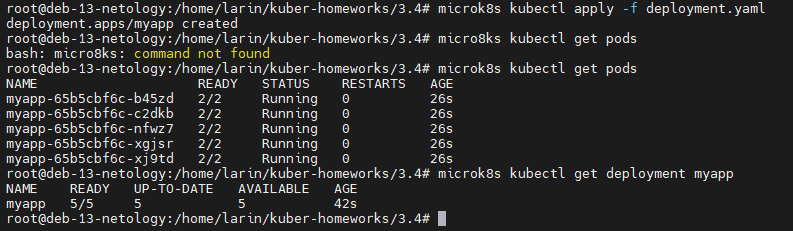
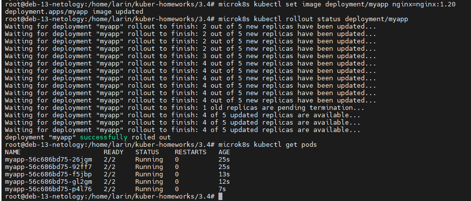
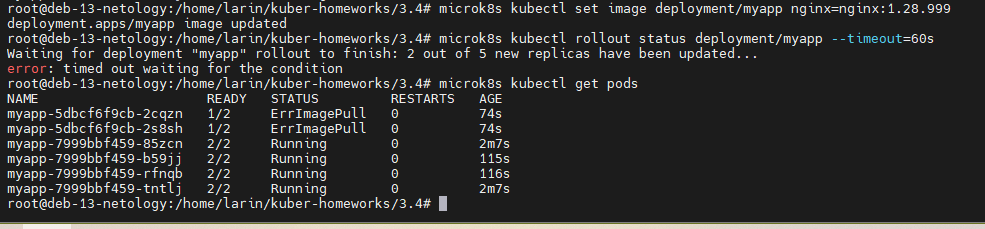
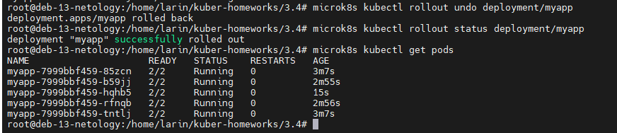

# Домашнее задание к занятию «Обновление приложений»

### Автор: Ларин Владимир

---

## Задание 1. Выбрать стратегию обновления приложения и описать ваш выбор

По условиям задачи у нас есть приложение с несколькими репликами, ресурсы ограничены (запас всего 20%), а обновление мажорное — новая версия не может работать вместе со старой.

Я выбрал стратегию **Recreate**.

Почему именно она: раз новая версия не совместима со старой, нам нельзя допустить ситуацию, когда одновременно работают поды с разными версиями. При RollingUpdate именно это и произойдёт — часть подов будет на старой версии, часть на новой, и приложение может сломаться. Recreate сначала останавливает все старые поды и только потом поднимает новые. Да, будет небольшой даунтайм, но зато мы точно не получим конфликт версий.

Ещё один момент — ресурсы ограничены, запас всего 20%. При RollingUpdate с maxSurge нужны дополнительные ресурсы, чтобы одновременно держать старые и новые поды. А с Recreate ресурсы освобождаются сначала полностью, потом занимаются новыми подами — тут никаких проблем с нехваткой ресурсов.

В идеале обновление лучше делать в момент наименьшей нагрузки, чтобы даунтайм минимально повлиял на пользователей.

---

## Задание 2. Обновить приложение

### 2.1 Создание deployment с nginx:1.19 и multitool (5 реплик)

Создал deployment с двумя контейнерами — nginx версии 1.19 и multitool. Стратегию обновления указал RollingUpdate с maxSurge: 1 и maxUnavailable: 1, чтобы обновление шло побыстрее, но приложение оставалось доступным.

Файл конфигурации: [deployment.yaml](deployment.yaml)

Применил манифест, все 5 реплик поднялись нормально.



### 2.2 Обновление nginx до версии 1.20

Обновил образ nginx до 1.20 командой `kubectl set image`. Обновление прошло через RollingUpdate — поды менялись постепенно, приложение было доступно всё время. Через какое-то время все 5 реплик обновились.

```
microk8s kubectl set image deployment/myapp nginx=nginx:1.20
```



### 2.3 Попытка обновления до несуществующей версии nginx:1.28.999

Попробовал обновить на версию nginx:1.28.999 (несуществующая). Новые поды не смогли скачать образ и получили статус `ErrImagePull`. Но при этом старые поды продолжали работать — приложение осталось доступным. Kubernetes не убил рабочие поды, пока новые не стали Ready.

```
microk8s kubectl set image deployment/myapp nginx=nginx:1.28.999
```



### 2.4 Откат после неудачного обновления

Выполнил откат командой `rollout undo`. Проблемные поды удалились, все 5 реплик снова в статусе Running на предыдущей рабочей версии.

```
microk8s kubectl rollout undo deployment/myapp
```


