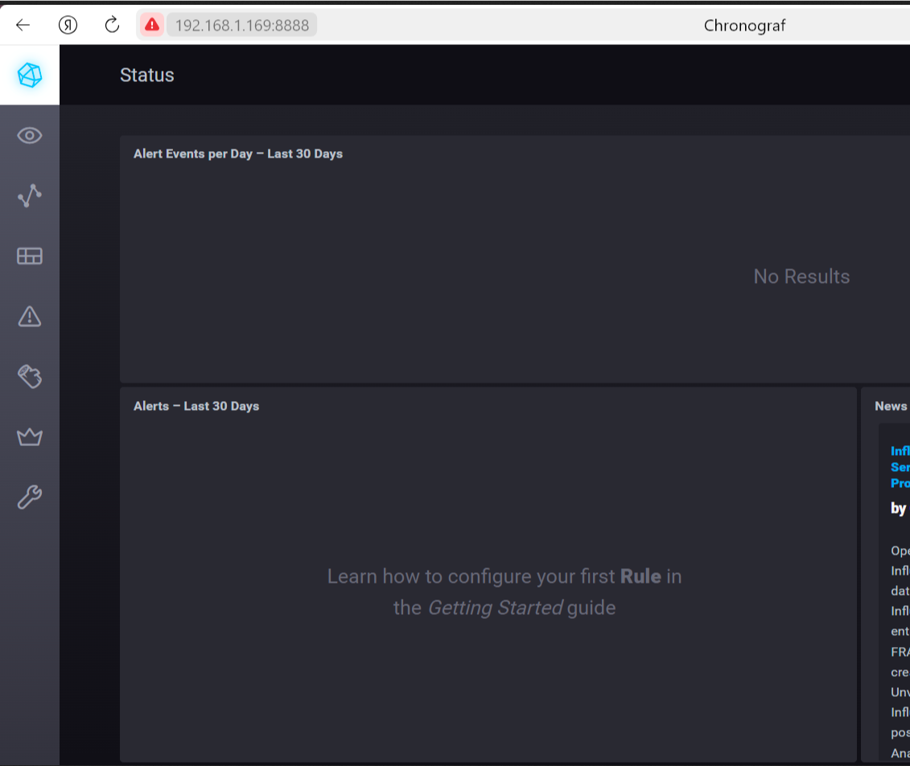
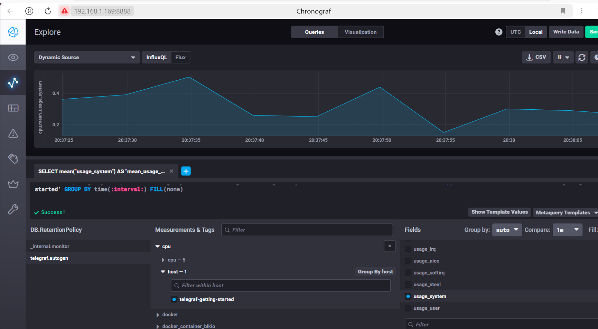
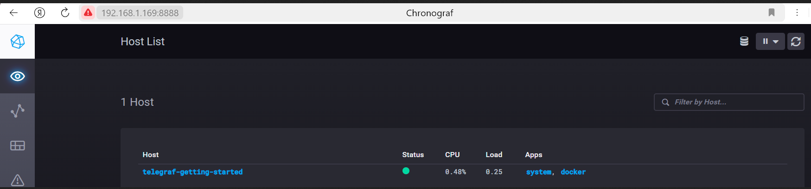

# Домашнее задание к занятию "13. Системы мониторинга"

## Ответы на обязательные задания

---

### Вопрос 1
**Вас пригласили настроить мониторинг на проект. На онбординге вам рассказали, что проект представляет из себя платформу для вычислений с выдачей текстовых отчетов, которые сохраняются на диск. Взаимодействие с платформой осуществляется по протоколу http. Также вам отметили, что вычисления загружают ЦПУ. Какой минимальный набор метрик вы выведите в мониторинг и почему?**

**Ответ:**

Минимальный набор метрик должен покрывать 4 золотых сигнала SRE (Latency, Traffic, Errors, Saturation) и специфику проекта:

1.  **HTTP-метрики (доступность сервиса):**
    *   **RPS (Requests Per Second):** Количество запросов в секунду. Показывает нагрузку на сервис (Traffic).
    *   **Latency (задержки):** 95-й и 99-й перцентили времени ответа. Важно считать на стороне сервера, чтобы понимать, сколько времени пользователи ждут результат вычислений.
    *   **Error Rate (количество ошибок):** Процент запросов с кодами `5xx` (проблемы сервера) и `4xx` (проблемы клиента).

2.  **Метрики ресурсов (инфраструктура):**
    *   **Загрузка CPU (Load Average):** Критически важно, так как вычисления нагружают ЦПУ. Высокий LA укажет на нехватку мощности (Saturation).
    *   **Использование RAM:** Нехватка памяти приведет к использованию swap или остановке сервиса (Saturation).
    *   **Свободное место на диске (в байтах и inodes):** Так как отчеты сохраняются на диск, его переполнение приведет к невозможности сохранить результат (Saturation).

**Почему именно так:** Этот набор позволяет ответить на вопросы: "Все ли хорошо с сервером?" (CPU, RAM, Disk) и "Довольны ли пользователи?" (Latency, Errors). Без любого из этих компонентов мы рискуем пропустить инцидент.

---

### Вопрос 2
**Менеджер продукта посмотрев на ваши метрики сказал, что ему непонятно что такое RAM/inodes/CPUla. Также он сказал, что хочет понимать, насколько мы выполняем свои обязанности перед клиентами и какое качество обслуживания. Что вы можете ему предложить?**

**Ответ:**

Нужно перевести технические метрики на язык бизнеса, используя концепцию SLO (Service Level Objectives) и OKR. Менеджеру можно предложить следующие метрики на дашборде:

1.  **Доступность сервиса (Availability):**
    *   *Техническая формула:* `(sum(2xx_requests) + sum(3xx_requests)) / (sum(all_requests) - sum(4xx_requests)) * 100`
    *   *Перевод для менеджера:* "Процент времени, когда система была полностью работоспособна и клиенты могли заказать вычисления".
    *   *Цель (SLO):* Например, 99.5% в месяц.

2.  **Скорость работы (Performance):**
    *   *Техническая формула:* `histogram_quantile(0.95, rate(http_request_duration_seconds_bucket[5m]))`
    *   *Перевод для менеджера:* "95% отчетов формируются быстрее N секунд. Это скорость, с которой клиент получает результат".
    *   *Цель (SLO):* Например, 95% запросов быстрее 2 секунд.

3.  **Качество/Надежность (Reliability):**
    *   *Техническая формула:* `rate(5xx_requests_total[5m]) / rate(all_requests_total[5m]) * 100`
    *   *Перевод для менеджера:* "Какой процент клиентов столкнулся с ошибкой сервера при попытке сформировать отчет".

---

### Вопрос 3
**Вашей DevOps команде в этом году не выделили финансирование на построение системы сбора логов. Разработчики в свою очередь хотят видеть все ошибки, которые выдают их приложения. Какое решение вы можете предпринять в этой ситуации, чтобы разработчики получали ошибки приложения?**

**Ответ:**

Без бюджета на платные системы (Splunk, ELK на больших мощностях) можно использовать бесплатные альтернативы:

1.  **Grafana Loki:** Это легковесная и бесплатная система сбора логов. Настроить сбор логов только уровня `ERROR` (или всех, Loki очень экономична). Интегрируется с уже возможной существующей Grafana. Разработчики смогут искать ошибки через веб-интерфейс.

2.  **Sentry (бесплатный тариф):** Лучшее решение для разработчиков. Внедрение в код занимает несколько минут. Все исключения (exceptions) автоматически отправляются в Sentry, группируются, и приходят уведомления на почту/в мессенджер. Это дает полную картину по ошибкам с бектрейсами.

3.  **Использовать существующий мониторинг:** Если стоит Prometheus, можно добавить счетчик ошибок в код приложения и вывести график "Количество ошибок в минуту" в Grafana, настроив на него алерты. Минус — нет деталей ошибок.

4.  **Docker logs:** Если приложение в контейнерах, убедиться, что логи пишутся в `stdout/stderr`. Разработчики смогут смотреть ошибки через `docker logs` или `kubectl logs`, но это менее удобно для агрегации и поиска.

---

### Вопрос 4
**Вы, как опытный SRE, сделали мониторинг, куда вывели отображения выполнения SLA=99% по http кодам ответов. Вычисляете этот параметр по следующей формуле: summ_2xx_requests/summ_all_requests. Данный параметр не поднимается выше 70%, но при этом в вашей системе нет кодов ответа 5xx и 4xx. Где у вас ошибка?**

**Ответ:**

Ошибка в некорректной формуле. В знаменателе `summ_all_requests` учитываются **все** запросы, включая редиректы (3xx).

Так как 4xx и 5xx кодов нет, но SLA всего 70%, это означает, что оставшиеся 30% трафика — это **HTTP-редиректы (коды 3xx)**.
*   Например: 1000 запросов, из них 700 = 2xx, 300 = 3xx. По формуле `700/1000` получаем 70%.

**Правильное решение:** Исключить редиректы из расчета, если они не являются целевым действием, либо учитывать их как успех.
*   Если 3xx считать успехом (часто так и делают, т.к. это не ошибка): `(summ_2xx + summ_3xx) / summ_all_requests`
*   Если 3xx не считать успехом (исключаем их из знаменателя): `summ_2xx / (summ_all_requests - summ_3xx)`

---

### Вопрос 5
**Опишите основные плюсы и минусы pull и push систем мониторинга.**

**Ответ:**

| | **Pull модель (Prometheus и др.)** | **Push модель (TICK и др.)** |
|------|-------------------------------------|-------------------------------|
| **Как работает** | Сервер сам забирает (тянет) метрики с агентов по HTTP | Агенты сами отправляют (толкают) метрики на сервер |
| **Плюсы** | ✅ Легко понять, что целевой сервер умер (последний pull не удался) | ✅ Проще настройка за файрволами (агент сам инициирует соединение) |
| | ✅ Сервер сам контролирует частоту и момент сбора данных | ✅ Легко отправлять данные из эфемерных задач (batch-обработка, краткосрочные job'ы) |
| | ✅ Проще централизованная конфигурация (Service Discovery) | ✅ Серверу не нужно знать обо всех источниках заранее |
| **Минусы** | ❌ Сложнее пробивать файрволы (нужен доступ с сервера к агенту) | ❌ Сложнее отследить "смерть" агента (отсутствие данных может означать и отсутствие событий) |
| | ❌ Нужен механизм Service Discovery, чтобы находить новые цели | ❌ Риск "заспамить" сервер при неверной настройке агента |

---

### Вопрос 6
**Какие из ниже перечисленных систем относятся к push модели, а какие к pull? А может есть гибридные?**
**Prometheus, TICK, Zabbix, VictoriaMetrics, Nagios**

**Ответ:**

| Система | Модель | Комментарий |
|---------|--------|-------------|
| **Prometheus** | **Pull** | Основной режим — опрос экспортеров. Есть Pushgateway для разовых задач (гибридный элемент). |
| **TICK (Telegraf → InfluxDB)** | **Push** | Telegraf настроен на отправку (push) данных в InfluxDB. |
| **Zabbix** | **Гибридная** | Поддерживает и Pull (опрос агентов сервером), и Push (активные агенты сами шлют данные). |
| **VictoriaMetrics** | **Гибридная** | Поддерживает Pull (как Prometheus) и все популярные форматы Push (InfluxDB, Graphite, OpenTSDB). |
| **Nagios** | **Pull** | Сервер сам запускает плагины и забирает результаты проверок по расписанию. |

---

### Вопрос 7
**Склонируйте себе репозиторий и запустите TICK-стэк, используя технологии docker и docker-compose.**
**В виде решения на это упражнение приведите скриншот веб-интерфейса ПО chronograf (http://localhost:8888).**

**Ответ:**

Для запуска TICK-стека был использован `docker-compose.yml`. Контейнеры успешно запущены. Веб-интерфейс Chronograf доступен.

**Скриншот веб-интерфейса Chronograf:**


*(На скриншоте отображена главная страница Chronograf, доступная по адресу localhost:8888)*

> *Примечание:* Если контейнеры падали с ошибкой прав доступа, в docker-compose.yml для volumes была добавлена опция `:Z` (например, `./data:/var/lib:Z`).

---

### Вопрос 8
**Перейдите в веб-интерфейс Chronograf (http://localhost:8888) и откройте вкладку Data explorer.**
**Нажмите на кнопку Add a query. Изучите вывод интерфейса и выберите БД telegraf.autogen. В measurments выберите cpu->host->telegraf-getting-started, а в fields выберите usage_system. Внизу появится график утилизации cpu.**
**Вверху вы можете увидеть запрос, аналогичный SQL-синтаксису. Поэкспериментируйте с запросом, попробуйте изменить группировку и интервал наблюдений.**
**Для выполнения задания приведите скриншот с отображением метрик утилизации cpu из веб-интерфейса.**

**Ответ:**

В Data Explorer построен график утилизации CPU (`usage_system`). Запрос отображает изменение метрики во времени. В запросе использована функция `mean()` для агрегации данных.

**Скриншот с метриками утилизации CPU:**


*(На скриншоте виден график `usage_system`, панель построения запроса и выбранные измерения: `cpu`, `host`, `usage_system`)*

---

### Вопрос 9
**Изучите список telegraf inputs. Добавьте в конфигурацию telegraf следующий плагин - docker:**
   ```toml
[[inputs.docker]]
  endpoint = "unix:///var/run/docker.sock"
  ```

**Дополнительно вам может потребоваться донастройка контейнера telegraf в docker-compose.yml дополнительного volume и режима privileged.**
```toml
  telegraf:
    image: telegraf:1.4.0
    privileged: true
    volumes:
      - ./etc/telegraf.conf:/etc/telegraf/telegraf.conf:Z
      - /var/run/docker.sock:/var/run/docker.sock:Z
    links:
      - influxdb
    ports:
      - "8092:8092/udp"
      - "8094:8094"
      - "8125:8125/udp"
```

**После настройке перезапустите telegraf, обновите веб интерфейс и приведите скриншотом список measurments в веб-интерфейсе базы telegraf.autogen . Там должны появиться метрики, связанные с docker.**

**Ответ:**

В конфигурацию Telegraf добавлен плагин `inputs.docker`. В `docker-compose.yml` добавлен проброс сокета Docker (`/var/run/docker.sock`) и перезапущен контейнер. Telegraf начал собирать метрики Docker daemon'а.

**Скриншот списка измерений (measurements) с метриками Docker:**


*(На скриншоте в выпадающем списке measurements базы `telegraf.autogen` присутствуют новые метрики, начинающиеся с префикса `docker_`)*

> Среди появившихся метрик: `docker_container_cpu`, `docker_container_mem`, `docker_container_net`, `docker_container_blkio` и другие.

---
